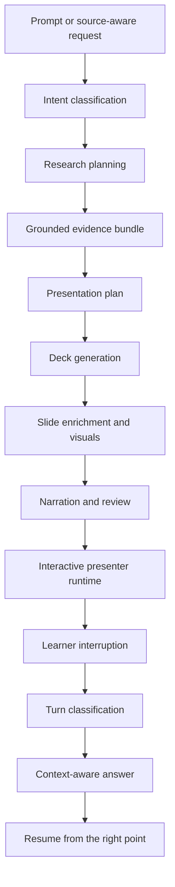
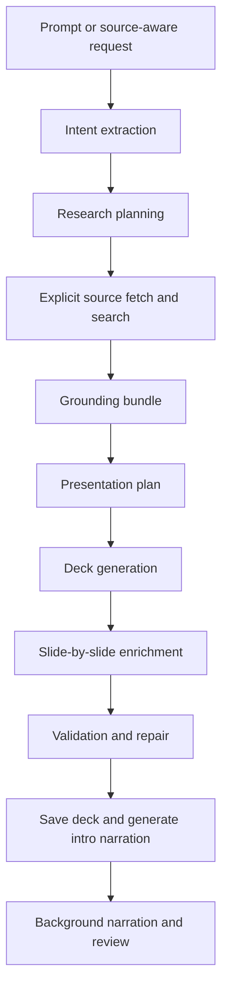
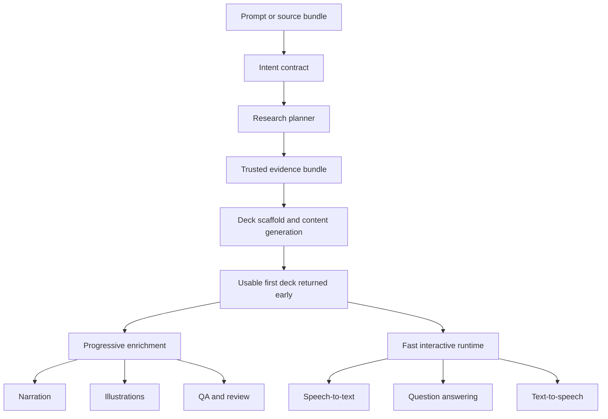
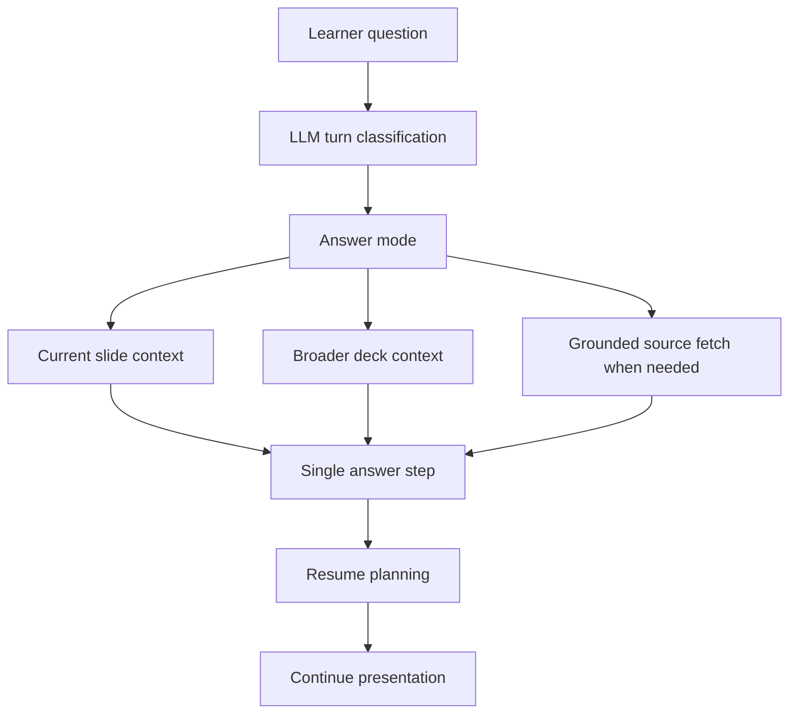

# SlideSpeech

SlideSpeech is an interactive AI presenter and AI teacher.

The product is not "generate slides and stop there". It is an orchestration runtime that can:

- turn a topic or source material into a teachable deck
- present it step by step
- let the learner interrupt naturally
- answer in context
- adapt the teaching style
- and resume from the right place

The ambition is simple:

- generate a usable presentation quickly
- keep it grounded in real source material when grounding matters
- present it like a teacher, not like a static slide deck
- let the audience interrupt without breaking the flow

The architecture is intentionally modular so LLM, vision, STT, TTS, VAD, storage, and research backends can be swapped without rewriting the core product logic.

## What makes SlideSpeech interesting

Most AI slide tools stop after deck generation.
SlideSpeech treats generation as the first step in a longer teaching loop:

1. classify the prompt into a structured presentation intent
2. build a grounded plan and deck
3. present the material progressively
4. classify interruptions and questions at runtime
5. answer in context
6. resume from the right point

That is the real product shape:

- a generation system
- a presentation runtime
- a conversational teaching layer on top

## Classification and pipeline

Classification is central to the system.
SlideSpeech tries to make explicit decisions early instead of relying on one giant prompt.

At generation time, the system classifies things like:

- `presentationFrame`
  - `subject`
  - `organization`
  - `mixed`
- `deliveryFormat`
  - `presentation`
  - `workshop`
- `contentMode`
  - `descriptive`
  - `procedural`
- whether live web grounding is required

At runtime, the system classifies learner turns into a small number of response modes so it can build only the context it actually needs.

### End-to-end product flow



This is the core idea behind the codebase:

- classify first
- build the right context for that class of task
- answer or generate once
- validate locally
- keep the runtime fast and recoverable

## Current generation pipeline

SlideSpeech is not meant to be "one prompt in, one static deck out".
The product goal is a grounded teaching pipeline with two modes:

- a generation pipeline that turns a topic or source bundle into a teachable presentation
- a runtime pipeline that presents, answers questions, adapts, and resumes in context

### Current generation pipeline

Today, generation is quality-first and still more conservative than fast.
In plain terms, the system currently does this:

1. Interpret the user prompt into a structured teaching intent.
2. Decide whether live web research is needed, and if so fetch and summarize sources.
3. Build a grounded presentation plan.
4. Generate a deck draft, often through multiple guarded attempts.
5. Enrich slides one by one into the internal slide schema.
6. Validate and repair the deck when quality checks fail.
7. Generate the first narration so presenter mode can start.
8. Continue background enrichment for later narrations and final review.



This is why SlideSpeech can already produce grounded, narration-aware decks, but also why generation can still take too long: several LLM-heavy stages are still serialized and guarded.

## Demo focus, temporary freeze, and current reality

The project is temporarily shifting focus from deep generator work to end-to-end demo readiness.
That does **not** mean presentation generation is solved.

Current reality:

- presentation generation is still **not close to done**
- the generator still relies on too many retries, repairs, and guarded fallback paths
- opening-slide quality, deck-wide topic discipline, and narration consistency are still not reliable enough
- generation latency is still too high for the final product shape

What this temporary shift means:

- we will build and polish the full user flow needed for a demo
- we will use a curated set of prompts that currently behave well enough
- we will continue measuring generation quality during that work
- we are **not** treating current generation as production-ready, general-purpose, or even broadly reliable yet

In other words: SlideSpeech may become demoable before its generation pipeline is truly good.
That is acceptable for a POC, but it should not be mistaken for the generator being finished.

### Target pipeline

The target architecture is faster, cleaner, and more progressive.
The goal is to make the first usable deck appear quickly while keeping quality high through structured enrichment afterward.

In plain terms, the target system should do this:

1. Turn the prompt into a clean intent contract: subject, audience, format, constraints, and required activities.
2. Build a strong evidence bundle from trusted sources only when grounding is actually needed.
3. Generate a coherent deck from that contract with fewer retries and less repair.
4. Return a usable first result early.
5. Enrich narration, illustrations, QA, and presenter assets progressively in the background.
6. Keep question answering, STT, and TTS on a separate fast runtime path instead of blocking generation.



### What this means in practice

- The current system is already architected around provider boundaries and grounded generation.
- The target system keeps that architecture, but moves toward fewer retries, less repair, earlier first render, and much faster interaction.
- This is the path to a demo-worthy product: good presentations in a reasonable time, then fast question answering on top.
- We are not there yet. The current generator is still under active correction and should be treated as an unfinished subsystem.

## Runtime Q&A pipeline

Question answering should behave like a small agent runtime, not like a bag of presentation-specific special cases.

### Target Q&A pipeline

The intended runtime path is:

1. Classify the learner turn with the LLM.
2. Route the turn into a small set of answer modes.
3. Build only the context that mode actually needs.
4. Answer once.
5. Resume from the right point after the answer.



The important design rule is that context-building follows classification, not the other way around.
That keeps the runtime simpler, reduces unnecessary fetches, and makes the system easier to extend to more languages later.

### Current answer modes

The runtime is moving toward these modes:

- `summarize_current_slide`
- `general_contextual`
- `grounded_factual`
- `simplify`
- `deepen`
- `example`
- `repeat`

In practice this means:

- current-slide summary questions should be answered from the current slide
- broader conceptual questions should use current slide plus deck context
- factual grounded questions may fetch source material before answering
- resume planning should happen after the answer is known, not as a separate competing path

This runtime is still under active refinement.
The architecture is now moving toward a real classify -> route -> answer -> resume pipeline, but question quality and latency are not yet at the final bar.

### Structured output findings

Recent benchmarking against LM Studio with `qwen/qwen3.6-35b-a3b` showed a clear split between two structured-output strategies:

- free JSON-in-text prompting was unreliable for small planner-style calls
- the model often produced only `reasoning_content` and hit `finish_reason = "length"` without final `message.content`
- this stayed true even when we tried:
  - higher token budgets
  - explicit thinking enabled
  - explicit thinking disabled
  - `/no_think`-style prompt prefixes

- tool/function-style output was materially more reliable for the same planner task
- with a required tool call, LM Studio returned structured tool arguments consistently enough to parse and validate

In practice this means:

- planner-like runtime classification should not rely on `chatText -> extract JSON -> parse`
- answer generation can still remain free-text
- critical structured runtime steps should move toward tool/function output when the serving layer supports it

This matters for multilingual support too:

- tool/function routing is more language-neutral than regex-heavy or prompt-fragile string parsing
- it reduces the need for English-specific after-the-fact output repair

## Current status

Implemented now:

- topic to internal deck JSON
- web presenter runtime
- per-slide narration generation
- segmented narration with per-slide progress tracking
- text-based conversational interruption flow
- browser-native speech recognition when available, with backend audio upload as fallback
- browser playback through a backend TTS provider for narration points and answers
- real local TTS through the macOS system voice backend
- structured visual slides with layouts, cards, callouts, flow blocks, and local illustration slots
- provider-driven slide illustration pipeline with mock-local rendering and hosted web-image lookup
- session state machine and narration-aware resume planning
- automatic web-grounded deck generation for time-sensitive topics when hosted research is enabled
- LM Studio integration behind an `LLMProvider`
- explicit external web research API and UI panel
- file-based persistence for decks, sessions, and transcripts

Not implemented yet:

- realtime voice runtime
- document and PPTX ingestion
- visual slide analysis
- provenance-aware runtime use of external research
- real backend STT provider beyond browser-native recognition and the mock server adapter

## Product principles

- provider interfaces first
- no vendor logic in core orchestration
- internal deck JSON is the source of truth
- simple, testable modules over clever but fragile abstractions
- explicit state transitions
- explicit provenance when external knowledge is used

## Current-topic grounding

Deck generation is topic-only by default, but time-sensitive topics can be
web-grounded automatically before the LLM builds the deck.

- examples: `latest`, `current`, `today`, `recent`, year-based topics like `2026`
- hosted web research runs first
- its summary and source URLs are passed into deck generation as grounding
- resulting decks should use `source.type = "mixed"` with external `sourceIds`

If hosted web research is not enabled, the API now fails fast for topics that
look time-sensitive instead of silently pretending the model has fresh facts.

## Architecture

```text
apps/
  api/        HTTP API, provider wiring, session orchestration
  web/        Next.js UI for generation, presenting, and debugging

packages/
  core/       state machine, planners, conversation runtime, resume logic
  providers/  LLM, web research, storage, export, mock speech/vision adapters
  types/      domain models, zod schemas, provider contracts
  ui/         shared UI components
```

Core product IP lives in `packages/core`.
Stable contracts live in `packages/types`.

This is what keeps migrations cheap:

- LM Studio now, vLLM later
- local speech stack now, hosted speech later
- file storage now, SQLite/Postgres later

without changing the teaching runtime itself.

## Conversation-first runtime

The runtime is designed so learner input is treated as conversation first, command second.

A user turn can produce:

- a natural assistant response
- inferred learner needs such as confusion, example, deepen, repeat
- runtime effects such as pause, back, restart slide, adapt detail level
- a resume plan

That lets turns like:

`I do not get why the processing step matters here`

behave like a real teaching interruption instead of a hardcoded button command.

## Provider model

Main interfaces live in [`packages/types/src/providers.ts`](packages/types/src/providers.ts).

Key interfaces:

- `LLMProvider`
- `VisionProvider`
- `SpeechToTextProvider`
- `TextToSpeechProvider`
- `VoiceActivityProvider`
- `WebResearchProvider`
- `DeckExporter`
- `DeckIngestionProvider`
- `DeckRepository`
- `SessionRepository`
- `TranscriptRepository`

Main domain models live in [`packages/types/src/domain.ts`](packages/types/src/domain.ts).

Key models:

- `Deck`
- `Slide`
- `SlideNarration`
- `Session`
- `UserInterruption`
- `ResumePlan`
- `PedagogicalProfile`
- `TranscriptTurn`

## Web research

Web augmentation is implemented as an explicit capability, not a hidden side effect.

Available endpoints:

- `GET /api/research/health`
- `POST /api/research/query`
- `POST /api/research/fetch`

Current behavior:

- search for external sources
- fetch selected pages
- summarize findings
- keep this separate from deck-grounded teaching

This is deliberate. The runtime should know when it is using:

- deck-grounded knowledge
- document-grounded knowledge
- externally augmented knowledge

instead of blending them invisibly.

## Local development

1. Install dependencies:

```bash
npm install
```

2. Copy environment defaults if needed:

```bash
cp .env.example .env
```

3. If you want local Piper TTS, bootstrap the server-side voice assets:

```bash
npm run setup:tts
```

This installs the default Piper voice used by the backend, so every browser user of that backend hears the same narration without needing local browser TTS setup.

4. Start the app:

```bash
npm run dev
```

5. Open:

- web: [http://localhost:3000](http://localhost:3000)
- api: [http://localhost:4000](http://localhost:4000)

## Stable local ports

Use fixed ports during development:

- web: `3000`
- api: `4000`
- LM Studio: `1234`

For a fixed-port API smoke test:

```bash
npm run verify:api
```

## LM Studio

LM Studio is supported as an OpenAI-compatible backend, but it is not treated as the center of the architecture.

Example config:

```bash
LLM_PROVIDER=lmstudio
ILLUSTRATION_PROVIDER=mock
LMSTUDIO_BASE_URL=http://127.0.0.1:1234/v1
LMSTUDIO_MODEL=your-loaded-model
LLM_TIMEOUT_MS=180000
LLM_FALLBACK_TO_MOCK_ON_ERROR=false
```

The LM Studio adapter lives in [`packages/providers/src/llm/lmstudio-llm-provider.ts`](packages/providers/src/llm/lmstudio-llm-provider.ts).

## Web research provider

The project supports both mock and hosted web research providers.

Example config:

```bash
WEB_RESEARCH_PROVIDER=mock
WEB_RESEARCH_TIMEOUT_MS=15000
```

or

```bash
WEB_RESEARCH_PROVIDER=hosted
WEB_RESEARCH_TIMEOUT_MS=15000
```

## Testing

Useful commands:

```bash
npm run typecheck
npm test
npm run build --workspace @slidespeech/web
npm run verify:api
```

## Roadmap

### Next

- document and PPTX ingestion
- real backend STT provider

### After that

- provenance-aware runtime use of external research
- stronger pedagogy engine
- visual slide analysis

## Recommended files to read first

- [`docs/architecture-plan.md`](docs/architecture-plan.md)
- [`packages/core/src/session-service.ts`](packages/core/src/session-service.ts)
- [`packages/core/src/conversation-turn-engine.ts`](packages/core/src/conversation-turn-engine.ts)
- [`packages/core/src/resume-planner.ts`](packages/core/src/resume-planner.ts)
- [`apps/api/src/server.ts`](apps/api/src/server.ts)
- [`apps/web/components/presentation-workbench.tsx`](apps/web/components/presentation-workbench.tsx)

## License

No license has been added yet.
