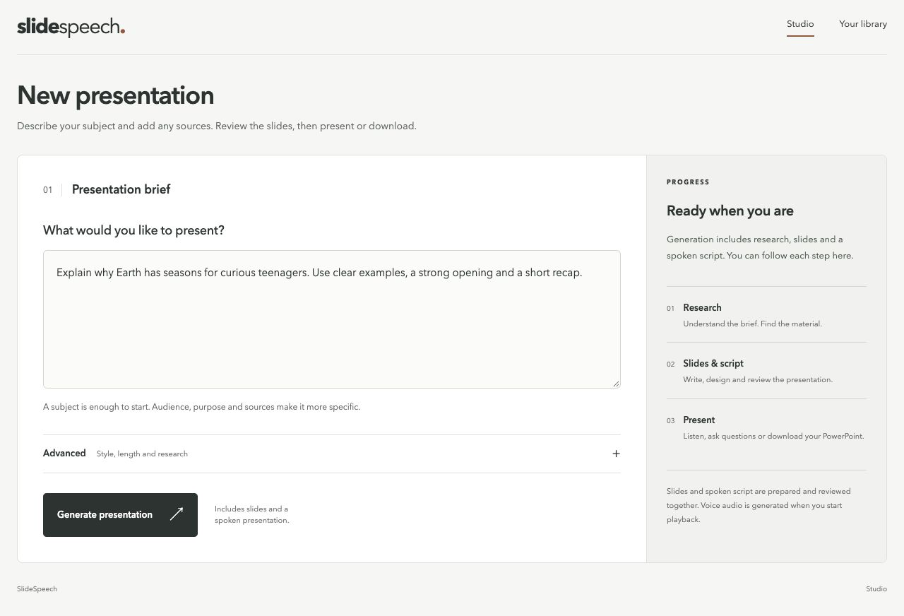
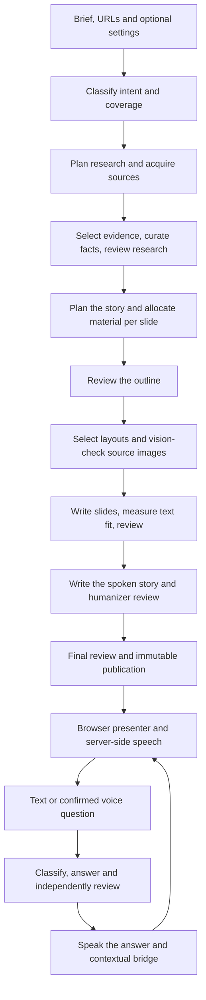
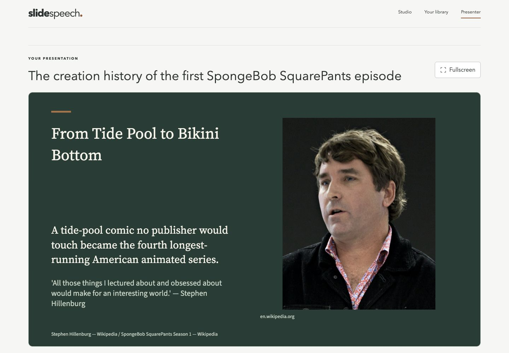
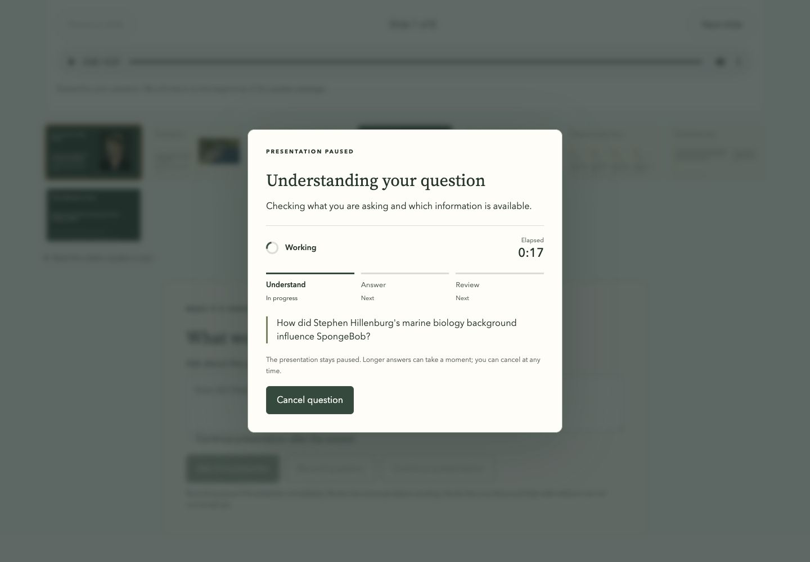
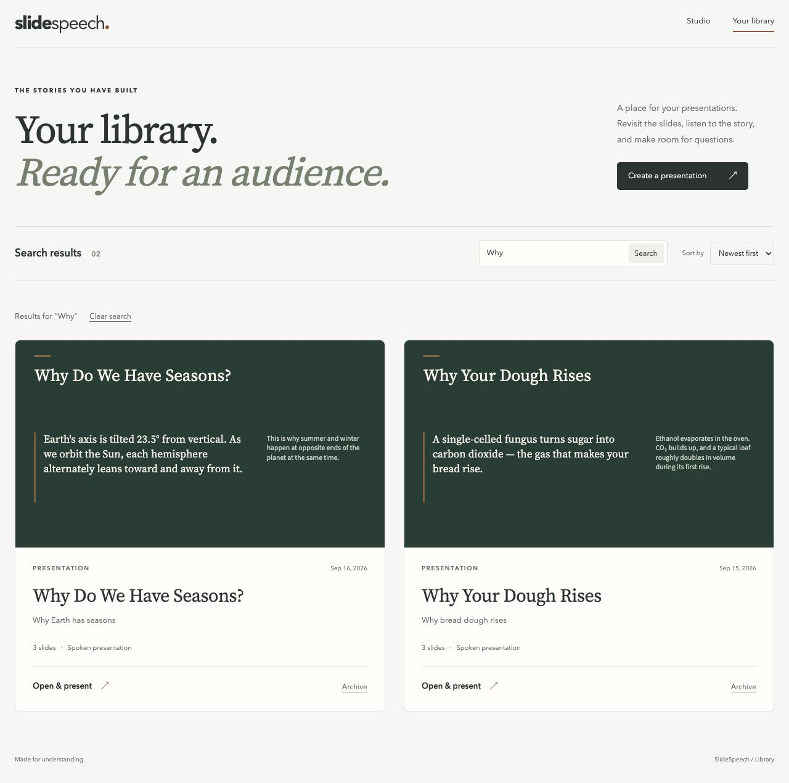

# SlideSpeech

**Turn a brief into a presentation you can have a conversation with.**

SlideSpeech researches a subject, designs the slides, writes a spoken story,
and presents it in your browser. Ask a question by text or recorded voice,
hear the answer, and return to the presentation with a contextual transition.
The goal is more than a generated deck: a presenter that can explain its material.

**Current status: working Pipeline 2.0 prototype for small, trusted test groups.**
Generation, saved presentations, server-side speech and reviewed Q&A are connected.
Quality and reliability still need broader validation. This is not a public,
multi-tenant production service. Status below reflects **September 18, 2026**.



## Classification First, Then Generation

The model first identifies the subject, audience, language, goal, deck mode,
research needs and explicit coverage requirements. The original request preserves
URLs and user settings independently so later stages cannot silently discard them.

Pipeline 2.0 passes typed, traceable artifacts between stages, rather than asking
one large prompt to research, design, write and judge everything at once.


```mermaid
flowchart TD
    Request["Brief, URLs and optional settings"] --> Intent["Classify intent and coverage"]
    Intent --> Research["Plan research and acquire sources"]
    Research --> Facts["Select evidence, curate facts, review research"]
    Facts --> Outline["Plan the story and allocate material per slide"]
    Outline --> OutlineReview["Review the outline"]
    OutlineReview --> Design["Select layouts and vision-check source images"]
    Design --> Slides["Write slides, measure text fit, review"]
    Slides --> Narration["Write the spoken story and humanizer review"]
    Narration --> Publish["Final review and immutable publication"]
    Publish --> Presenter["Browser presenter and server-side speech"]
    Presenter --> Question["Text or confirmed voice question"]
    Question --> Answer["Classify, answer and independently review"]
    Answer --> Return["Speak the answer and contextual bridge"]
    Return --> Presenter
```

- **Meaning belongs to the model.** Relevance, factual coverage, narrative planning
  and semantic review are model decisions, not topic-specific regex rules.
- **Integrity belongs to code.** Schemas, source references, layout geometry,
  deadlines, queue limits and cancellation are deterministic.
- **No generic recovery deck.** Unsupported, malformed or rejected output stops
  at an explicit failed stage. V2 generation and Q&A do not switch to mock content.
- **Bounded revision, not endless repair.** Actionable feedback returns to the
  responsible stage within its attempt budget. Reviews do not secretly rewrite copy.
- **A story, not a bullet reading.** Every deck has an introduction and conclusion;
  narration is written and reviewed as a connected presentation before publication.

The [pipeline specification](docs/generation-pipeline-v2.md) is canonical.
The [architecture map](docs/generation-architecture-map.md) shows implemented paths;
[tasks.md](tasks.md) tracks completed work and outstanding acceptance checks.

## What You Can Do

| Capability | Current behavior |
| --- | --- |
| Create a presentation | Start with a subject, audience and optional source URLs. The connected run includes slides, narration and publication review. |
| Control the result | Advanced settings offer Paper, Editorial or Signal, a slide-count target, speaking-time target and required web research. |
| Follow generation | See actual stages, attempts, queue position, elapsed time and an approximate range when comparable successful runs exist. Cancel explicitly; errors stay visible. |
| Present in the browser | Play server-generated narration, navigate slides, inspect the script and use fullscreen. Audio is prepared on first playback. |
| Ask questions | Type a question or record one, edit and confirm its transcript, then use the same grounded Q&A pipeline. |
| See answer progress | A cancellable dialog shows elapsed time and real Understand, Answer and Review stages, not fabricated percentages. |
| Return naturally | Hear a reviewed answer and bridge; when continuation is enabled, restart at the interrupted passage boundary rather than mid-word. |
| Reuse your work | Search, reopen and archive saved presentations in the shared Library without generating them again. |

### Slides With Structure And Source Images

The renderer supports **20 layout roles across three design systems**. Paper,
Editorial and Signal differ in composition, typography, hierarchy and image
placement, not just palette. The agent chooses layouts for the material and writes
to measured text areas. The layouts are code-defined; the story, copy, narration
and content-driven layout selection are model-generated. This is not arbitrary
model-generated HTML or slide code.

Research discovers image candidates alongside source text. The model selects
promising images and inspects their actual pixels before inclusion. Publisher
logos and decorative filler are not substitutes for relevant subject images.
The current image pass selects at most four images per deck; it does not promise
an image on every slide. Image relevance review does not establish reuse rights.



### Questions Stay Connected To The Presentation

Q&A keeps the published request, evidence, facts, slides and narration available.
The model classifies relevance and evidence sufficiency, writes an answer and
return transition, then independently reviews them. It can also ask for
clarification, explain an evidence gap or redirect an off-topic question.
Rejected answers remain errors, not generic text read from a slide.

Recording pauses playback immediately. Rolling backend transcripts can be edited
before submission. Piper speaks approved answers for every browser user; this
does not depend on a voice installed on the listener's computer. The answer stays
readable after the temporary working dialog closes.



### A Library You Can Return To

Saved V2 publications include their scenes, sources and approved spoken scripts.
Archiving removes a presentation from the active collection without permanently
deleting its stored file. The Library does not mix in the retired V1 collection.



These are screenshots of the running application, not design mockups. The slides
shown are saved generated examples, not a guarantee of factual accuracy on every
topic. Capture details are in [docs/screenshots](docs/screenshots/README.md).

## Current Limits

- **Generation remains model- and source-dependent.** Difficult research and
  lengthy structured responses can still fail. A successful stage probe is not
  the same as a complete, factually accepted presentation. Review important claims
  before presenting them to an audience.
- **English is the primary validation language.** The contracts are language-aware,
  but equivalent multilingual quality and speech support are not yet established.
- **Hands-free Live Voice is not connected.** Recorded questions are implemented;
  physical-microphone, noise/echo and mobile-browser acceptance remain incomplete.
- **Q&A does not yet perform fresh web research.** It uses the published material
  and permitted model knowledge, with explicit handling of missing evidence.
- **V2 PowerPoint download is not connected in the user journey.** An editable
  PPTX renderer and developer proof scripts exist, but the current V2 player does
  not offer a working download. Some Studio copy still mentions download; this is
  ahead of the implementation. The legacy export route is not a V2 substitute.
- **Shared library, not private accounts.** Trusted testers share the same saved
  presentations and archive controls. Jobs and queues are process-local; an API
  restart loses active jobs, while saved publications and traces remain on disk.
- **Not production-hardened.** Broader end-to-end acceptance, dependency/security
  maintenance and deployment hardening are still required before public access.

## Run Locally

### Prerequisites

- Node.js 22 and npm workspaces (the current local setup uses Node 22.16).
- An OpenAI-compatible model server with structured-output and vision support.
- Python virtual environments for Piper and Faster Whisper if you want speech.
- Internet access for web research and initial model/browser downloads.

The current live setup uses **`qwen/qwen3.8-27b` through LM Studio**, with roughly
50k context and two concurrent inference slots. V2 explicitly requests **low
reasoning effort**. Model ID, context capacity and concurrency must match the
model actually loaded in your server; a different model requires validation.

### Install And Configure

```bash
npm ci
npx playwright install chromium --only-shell
cp .env.example .env
```

Keep install scripts enabled: `postinstall` applies a pinned PptxGenJS package
serialization correction. See [dependency corrections](patches/README.md).
Chromium is used by source acquisition and measured slide rendering.

Set the actual model and speech providers in `.env`:

```dotenv
LLM_PROVIDER=lmstudio
LMSTUDIO_BASE_URL=http://127.0.0.1:1234/v1
LMSTUDIO_MODEL=qwen/qwen3.8-27b
LLM_TIMEOUT_MS=180000
LLM_FALLBACK_TO_MOCK_ON_ERROR=false
WEB_RESEARCH_PROVIDER=hosted
STT_PROVIDER=faster-whisper
TTS_PROVIDER=piper
```

`.env.example` leaves speech providers at `mock` for scaffolding; copying it alone
does not configure real audio. The V2 image pass uses the configured generation
model's vision capability, not the legacy illustration/vision mock settings.
V2 does not use the legacy mock-LLM fallback switch to recover failed generations.

### Install Speech

The following versions match the current working local speech environments:

```bash
python3.11 -m venv .venv-tts
.venv-tts/bin/python -m pip install piper-tts==1.4.2

python3.12 -m venv .venv-stt
.venv-stt/bin/python -m pip install faster-whisper==1.2.1

npm run setup:tts
```

The default Piper voice is `en_US-hfc_male-medium`; setup also downloads Bryce and
Lessac medium. Voice assets live under `models/tts/`. The setup script downloads
voices, not the Python runtime. Faster Whisper defaults to `base` with `int8`
compute and downloads its model on first use. Both run on the server; listeners
only need a browser. Use the Python/model paths in `.env.example` to override them.

The earlier experimental Qwen3-TTS/MLX path is not active. It was removed from the
local Mac workflow following repeated crashes during testing; Piper remains the
supported connected TTS provider.

### Start

```bash
npm run dev
```

Open [Studio](http://localhost:3000), then generate a presentation or visit
[Your library](http://localhost:3000/library). `npm run dev` checks/downloads Piper
voice assets before starting. Separate commands are `npm run dev:api` and
`npm run dev:web`.

The web app uses port **3000**, the API **4000**, and the example model server
**1234**. Web and API bind to loopback. Browser requests use same-origin `/api`;
the web server proxies to the API. Do not set a browser-facing localhost API URL
for remote visitors. `SLIDESPEECH_API_ORIGIN` is an optional server-side override.

For the built web app, keep the API running separately:

```bash
npm run build --workspace @slidespeech/web
npm run start --workspace @slidespeech/web
```

## Share With A Few Friends

After configuring ngrok on the host and starting the app:

```bash
npm run share:private
```

The launcher requires password protection on every path, including API and audio.
It creates local credentials in the Git-ignored `.local/ngrok/access.json`; share
the HTTPS address and credentials separately. The app itself has no account/login
system, so keep local services loopback-only. See [private sharing](docs/private-sharing.md)
for setup, credential rotation, privacy implications and acceptance checks.

One generation and one Q&A request may run concurrently, with separate bounded
queues of four waiting requests each. Transcription is also serialized and
cancellable. This fits the current two-slot model setup and protects a small
shared server from overlapping work; it is not distributed multi-user scaling.

## Development And Validation

```bash
npm run typecheck
npm test
npm run build --workspace @slidespeech/web
npm run arch:graph
npm run arch:check
git diff --check
```

The current regression suite contains **518 tests**. Automated checks cover
artifact boundaries, rejection and cancellation, bounded revisions, research
transport, image handling, text fit, publication, speech, queues and streamed
question progress. They do not prove factual or conversational quality; live
model runs and listening checks are tracked separately in [tasks.md](tasks.md).

Generation traces are written under `data/generation-runs/`; saved publications
are under `data/published-v2/`. Both are local, Git-ignored data. Preserve them if
you need reproducible investigations, and avoid sharing traces containing private
briefs or source material.

For a controlled downstream evaluation against recorded artifacts:

```bash
node --import tsx scripts/eval_generation_v2_recorded.ts outline data/generation-runs/<run-id>
node --import tsx scripts/eval_generation_v2_recorded.ts slides data/generation-runs/<run-id>
```

These reuse recorded upstream material; they are not fresh end-to-end research
tests. Additional stage-specific evaluation scripts live in `scripts/`.

## Code Map

| Location | Responsibility |
| --- | --- |
| `apps/web` | Studio, Library, presenter, recording and visible job/question progress. |
| `apps/api/src/services/generation-v2` | Runtime wiring, queues, persisted publications, speech and transcription. |
| `packages/core/src/generation/v2` | Named pipeline stages, artifact handoffs, bounded review/revision and Q&A. |
| `packages/providers/src/generation-v2` | Structured model calls, research acquisition, source images, rendering and storage. |
| `packages/types/src/generation-v2` | Artifact schemas, provider contracts, slide layout catalogue and shared scene geometry. |
| `packages/ui` | Shared slide-scene rendering. |

Start with the [canonical pipeline](docs/generation-pipeline-v2.md),
[implementation map](docs/generation-architecture-map.md),
[deck/slide inventory](docs/deck-and-slide-types.md) and [task tracker](tasks.md).
[Product landscape notes](docs/product-landscape.md) record inspiration and
comparisons, not current product commitments. Some retained infrastructure serves
legacy saved sessions; it is not an alternative V2 generation path.

## License And Assets

No project license has been added. Third-party dependencies, models and images
have their own terms. Bundled Source Sans 3 and Source Serif 4 font licenses are
included in [the font directory](packages/providers/assets/fonts/README.md).
Source-image provenance is retained, but image rights remain unverified; do not
treat a generated presentation or screenshot as a license to redistribute them.
