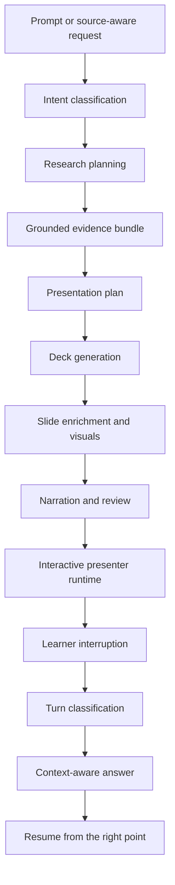
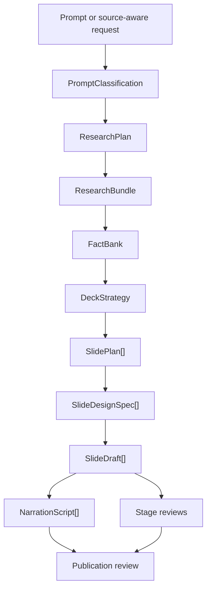
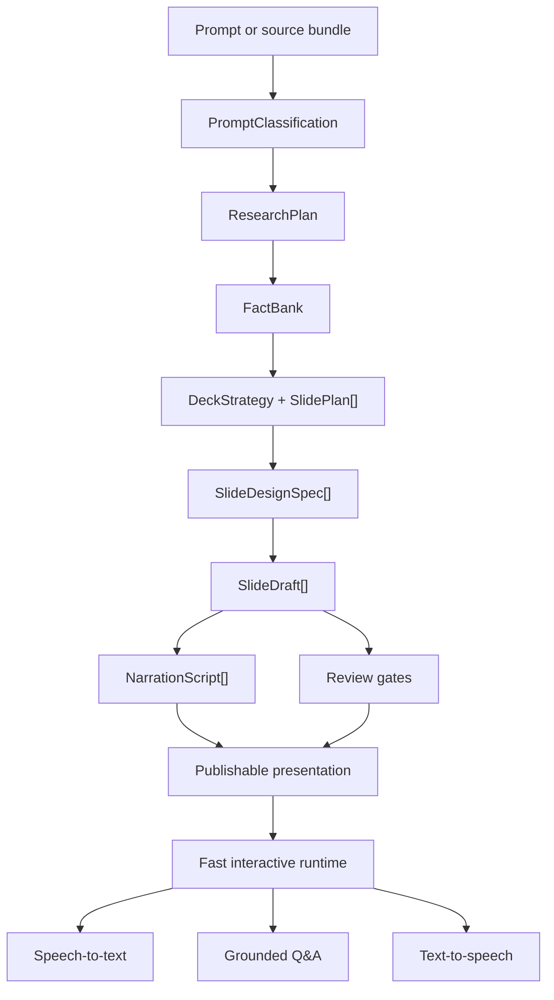
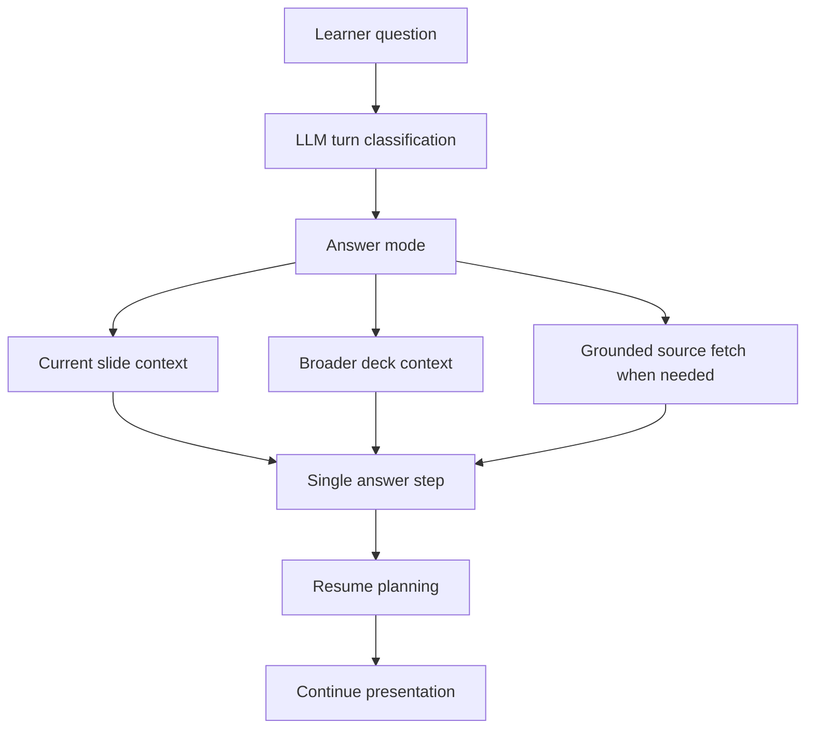

# SlideSpeech

SlideSpeech is an interactive AI presenter and AI teacher.

The product is not "generate slides and stop there". It is an orchestration runtime that can:

- turn a topic or source material into a teachable deck
- present it step by step
- let the learner interrupt naturally
- answer in context
- adapt the teaching style
- and resume from the right place

The ambition is simple:

- generate a usable presentation quickly
- keep it grounded in real source material when grounding matters
- present it like a teacher, not like a static slide deck
- let the audience interrupt without breaking the flow

The architecture is intentionally modular so LLM, vision, STT, TTS, VAD, storage, and research backends can be swapped without rewriting the core product logic.

Active implementation tracking lives in [tasks.md](/Users/johanengwall/github_repos/slidespeech/tasks.md).
This README is the product and status narrative, not the canonical task list.
Competitive and product-reference notes live in [docs/product-landscape.md](/Users/johanengwall/github_repos/slidespeech/docs/product-landscape.md).
The canonical target generation architecture lives in [docs/generation-pipeline-v2.md](/Users/johanengwall/github_repos/slidespeech/docs/generation-pipeline-v2.md).
Deck-mode and slide-role inventory/mapping lives in [docs/deck-and-slide-types.md](/Users/johanengwall/github_repos/slidespeech/docs/deck-and-slide-types.md).

## What makes SlideSpeech interesting

Most AI slide tools stop after deck generation.
SlideSpeech treats generation as the first step in a longer teaching loop:

1. classify the prompt into a structured presentation intent
2. build a grounded plan and deck
3. present the material progressively
4. classify interruptions and questions at runtime
5. answer in context
6. resume from the right point

That is the real product shape:

- a generation system
- a presentation runtime
- a conversational teaching layer on top

## Classification and pipeline

Classification is central to the system.
SlideSpeech tries to make explicit decisions early instead of relying on one giant prompt.

The target Pipeline 2.0 artifacts are defined in [docs/generation-pipeline-v2.md](/Users/johanengwall/github_repos/slidespeech/docs/generation-pipeline-v2.md). Deck-mode and slide-role mapping lives in [docs/deck-and-slide-types.md](/Users/johanengwall/github_repos/slidespeech/docs/deck-and-slide-types.md).

At generation time, the system classifies things like:

- `presentationFrame`
  - `subject`
  - `organization`
  - `mixed`
- `deliveryFormat`
  - `presentation`
  - `workshop`
- `contentMode`
  - `descriptive`
  - `procedural`
- whether live web grounding is required

At runtime, the system classifies learner turns into a small number of response modes so it can build only the context it actually needs.

### End-to-end product flow


```mermaid
flowchart TD
    A["Prompt or source-aware request"] --> B["Intent classification"]
    B --> C["Research planning"]
    C --> D["Grounded evidence bundle"]
    D --> E["Presentation plan"]
    E --> F["Deck generation"]
    F --> G["Slide enrichment and visuals"]
    G --> H["Narration and review"]
    H --> I["Interactive presenter runtime"]
    I --> J["Learner interruption"]
    J --> K["Turn classification"]
    K --> L["Context-aware answer"]
    L --> M["Resume from the right point"]
```

This is the core idea behind the codebase:

- classify first
- build the right context for that class of task
- answer or generate once
- validate locally
- keep the runtime fast and recoverable

## Current generation status

SlideSpeech is not meant to be "one prompt in, one static deck out".
The product goal is a grounded teaching pipeline with two modes:

- a generation pipeline that turns a topic or source bundle into a teachable presentation
- a runtime pipeline that presents, answers questions, adapts, and resumes in context

### Pipeline 2.0 migration state

The old generation path is intentionally being dismantled before V2 generation
is rebuilt. Production deck generation is fail-closed until the typed V2 stages
exist.

The target runtime will do this:

1. Classify the prompt into `PromptClassification`.
2. Plan and execute research only when it is needed.
3. Curate a traceable `FactBank`.
4. Plan `DeckStrategy` and `SlidePlan[]` before any visible slide copy is
   written.
5. Select `SlideDesignSpec[]` from content needs.
6. Generate `SlideDraft[]` from allocated facts and design specs.
7. Generate presenter-style `NarrationScript[]`.
8. Review each stage and fail closed when material or quality is insufficient.


```mermaid
flowchart TD
    A["Prompt or source-aware request"] --> B["PromptClassification"]
    B --> C["ResearchPlan"]
    C --> D["ResearchBundle"]
    D --> E["FactBank"]
    E --> F["DeckStrategy"]
    F --> G["SlidePlan[]"]
    G --> H["SlideDesignSpec[]"]
    H --> I["SlideDraft[]"]
    I --> J["NarrationScript[]"]
    I --> K["Stage reviews"]
    J --> L["Publication review"]
    K --> L
```

The critical rule is that validation protects publication. It must not repair a
bad deck into something that merely looks publishable.

## Current implementation reality

The legacy semantic generator, recovery builders, and static fallback decks have
been removed. Production deck generation is intentionally fail-closed while the
typed Pipeline 2.0 stages are implemented.

What currently works independently of new deck generation:

- the web application and saved-presentation runtime
- session state, interruption handling, and typed Q&A infrastructure
- backend Faster Whisper STT and Piper TTS provider boundaries
- hosted image resolution with renderer-safe visual fallback
- PowerPoint export infrastructure

What is being built now:

- explicit V2 artifact schemas and stage diagnostics
- agentic prompt classification, research planning, and fact curation
- deck strategy and per-slide fact allocation before prose generation
- layout-specific slide drafts and coherent deck-level narration

The application must not claim successful generation until a complete
`PublishablePresentation` has passed all V2 review gates.

## Experimental note: Qwen3-TTS on Apple Silicon

We tested `Qwen3-TTS` on Apple Silicon through an `MLX` runtime because voice quality was promising.
On this Mac-based setup, that path was not stable enough to keep:

- repeated Python crashes during `libmlx` / Metal device initialization
- at least one kernel panic and full machine reboot during benchmarking

For that reason, the local Mac workflow intentionally stays on `Piper` for now.
If we revisit `Qwen3-TTS`, it should happen on a separate machine or with a different runtime stack rather than this current Apple Silicon + MLX combination.

### Target pipeline

The target architecture is faster, cleaner, and stage-driven.
The goal is to generate a good deck from the right facts and plan, not to
recover a weak deck after the fact.

In plain terms, the target system should do this:

1. Turn the prompt into a clean classification artifact.
2. Build a fact bank from trusted sources when grounding is needed.
3. Allocate facts and slide jobs before prose generation.
4. Generate visible slides from allocated material and design specs.
5. Generate presenter narration after slide drafts are stable.
6. Keep question answering, STT, and TTS on a separate fast runtime path.


```mermaid
flowchart TD
    A["Prompt or source bundle"] --> B["PromptClassification"]
    B --> C["ResearchPlan"]
    C --> D["FactBank"]
    D --> E["DeckStrategy + SlidePlan[]"]
    E --> F["SlideDesignSpec[]"]
    F --> G["SlideDraft[]"]
    G --> H["NarrationScript[]"]
    G --> I["Review gates"]
    H --> J["Publishable presentation"]
    I --> J
    J --> K["Fast interactive runtime"]
    K --> L["Speech-to-text"]
    K --> M["Grounded Q&A"]
    K --> N["Text-to-speech"]
```

### What this means in practice

- The current system is already architected around provider boundaries and grounded runtime behavior.
- The target system keeps those boundaries, but removes hidden semantic fallback and post-hoc content repair.
- We are not there yet. Generation should be treated as an unfinished subsystem until Pipeline 2.0 is implemented and validated.

## Runtime Q&A pipeline

Question answering should behave like a small agent runtime, not like a bag of presentation-specific special cases.

### Target Q&A pipeline

The intended runtime path is:

1. Classify the learner turn with the LLM.
2. Route the turn into a small set of answer modes.
3. Build only the context that mode actually needs.
4. Answer once.
5. Resume from the right point after the answer.


```mermaid
flowchart TD
    A["Learner question"] --> B["LLM turn classification"]
    B --> C["Answer mode"]
    C --> D["Current slide context"]
    C --> E["Broader deck context"]
    C --> F["Grounded source fetch when needed"]
    D --> G["Single answer step"]
    E --> G
    F --> G
    G --> H["Resume planning"]
    H --> I["Continue presentation"]
```

The important design rule is that context-building follows classification, not the other way around.
That keeps the runtime simpler, reduces unnecessary fetches, and makes the system easier to extend to more languages later.

### Current answer modes

The runtime is moving toward these modes:

- `summarize_current_slide`
- `general_contextual`
- `grounded_factual`
- `simplify`
- `deepen`
- `example`
- `repeat`

In practice this means:

- current-slide summary questions should be answered from the current slide
- broader conceptual questions should use current slide plus deck context
- factual grounded questions may fetch source material before answering
- resume planning should happen after the answer is known, not as a separate competing path

This runtime is still under active refinement.
The architecture is now moving toward a real classify -> route -> answer -> resume pipeline, but question quality and latency are not yet at the final bar.

### Structured output findings

Recent benchmarking against LM Studio with `qwen/qwen3.6-35b-a3b` showed a clear split between two structured-output strategies:

- free JSON-in-text prompting was unreliable for small planner-style calls
- the model often produced only `reasoning_content` and hit `finish_reason = "length"` without final `message.content`
- this stayed true even when we tried:
  - higher token budgets
  - explicit thinking enabled
  - explicit thinking disabled
  - `/no_think`-style prompt prefixes

- tool/function-style output was materially more reliable for the same planner task
- with a required tool call, LM Studio returned structured tool arguments consistently enough to parse and validate

In practice this means:

- planner-like runtime classification should not rely on `chatText -> extract JSON -> parse`
- answer generation can still remain free-text
- critical structured runtime steps should move toward tool/function output when the serving layer supports it

This matters for multilingual support too:

- tool/function routing is more language-neutral than regex-heavy or prompt-fragile string parsing
- it reduces the need for English-specific after-the-fact output repair

## Current status

Active implementation tracking now lives in [tasks.md](/Users/johanengwall/github_repos/slidespeech/tasks.md). This README is a product/status narrative, not the canonical task list.

Available infrastructure:

- web presenter runtime
- per-slide narration generation
- segmented narration with per-slide progress tracking
- text-based conversational interruption flow
- browser-native speech recognition when available, with backend audio upload as fallback
- browser playback through a backend TTS provider for narration points and answers
- server-side Piper TTS assets for browser-accessible narration and answers
- structured visual slides with layouts, cards, callouts, flow blocks, and local illustration slots
- provider-driven slide illustration pipeline with mock-local rendering and hosted web-image lookup
- session state machine and narration-aware resume planning
- LM Studio integration behind an `LLMProvider`
- explicit external web research API and UI panel
- file-based persistence for decks, sessions, and transcripts

Temporarily disabled or pending under Pipeline 2.0:

- user-facing topic/source to publishable deck generation
- automatic web-grounded deck generation for time-sensitive topics
- production `PromptClassification` -> `ResearchPlan` -> `FactBank` -> `SlidePlan[]` -> `SlideDraft[]`
- publication of generated decks before V2 stage review passes

Not implemented yet:

- realtime voice runtime
- document and PPTX ingestion
- visual slide analysis
- provenance-aware runtime use of external research
- real backend STT provider beyond browser-native recognition and the mock server adapter

## Product principles

- provider interfaces first
- no vendor logic in core orchestration
- internal deck JSON is the runtime presentation state; Pipeline 2.0 documents define generation architecture
- simple, testable modules over clever but fragile abstractions
- explicit state transitions
- explicit provenance when external knowledge is used

## Current-topic grounding

Current-topic grounding is a target behavior for Pipeline 2.0, not an active
publishable-deck path while generation is fail-closed.

- examples: `latest`, `current`, `today`, `recent`, year-based topics like `2026`
- hosted web research should run before generation when grounding is required
- curated facts and source URLs should be passed into V2 fact curation and slide planning
- resulting decks should preserve explicit source provenance

If hosted web research is required but unavailable, generation should fail
instead of silently pretending the model has fresh facts.

## Architecture

```text
apps/
  api/        HTTP API, provider wiring, session orchestration
  web/        Next.js UI for generation, presenting, and debugging

packages/
  core/       state machine, planners, conversation runtime, resume logic
  providers/  LLM, web research, storage, export, mock speech/vision adapters
  types/      domain models, zod schemas, provider contracts
  ui/         shared UI components
```

Core product IP lives in `packages/core`.
Stable contracts live in `packages/types`.

This is what keeps migrations cheap:

- LM Studio now, vLLM later
- local speech stack now, hosted speech later
- file storage now, SQLite/Postgres later

without changing the teaching runtime itself.

## Conversation-first runtime

The runtime is designed so learner input is treated as conversation first, command second.

A user turn can produce:

- a natural assistant response
- inferred learner needs such as confusion, example, deepen, repeat
- runtime effects such as pause, back, restart slide, adapt detail level
- a resume plan

That lets turns like:

`I do not get why the processing step matters here`

behave like a real teaching interruption instead of a hardcoded button command.

## Provider model

Main interfaces live in [`packages/types/src/providers.ts`](packages/types/src/providers.ts).

Key interfaces:

- `LLMProvider`
- `VisionProvider`
- `SpeechToTextProvider`
- `TextToSpeechProvider`
- `VoiceActivityProvider`
- `WebResearchProvider`
- `DeckExporter`
- `DeckIngestionProvider`
- `DeckRepository`
- `SessionRepository`
- `TranscriptRepository`

Main domain models live in [`packages/types/src/domain.ts`](packages/types/src/domain.ts).

Key models:

- `Deck`
- `Slide`
- `SlideNarration`
- `Session`
- `UserInterruption`
- `ResumePlan`
- `PedagogicalProfile`
- `TranscriptTurn`

## Web research

Web augmentation is implemented as an explicit capability, not a hidden side effect.

Available endpoints:

- `GET /api/research/health`
- `POST /api/research/query`
- `POST /api/research/fetch`

Current behavior:

- search for external sources
- fetch selected pages
- summarize findings
- keep this separate from deck-grounded teaching

This is deliberate. The runtime should know when it is using:

- deck-grounded knowledge
- document-grounded knowledge
- externally augmented knowledge

instead of blending them invisibly.

## Local development

1. Install dependencies:

```bash
npm install
```

2. Copy environment defaults if needed:

```bash
cp .env.example .env
```

3. Start the app:

```bash
npm run dev
```

`npm run dev` and `npm run dev:api` automatically bootstrap the default server-side Piper voice if it is missing, so browser users of that backend hear the same narration without needing local browser TTS setup.

If you want to prefetch the Piper assets explicitly:

```bash
npm run setup:tts
```

4. Open:

- web: [http://localhost:3000](http://localhost:3000)
- api: [http://localhost:4000](http://localhost:4000)

## Stable local ports

Use fixed ports during development:

- web: `3000`
- api: `4000`
- LM Studio: `1234`

For a fixed-port API smoke test:

```bash
npm run verify:api
```

## LM Studio

LM Studio is supported as an OpenAI-compatible backend, but it is not treated as the center of the architecture.

Example config:

```bash
LLM_PROVIDER=lmstudio
ILLUSTRATION_PROVIDER=mock
LMSTUDIO_BASE_URL=http://127.0.0.1:1234/v1
LMSTUDIO_MODEL=your-loaded-model
LLM_TIMEOUT_MS=180000
LLM_FALLBACK_TO_MOCK_ON_ERROR=false
```

The LM Studio adapter lives in [`packages/providers/src/llm/lmstudio-llm-provider.ts`](packages/providers/src/llm/lmstudio-llm-provider.ts).

## Web research provider

The project supports both mock and hosted web research providers.

Example config:

```bash
WEB_RESEARCH_PROVIDER=mock
WEB_RESEARCH_TIMEOUT_MS=15000
```

or

```bash
WEB_RESEARCH_PROVIDER=hosted
WEB_RESEARCH_TIMEOUT_MS=15000
```

## Testing

Useful commands:

```bash
npm run typecheck
npm test
npm run build --workspace @slidespeech/web
npm run verify:api
```

## Roadmap

### Next

- document and PPTX ingestion
- real backend STT provider

### After that

- provenance-aware runtime use of external research
- stronger pedagogy engine
- visual slide analysis

## Recommended files to read first

- [`docs/architecture-plan.md`](docs/architecture-plan.md)
- [`packages/core/src/session-service.ts`](packages/core/src/session-service.ts)
- [`packages/core/src/conversation-turn-engine.ts`](packages/core/src/conversation-turn-engine.ts)
- [`packages/core/src/resume-planner.ts`](packages/core/src/resume-planner.ts)
- [`apps/api/src/server.ts`](apps/api/src/server.ts)
- [`apps/web/components/presentation-workbench.tsx`](apps/web/components/presentation-workbench.tsx)

## License

No license has been added yet.
