# Generation Architecture Map

Status: active working map
Last reviewed: 2026-09-18
Source of truth: [`generation-pipeline-v2.md`](./generation-pipeline-v2.md)
Generated import graph: [`generated/generation-imports.mmd`](./generated/generation-imports.mmd)

The generated graph distinguishes canonical V2 paths from transitional legacy
entrypoints. A file is not V2 merely because it lives under a directory named
`generation`; V2 code must live under a canonical `generation-v2` or
`generation/v2` boundary and pass the dependency policy in `arch:check`.

This file is the visual control surface for generation refactoring. It must stay
updated while the V2 pipeline is built. If a generation change cannot be placed
on this map, the architecture document is incomplete or the change is a patch.

## Maintenance Contract

For every substantial change under generation, research, deck planning, slide
generation, narration, validation, or Q&A:

1. State the V2 stage before editing.
2. Delete or isolate the legacy path being replaced.
3. Update this file when a stage boundary, adapter, or removal status changes.
4. Run `npm run arch:graph` after import-level changes.
5. Run `npm run arch:check` before closing the work.
6. Keep `tasks.md` aligned with the current removal status.

The graph policy also forbids canonical V2 modules from importing the legacy
`PresentationIntent`, `PresentationPlan`, `GenerateDeckInput`, or `SlideBrief`
contracts. Natural-language semantics belong to agentic stages; deterministic
V2 code is limited to artifact shape, transport, source hygiene, rendering, and
runtime safety.

`arch:check` detects stale generated imports and missing map sections. It cannot
verify that the hand-maintained map describes the implementation correctly;
that comparison is part of every substantial change's manual review.
The legacy removal queue below is the active list of removed paths and any
remaining cleanup that must not shape V2.

## Current Architecture Map

Private remote access is a separate transport boundary: ngrok HTTPS with required
shared Basic Auth -> loopback Next -> same-origin `/api` proxy -> loopback API.
All API/audio/export paths share the login; queues and model stages are unchanged.
See [private sharing](./private-sharing.md). No account/tenant layer is implied.

```mermaid
flowchart LR
  subgraph App["Current application: transitional runtime"]
    UI["Studio: generate complete presentation"] --> Jobs["V2 API jobs: progress and cancellation"]
    API["Retained legacy generation routes"] --> Disabled["STOP: generateDeck disabled"]
    Saved["V1 library retired: local files archived"] --> Runtime["Retained legacy read routes; no V2 library access"]
    Library["New library: actual cover scenes, search, confirmed archive"]
  end
  subgraph V2["Implemented V2: research through reviewed publication"]
    Eval["eval_generation_v2_phase4"] --> Request["PresentationRequestArtifact"]
    Jobs --> Request
    Request --> Classification["PromptClassification: semantic intent + source-candidate selection"]
    Classification --> Plan["ResearchPlan"]
    Plan --> Acquisition["ResearchBundle: acquired pages"]
    Acquisition --> Evidence["EvidenceSet: selected evidence"]
    Evidence --> Facts["FactBank"]
    Facts --> Review["ResearchReviewResult: per-requirement audit"]
    Acquisition -. "metadata manifest, no raw pages" .-> Review
    Review --> Approved["Approved research output, not a deck"]
    Approved --> Strategy["DeckStrategy: ordered roles and audience questions"]
    Strategy --> Allocation["SlidePlanSet: fact IDs, overlap and permissions"]
    Allocation --> OutlineReview["Outline review: explicit semantic approval"]
    OutlineReview --> Design["Agent theme + composition selection: honors Advanced, no prewritten claims"]
    Publication --> Preview["Studio: reviewed slides, script and Start presentation"]
    Review -. "one targeted retry" .-> Plan
    Review -. "one targeted retry, preserve plan" .-> Acquisition
    Review -. "one targeted retry" .-> Evidence
    Review -. "one targeted retry" .-> Facts
  end

  Acquisition --> Images["Image candidates on source pages: unapproved metadata"]
  Images --> Assets["Design-owned selection + bounded public raster download"]
  Assets --> Vision["Agent vision: exact normalized pixels and slide purpose"]
  Vision --> Design
  Design --> Drafts["Slide writing"]
  Drafts --> SlideReview["Factual slide review: material errors, not cosmetic perfection"]
  SlideReview -. "one author revision of identified slides; preserve research/design" .-> Drafts
  SlideReview --> Narration["Whole-deck narration generation"]
  Narration --> Humanizer["Narration review: humanizer + factual fidelity"]
  Humanizer -. "one owning-stage revision, new artifact + review" .-> Narration
  Humanizer --> Publication["Explicit final review + complete publication contract"]
  Drafts --> Scene["Shared scene: 20 layout roles, three distinct design systems, whole-image geometry"]
  Scene --> WritingContract["Shared field geometry + measured line capacity"]
  WritingContract --> Drafts
  Scene --> TextFit["Font metrics + Unicode line layout; explicit overflow"]
  TextFit --> Canvas["16:9 browser canvas; measured lines"]
  TextFit -. "one author revision on overflow" .-> Drafts
  TextFit --> PPTX["Native PPTX; same measured lines"]
  Publication --> Store["Write-once V2 publication + measured scenes"]
  Store --> Presenter["V2 player: unchanged slides + approved script"]
  Store --> Library
  Library --> Presenter
  Library --> Archive["Original publication bytes retained outside active library"]
  Presenter --> Speech["Shared backend Piper: exact approved passages"]
  Presenter --> Questions["Typed or confirmed question: preserve audio cursor"]
  Questions --> QuestionScope["LLM relevance and evidence classification"]
  Store --> QuestionContext["Full immutable material; no snippet ranking"]
  QuestionScope --> QuestionContext
  QuestionContext --> Answer["LLM answer and bridge"]
  Answer --> AnswerReview["Explicit LLM answer approval"]
  AnswerReview --> AnswerAudio["Server-approved answer + bridge: Piper audio"]
  AnswerAudio --> Resume["Reviewed bridge; restart interrupted approved passage if Continue is enabled"]
  Resume --> Presenter
  Presenter --> Recording["Record: immediate pause, input meter, Cancel"]
  Recording --> STT["Faster Whisper + Silero; bounded rolling transcripts"]
  STT --> Confirm["Edit and confirm transcript"]
  Confirm --> Questions
  Voice["Pending hands-free speech onset and echo handling"] -.-> Recording
  QuestionContext -. "pending" .-> FollowUp["Controlled follow-up research"]

  classDef implemented fill:#163d2a,stroke:#4ade80,color:#ecfdf5;
  classDef pending fill:#343b46,stroke:#94a3b8,color:#f8fafc;
  classDef stopped fill:#4a2f10,stroke:#f59e0b,color:#fff7ed;
  class UI,Jobs,Preview,Eval,Request,Classification,Plan,Acquisition,Evidence,Facts,Review,Approved,Strategy,Allocation,OutlineReview implemented;
  class Design,Drafts implemented;
  class Images,Assets,Vision implemented;
  class Narration,Humanizer implemented;
  class Publication,Store,Presenter,Speech,Library,Archive implemented;
  class Questions,QuestionScope,QuestionContext,Answer,AnswerReview,AnswerAudio,Resume,Recording,STT,Confirm implemented;
  class Voice,FollowUp pending;
  class Scene,WritingContract,TextFit,Canvas,PPTX implemented;
  class Disabled stopped;
```

The runner records stage artifacts, progress, deadlines, and bounded rejection
feedback. Execution failure/cancellation ends a stage rather than replaying it.
Its deadline/cancellation primitive is shared with evidence selection per page
and sequential slide writing: 180s per page or slide, including a slide's optional
fit revision, with a work-count-derived stage deadline capped at 15 minutes.
The provider centrally reserves 7,000 completion tokens per slide-writing call,
including reasoning and final JSON; low effort and deadlines are unchanged.
This is a fixed single-unit resource allowance, not a semantic rule or retry increase.
A timed-out unit fails the stage without returning a partial evidence set or
publishing a partial deck. This changes execution ownership, not semantic stages.
Request capture uses standard link parsing rather than a URL regex plus
unconditional punctuation trimming. Full HTTP(S) URLs remain explicit sources;
scheme-less domain mentions are separate immutable candidates, selected or declined
semantically by the existing classifier. Only selected candidate positions become
ordinary requested sources and direct research targets. Balanced path delimiters
survive; semantics and public-fetch security retain their existing owners.

Source acquisition renders new HTML responses as bounded static CSS layout,
preserving exact text blocks and coordinates instead of treating DOM adjacency
as attribution. `rendered-research-document.ts` owns isolated Chromium capture;
all style/font requests use the public-address transport and page scripts/media
are disabled. ResearchBundle retains this single source representation. Capture
rejects unavailable CSS but records unavailable fonts while measuring the
browser's actual substitute-font layout. It never fabricates missing source text;
empty acquisition reports actual fetch failures and candidate rejection reasons.
Evidence selection preserves whole block lines and curation/review interpret relationships.
This is not screenshot vision, semantic pairing or support for script-only sites.
Historical HTML evidence remains readable. Classification consistency now
uses the existing structured-client correction boundary before core acceptance.
Current fact authoring no longer assigns display permissions: research owns
claims/provenance; allocation and writing own visible versus spoken material.
Legacy fact labels remain readable in immutable publications.

Image selection receives all candidates and their source metadata, but not their
responsive-resolution URL arrays. Those remain in the acquired artifact for the
image downloader. This is a transport projection, not semantic filtering or loss
of deck context; pixel review still inspects the exact downloaded/rendered bytes.

`grounded-authoring-policy.ts` defines the shared semantic meaning of allowed
model knowledge for slide/narration writers and reviewers: explanation/examples
do not authorize extra subject-specific facts. Notes are not exempt from
grounding. This adds no pipeline stage or deterministic text guardrail.

Slide review now receives `slideFactualReviewView`: unchanged claims, uncertainties,
visible copy and notes, with author planning/design context removed. It verifies
factual fidelity rather than approving the already-approved story again. Original
index order and core artifact mapping are preserved. Outline/render/publication
retain their existing story, fit and whole-experience responsibilities. Focused
live controls improved rejection, but end-to-end factual acceptance remains open.

The API now continues through whole-deck narration and humanizer review before
returning its preview. Legacy saved slide-only previews remain readable but are
not silently converted to speech. `narrateSlides` is also the exact continuation
used by the diagnostic narration evaluator, not a second semantic implementation.
Writer owns one targeted revision; reviewer never rewrites. The retained legacy
SessionService/NarrationEngine path is not invoked by V2. Final review and exact
publication contracts now precede write-once storage and the V2 player. The audio
adapter reuses only the shared configured Piper provider, not legacy narration
or session generation. Native browser audio owns pause/time/ended; a new run never
rewrites a published script. Text and confirmed recordings share the three-stage
V2 question pipeline. Approved answer/bridge audio is server-owned, with conditional
resume at the start of the interrupted approved passage. The visible Continue
preference and the same question POST remain the runtime boundary. That POST can
stream real stage events and the reviewed result to a typed web reader; the modal
shows actual steps, visible activity and elapsed time. It has no timer-based
progress, extra question job store or changed semantic pipeline. The Continue
preference replaces the previous hidden was-playing check. Piper clips preserve
the approved passage order; the next clip is preloaded. Rolling STT uses real Silero VAD and unknown
confidence, not language-probability scoring or legacy mock VAD. Cancellation
releases microphone tracks, rejects stale responses and bounds STT worker work.
Physical microphone quality and hands-free onset/echo acceptance remain open;
an input-level meter is not a speech classifier. Follow-up research is not connected.
The in-app permission modal also failed to dismiss on Cancel in the live browser
test; isolated recorder cleanup tests do not establish component acceptance.
Research review uses one coherent material-sufficiency instruction, not a second
per-fact metadata checklist. Its full factual context, exhaustive keyed coverage
audit, low reasoning, finite token budget and explicit approval gate are unchanged.
Unsupported assessments carry their own retry instructions without needing a
duplicate generic issue. This is a simplification inside the existing review
responsibility, not a new summarization, validation or repair stage.
The first fresh source-backed Studio run has now reached reviewed slide previews
from real W3C sources. It took 10m44s and exposed authored qualification loss
despite slide-review approval (R19); this proves the connected path, not general
content quality, efficient latency, narration or publication readiness.
The extended R19 trace locates the first changed meaning in strategy purpose,
then repeated in allocation and design prose.
An instruction-only experiment was tested and withdrawn: it did not reliably
prevent or detect the distortion. The subsequent structural change removes
allocation mini-scripts and design emphasis/speaker prose. Strategy alone owns
each audience question; allocation selects facts and design selects layout.
Full facts and story context remain available. Factual authority remains an
architectural requirement, not a demonstrated universal fix. There is
no additional reviewer or semantic text filter. A fresh music preview succeeded
during the experiment; both W3C continuations failed on finite execution budgets.
R19 remains open, and clear positive/negative controls passing at both baseline
and experiment is not general semantic acceptance.
The smaller planning contracts subsequently completed a W3C continuation in
3m27s, but the writer still independently overgeneralized and review approved.
A fresh, unrelated fiction-writing browser run reached design, then exhausted
the existing writer output budget despite low effort. Neither semantic acceptance
nor general execution reliability is closed by this structural simplification.
Publication contracts now accept the actual research review without dropping
its requirement audit. This is contract integration, not a working publication
implementation.

The new Studio replaces the legacy launchpad and its unused browser generation
clients. It calls `/api/generation-v2/jobs`, not the old generation
queue. The API adapter runs the connected V2 pipeline with low reasoning;
it owns no classification, research planning, semantic review, or fallback logic.
One active generation and up to four waiting jobs are allowed. A FIFO queue reports
position and supports cancellation before dispatch. The latest 20 jobs are held
in process memory; waiting and still-unwinding jobs are never evicted.
The browser reconnects by job id after reload, reports missing jobs after API
restart, and never silently reruns. Cancel propagates an external abort signal
through the existing stage runner to model/research calls; late output cannot
replace a cancelled result. On-disk V2 traces remain the execution record.
Studio exposes those same stages in a dismissible generation dialog, not a new
pipeline. Optional API timing metadata comes from recent successful same-model
traces; queue wait is separate, slide-count scaling is disclosed, and absent
measurements or overruns remain explicit. Timing never controls content or gates.
For the private single-server beta, one serial question lane runs alongside the
serial generation lane, keeping current V2 model calls at most two. Other questions
wait before their execution budgets begin; STT has its own serial, bounded queue.
These API admission controls own capacity only, not model semantics or retries.
This integration does not close the open research acceptance work. Publication
now follows the explicit final gates described above. Advanced exposes implemented
request fields, including automatic/Paper/Editorial/Signal style selection;
unsupported voice controls are not shown.

`GenerationV2Pipeline` delegates research to the existing stage group, then runs
strategy, allocation, outline review, design selection, slide writing and slide
review through the same stage runner. No research is reconstructed or replayed
by the UI. Output is `slides-ready`,
not published. Core owns IDs, ordering and reference/shape checks; the agent
owns the story, material allocation and semantic review. Explicit rejection or
unavailable review stops the run. No new retry engine, static outline, semantic
regex, or legacy planner is involved. The controlled recorded-artifact eval can
consume approved research or an approved outline using the same pipeline methods;
it is not a fresh end-to-end research benchmark or a publication route.

Classification now preserves structure/delivery as `presentationDirections`,
separate from research coverage. Strategy owns each story beat's role before
allocation. A single positive `allowedFactIds` list bounds both copy and speech;
the agent selects recap material, and outline review checks whether it answers
the strategy question. No semantic strings are filtered or repaired by core.
Old experimental planning artifacts must be regenerated from approved research;
there is no prose-migration adapter or alternate planning route.

Slide review can request one author-owned semantic revision of explicitly
identified defective drafts. Other drafts/scenes and all upstream artifacts stay
unchanged. The same writer measures corrected slides, preserving factual feedback
through its bounded physical-fit correction, then the whole new set is reviewed.
Unscoped or upstream-owned errors, execution failures and a second rejection stop;
there is no full rerun. Slides, narration and publication accept useful imperfect
work, not material misinformation; cosmetic advice does not trigger a revision.

The shared scene is connected to slide generation and Studio. The native PPTX
adapter remains a rendering foundation, not a publication route. Six manually authored test fixtures
exercise geometry, text and notes in both renderers. A shared font-aware layout
pass now measures actual font assets, preserves source text, and rejects overflow
or unavailable glyphs. Both renderers require its exact line plan rather than
independently wrapping text. Slide writing receives measured overflow and owns
one revision of the affected draft. Before writing, the same layout frame supplies
field paths, geometry and font-measured capacity; there is no second layout
description in the author prompt. Full upstream Source Serif 4/Source Sans 3
assets are shared by server/browser. Missing glyphs are asset failures, not
content-rewrite feedback. PowerPoint font distribution
and published runtime integration remain pending.
The developer-only proof server is separate from the user-facing application.

Acquisition now retains unapproved image candidates from the acquired page's
img and social-image metadata, using htmlparser2 rather than hand-written HTML
and RSS tag/attribute loops. Each page reports candidate count and truncation;
core assigns candidate IDs under the exact source/page identity. There is no
semantic keyword ranking. Captions and
declared dimensions are metadata, not factual evidence or quality approval.
Text research review intentionally receives the same text-only acquisition
manifest, not the new unassessed image metadata. Raw response decoding is bounded
before parsing. Older pages without discovery are not interpreted as searched.
Design now selects at most four candidates, downloads bounded raster images
through the same connection-time public-address policy as research, normalizes
them using the corrected provider decoder and inspects actual pixels with the
configured model. Exact byte identity, source lineage and per-slide decisions
survive into the design artifact. Selected whole images use the same geometry in
browser and native PPTX. Reuse rights remain explicitly unverified; SVG,
picture/art-direction sources and stronger visual-quality acceptance remain pending.
Standard img srcset resolution variants are retained and used without URL rewriting.
Metadata-only approval and approval after vision failure are forbidden. This is
an acquisition/design responsibility, not a second research pipeline or an
automatic generic-picture fallback. See the canonical source-image responsibility.

PPTX package integrity is now verified with a minimal, versioned correction to
the dependency's shared-master registration. This runs at dependency installation,
not as an extra generation or output-repair stage. The proof opens without repair
and all six fixture slides have been inspected in PowerPoint, again after shared
text layout was added. The owning generation-stage response to overflow is connected. Varied
generated-deck acceptance and the full layout library remain
pending; the map does not imply a publication-ready design stage.

Phase 7's required humanizer assessment is a responsibility of the existing
narration review, not a new orchestration layer. It evaluates the complete
spoken script against the story and factual context. Review supplies feedback;
the narration generator owns at most one revision under the existing budget.
Only the reviewed script reaches publication and TTS, with no runtime rewriting.
This is now connected through publication and initial Piper/browser playback.
The V2 player also owns fullscreen/window-fill display, preserving its mounted
audio, measured scenes and question flow. This adds no generation stage or artifact.
Full listening and multilingual acceptance remain open. Live W3C narration still
repeats the known factual scope defect and its reviewer misses it; R19 is not fixed.

Live acceptance checkpoint (2026-09-16): `generation_run_tg60phie` completed
eight slides and published four source images, verified in the browser. However,
its generated spoken segments contain a delivery-metadata field name as audible
text on every slide. Both existing model reviews missed it and approved. Manual
narration acceptance is therefore failed despite technical publication success.
The writer now excludes unused delivery cues from its output contract; older
immutable artifacts remain readable. Both existing reviewers consume the exact
`narrationPassages` projection through `narrationPlaybackView`, without dropping
any spoken text. Review policy distinguishes accidental spoken instructions
(revision required) from legitimate audience content. There is no named-string
removal rule, extra review stage or playback rewrite. The original publication
remains unchanged; controlled live findings and acceptance limits are in
`tasks.md`.

Evidence selection owns relevance only: it assesses every supplied source
segment. The provider's shared completion-capacity policy scales whole-artifact
allowances from slide/requirement counts and narration duration, capped at 14,000
tokens, with unchanged low reasoning, full input and stage deadlines. Fixed
per-page/per-image/per-slide calls remain bounded independently. This replaces
the isolated fact-capacity helper; it is not a semantic count rule, extra retry,
or a tokenizer/context-admission guarantee. Fact curation now has a 10,000-token
floor. Fixed Q&A classification/answer/review allowances also live in that helper
(1,500/2,500/5,000); increasing review headroom changes no context, grounding,
approval or deadline contract. Selection
retains exact selected text. Candidates pack whole multilingual
sentences with exact source offsets and whole-sentence overlap rather than
character-cut fragments. Semantic attribution remains model-owned; the aggregate
evidence budget is unchanged. The redundant segment-by-requirement
matrix is removed from generation; old publications can still read and validate
their historical optional coverage field without rewriting artifacts. Full
research questions and requirements remain in the selector's context.
Fact curation selects sparse lists of supplied snippet and requirement ids;
the core validates references and assigns new fact identities. This replaces
the output-heavy boolean matrix without adding a stage. Current `FactBank`
contains claims, provenance and source-linked uncertainties, not duplicated
source summaries, coverage assessments or self-approval. Requirement links are
contributions, not fulfillment. Research review alone owns exhaustive coverage,
source quality and readiness; its exact-artifact approval gates outline and
publication. Empty banks and missing/rejected reviews cannot pass. Historical
banks have a separate read-only contract and explicit insufficiency still blocks.
The active outline-preview path does not yet produce refreshed slides or PPTX.
The shared structured client supplies the same request schema to the model's
prompt and the grammar sampler; runtime contract validation remains mandatory.
The client treats an explicit output-token exhaustion as incomplete execution,
not a parser-repair opportunity: one request, a diagnostic, and a failed stage.
Completed malformed responses retain their bounded parser-feedback retry.

Acquisition fetches explicit URLs first, then shares the remaining attempt
budget across priority-ordered exploratory targets, one agent-selected page
per target per round. Search results are reused; later rounds can consider
newly discovered links. Global, per-domain, and total per-target attempt limits
bound the work without classifying relevance or declaring semantic coverage.

Research review and publication retain a content-free view of the acquisition
bundle with the same identity: source status/truncation, page sizes, fetch errors,
and attempted/skipped target outcomes. An acquisition-owned retry preserves the
plan and rebuilds acquisition and its downstream artifacts within the existing
one-retry budget. Metadata is not semantic coverage and does not replace evidence.

Open research issue: source selection still cannot inspect already fetched
content, so it can infer relevance from titles and repeat candidate work.
R9b2 must provide bounded content access without a parallel summary pipeline
or duplicating raw pages into every model call. Acquired text is bounded
(20,000 characters and 100 links per page by default); the manifest now exposes
truncation but does not itself solve incomplete acquisition or reasoning quality.

## Target V2 Shape

```mermaid
flowchart LR
  Request["PresentationRequestArtifact"] --> A["PromptClassification"]
  A --> B["ResearchPlan"] --> C["ResearchBundle"]
  C --> Evidence["EvidenceSet"] --> D["FactBank"]
  D --> ResearchReview["ResearchReviewResult"]
  ResearchReview --> E["DeckStrategy"] --> F["SlidePlan[]"]
  F --> OutlineReview["Outline review"] --> G["SlideDesignSpec[]"]
  G --> H["SlideDraft[]"] --> SlideReview["Slide review"]
  SlideReview --> J["NarrationScript[]"] --> NarrationReview["Narration review"]
  NarrationReview --> FinalReview["Publication review"]
  FinalReview --> K["PublishablePresentation: immutable artifacts and reviews"]
  K --> Runtime["Presenter runtime"] --> L["Grounded Q&A"] --> Runtime
```

## Legacy Removal Queue

| Priority | Status | Current path | Why it must not shape V2 | Target replacement |
| --- | --- | --- | --- | --- |
| P0 | removed 2026-05-08 | `buildOutlineScaffoldDeck` | Built a fake deck with public-looking copy before real generation. | `DeckStrategy` + `SlidePlan[]` without visible slide prose. |
| P0 | removed 2026-05-08 | `buildPromptSafeWorkingDeck` | Backfilled missing slides with fallback text and could leak scaffold assumptions into prompts. | Prompt from `SlidePlan[]` plus already finalized `SlideDraft[]`. |
| P0 | removed 2026-05-09 | `slide-contract-copy.ts` and `slide-contract-points.ts` public copy helpers | Deterministic contract code must not behave like a hidden author or acceptance oracle for slide copy. | Deleted; temporary contract adapter may only provide structural slide roles, fact allocation, and constraints. |
| P1 | removed 2026-05-08 | `allowScaffoldFallbacks` in `normalizeDeck` | Kept final normalization coupled to internal scaffold behavior. | Separate internal artifact validation from strict final deck normalization. |
| P1 | visual card repair removed 2026-05-09; deck validation-only reporting remains | `validateAndRepairDeck` visual card repair | Mutated deck output after generation. | Renderer/layout fallback only, or validation-only issue reporting. |
| P1 | removed 2026-05-09 | `validateAndRepairNarrations` deterministic narration rebuild | Could publish narration that was not generated as a presenter script. | Validation-only reporting; regenerate narration or fail review. |
| P1 | removed 2026-05-09 | `normalizePresentationPlan` default storyline/objectives/title recovery | Could turn a weak or malformed plan into a public-looking outline. | Keep usable LLM plan beats; fail if no usable title, objectives, or storyline remain. |
| P1 | removed 2026-05-09 | `buildSlideBriefs` contract-text required-claim fallback | Could turn internal contract focus/objective text into slide claims. | Required claims come from scoped facts only; otherwise leave claims empty and let LLM synthesize or fail review. |
| P1 | removed 2026-05-09 | Provider narration intro/transition/outro injection | Could add spoken presenter copy that the narration model did not generate. | Preserve generated narration segments and fail if opening/closing/spoken-flow requirements are missing. |
| P1 | removed 2026-05-09 | Legacy slide-contract/deck-normalization/enrichment/draft-assessment cluster | Contained static slide roles, contract prose selection, deterministic visual fallback, and test-only recovery logic that could bias V2 toward the old pipeline. | Deleted. V2 must introduce fresh `DeckStrategy`, `SlidePlan[]`, `SlideDesignSpec[]`, and semantic validators without importing legacy contract modules. |
| P1 | removed 2026-05-09 | Workbench/debug UI route and legacy eval/benchmark scripts | Kept obsolete generation surfaces and measurement paths around the V1 pipeline while V2 is intentionally fail-closed. | Deleted; V2 development should use the architecture graph, focused tests, and explicit live scenarios instead. |
| P1 | removed 2026-05-09 | macOS-only `system-tts` provider | Could make demo behavior depend on a local workstation voice instead of a backend provider available to all users. | Deleted; retained provider slots are backend-safe `mock`, `piper`, and `hosted`. |
| P1 | reduced 2026-05-09 | `evaluateDeckQuality` semantic text checks | Acted as a hidden V1 semantic reviewer with hardcoded text-pattern checks for prompt contamination, template language, topic alignment, and repetition. | Reduced to structural/publication metadata checks only. Semantic deck judgment belongs to LLM review and explicit V2 stage contracts. |
| P1 | reduced 2026-05-09 | `validateAndRepairDeck` semantic text checks and `text-quality-guards.ts` | Kept a second local semantic reviewer inside deck validation with English-oriented prompt/meta/template language checks. | Deleted local text-guard module; deck validation now reports structure/completeness/repetition signals only. Semantic rejection belongs to `reviewDeckSemantics` and publication review, and explicit reviewer rejection is publication-blocking. |
| P1 | reduced 2026-05-09 | `normalizePresentationPlan` V1 meta/instruction text filters | Filtered model-authored plan artifacts through English legacy deck-shape patterns before the V2 planning stage exists. | Plan normalization now only enforces artifact shape, language consistency, and generic deduplication. Semantic plan quality belongs to V2 planning/review. |
| P2 | reduced 2026-05-09 | `buildPresentationGenerationContext` research orchestration | Mixed intent, planning, source fetching, subject resolution, grounding classification, and session assembly in one function. | Reduced to linear orchestration; source execution and fact curation now live behind explicit stage modules. |
| P2 | reduced 2026-05-09 | Research/source heuristics spread across services | Hard to see what is source hygiene vs semantic fact curation. | Planning, source hygiene, cache, subject resolution, coverage support, source analysis, and fact-bank construction now have named modules; remaining deterministic source hygiene must stay language/source-quality oriented and not become deck-copy recovery. |
| P2 | reduced 2026-05-09 | `SessionService` publication gates | Mixed session lifecycle with final review, deck review, and reviewed-narration publication validation. | Publication review and reviewed-narration validation now live in `session-publication-review.ts`; session service delegates the gate and keeps lifecycle orchestration. |
| P2 | reduced 2026-05-11 | `OpenAICompatibleLLMProvider` task prompts | Mixed provider transport with grounding classification, presentation planning, narration generation, semantic deck review, and final presentation review prompts. | Provider now delegates those LLM tasks to named `openai-compatible-*` modules; the provider file is closer to API transport plus remaining runtime methods. |
| P2 | reduced 2026-05-11 | API/provider defaults for mock LLM and mock web research | Defaulting to `mock` could make missing model or research setup look like successful generation. | API default and `.env.example` now use `lmstudio` and `hosted` web research; `createPresentation` rejects mock LLM so mock generation remains test-only. |
| P2 | reduced 2026-05-11 | Review-code regex and English slide-number parsing | Core review helpers inferred missing slide ids from prose and regex-coded review classes. | Review repair follow-up now uses explicit `slideId` plus generic code fragments; missing `slideId` no longer triggers invented local mapping. |
| P2 | removed 2026-05-11 | Final-review narration repair side path | Final presentation review could act as both quality gate and narration author by returning replacement narrations. | Production review now reports issues only; publication ignores review-supplied narration rewrites and requires narration-stage regeneration instead. |
| P2 | removed 2026-05-11 | Q&A deterministic context/source answer fallback | Could answer user questions by extracting ranked slide or source snippets when the answer LLM failed or produced invalid output. | Q&A now uses LLM answer generation plus LLM validation, or returns an honest unavailable answer. Runtime command routing and explicit local slide-summary/example responses remain allowed. |
| P2 | removed 2026-05-11 | Guessed research URLs and support pages | Research could silently prefetch guessed encyclopedia pages or hardcoded same-domain paths, making source acquisition look better than the actual prompt/search stage. | Direct fetches now use explicit URLs only; additional source acquisition must come from site-scoped or provider search results. |
| P2 | reduced 2026-05-11 | Static slide-arc prompt templates | Plan prompts repeated fixed organization/teaching arcs and could make unrelated decks converge on the same structure. | Arc guidance now states structural requirements only: real intro, distinct middle beats, and synthesis/question-ready ending. |
| P2 | removed 2026-05-11 | Local semantic source-copy blacklists and synthetic highlights | Source hygiene filtered broad marketing claims and invented "notable focus areas" highlights in local code. | Local source hygiene now removes navigation, CTA, scrape, discussion, and low-quality-source noise only; semantic source value belongs to LLM classification/review. |
| P2 | classified 2026-05-11 | Remaining fallback/mock/regex references | Some names remain because they protect runtime controls, rendering, transport compatibility, or tests. | Allowed categories: `keep-runtime-safety`, `keep-render-safety`, `keep-transport-compat`, `test-only`, and `documented-temporary` prompt routing. None may author publishable deck copy. |

## Active Rule

New V2 generation code must not depend on removed legacy modules or recreate
their behavior as local semantic fallback. If a temporary adapter is needed to
keep the app running, it must be labeled on this map and removed from the queue
when replaced. Deck generation stays fail-closed until V2 planning, slide
generation, narration, publication, and runtime handoff are implemented and
validated. Implementing `DeckStrategy` alone does not reopen generation.
