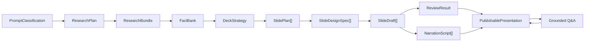

# Generation Architecture Map

Status: active working map
Last reviewed: 2026-05-11
Source of truth: [`generation-pipeline-v2.md`](./generation-pipeline-v2.md)
Generated import graph: [`generated/generation-imports.mmd`](./generated/generation-imports.mmd)

The generated graph distinguishes canonical V2 paths from transitional legacy
entrypoints. A file is not V2 merely because it lives under a directory named
`generation`; V2 code must live under a canonical `generation-v2` or
`generation/v2` boundary and pass the dependency policy in `arch:check`.

This file is the visual control surface for generation refactoring. It must stay
updated while the V2 pipeline is built. If a generation change cannot be placed
on this map, the architecture document is incomplete or the change is a patch.

## Maintenance Contract

For every substantial change under generation, research, deck planning, slide
generation, narration, validation, or Q&A:

1. State the V2 stage before editing.
2. Delete or isolate the legacy path being replaced.
3. Update this file when a stage boundary, adapter, or removal status changes.
4. Run `npm run arch:graph` after import-level changes.
5. Run `npm run arch:check` before closing the work.
6. Keep `tasks.md` aligned with the current removal status.

The graph policy also forbids canonical V2 modules from importing the legacy
`PresentationIntent`, `PresentationPlan`, `GenerateDeckInput`, or `SlideBrief`
contracts. Natural-language semantics belong to agentic stages; deterministic
V2 code is limited to artifact shape, transport, source hygiene, rendering, and
runtime safety.

`arch:check` fails when the visual architecture artifacts are stale or missing.
The legacy removal queue below is the active list of removed paths and any
remaining cleanup that must not shape V2.

## Current Architecture Map

## Target V2 Shape

## Legacy Removal Queue

| Priority | Status | Current path | Why it must not shape V2 | Target replacement |
| --- | --- | --- | --- | --- |
| P0 | removed 2026-05-08 | `buildOutlineScaffoldDeck` | Built a fake deck with public-looking copy before real generation. | `DeckStrategy` + `SlidePlan[]` without visible slide prose. |
| P0 | removed 2026-05-08 | `buildPromptSafeWorkingDeck` | Backfilled missing slides with fallback text and could leak scaffold assumptions into prompts. | Prompt from `SlidePlan[]` plus already finalized `SlideDraft[]`. |
| P0 | removed 2026-05-09 | `slide-contract-copy.ts` and `slide-contract-points.ts` public copy helpers | Deterministic contract code must not behave like a hidden author or acceptance oracle for slide copy. | Deleted; temporary contract adapter may only provide structural slide roles, fact allocation, and constraints. |
| P1 | removed 2026-05-08 | `allowScaffoldFallbacks` in `normalizeDeck` | Kept final normalization coupled to internal scaffold behavior. | Separate internal artifact validation from strict final deck normalization. |
| P1 | visual card repair removed 2026-05-09; deck validation-only reporting remains | `validateAndRepairDeck` visual card repair | Mutated deck output after generation. | Renderer/layout fallback only, or validation-only issue reporting. |
| P1 | removed 2026-05-09 | `validateAndRepairNarrations` deterministic narration rebuild | Could publish narration that was not generated as a presenter script. | Validation-only reporting; regenerate narration or fail review. |
| P1 | removed 2026-05-09 | `normalizePresentationPlan` default storyline/objectives/title recovery | Could turn a weak or malformed plan into a public-looking outline. | Keep usable LLM plan beats; fail if no usable title, objectives, or storyline remain. |
| P1 | removed 2026-05-09 | `buildSlideBriefs` contract-text required-claim fallback | Could turn internal contract focus/objective text into slide claims. | Required claims come from scoped facts only; otherwise leave claims empty and let LLM synthesize or fail review. |
| P1 | removed 2026-05-09 | Provider narration intro/transition/outro injection | Could add spoken presenter copy that the narration model did not generate. | Preserve generated narration segments and fail if opening/closing/spoken-flow requirements are missing. |
| P1 | removed 2026-05-09 | Legacy slide-contract/deck-normalization/enrichment/draft-assessment cluster | Contained static slide roles, contract prose selection, deterministic visual fallback, and test-only recovery logic that could bias V2 toward the old pipeline. | Deleted. V2 must introduce fresh `DeckStrategy`, `SlidePlan[]`, `SlideDesignSpec[]`, and semantic validators without importing legacy contract modules. |
| P1 | removed 2026-05-09 | Workbench/debug UI route and legacy eval/benchmark scripts | Kept obsolete generation surfaces and measurement paths around the V1 pipeline while V2 is intentionally fail-closed. | Deleted; V2 development should use the architecture graph, focused tests, and explicit live scenarios instead. |
| P1 | removed 2026-05-09 | macOS-only `system-tts` provider | Could make demo behavior depend on a local workstation voice instead of a backend provider available to all users. | Deleted; retained provider slots are backend-safe `mock`, `piper`, and `hosted`. |
| P1 | reduced 2026-05-09 | `evaluateDeckQuality` semantic text checks | Acted as a hidden V1 semantic reviewer with hardcoded text-pattern checks for prompt contamination, template language, topic alignment, and repetition. | Reduced to structural/publication metadata checks only. Semantic deck judgment belongs to LLM review and explicit V2 stage contracts. |
| P1 | reduced 2026-05-09 | `validateAndRepairDeck` semantic text checks and `text-quality-guards.ts` | Kept a second local semantic reviewer inside deck validation with English-oriented prompt/meta/template language checks. | Deleted local text-guard module; deck validation now reports structure/completeness/repetition signals only. Semantic rejection belongs to `reviewDeckSemantics` and publication review, and explicit reviewer rejection is publication-blocking. |
| P1 | reduced 2026-05-09 | `normalizePresentationPlan` V1 meta/instruction text filters | Filtered model-authored plan artifacts through English legacy deck-shape patterns before the V2 planning stage exists. | Plan normalization now only enforces artifact shape, language consistency, and generic deduplication. Semantic plan quality belongs to V2 planning/review. |
| P2 | reduced 2026-05-09 | `buildPresentationGenerationContext` research orchestration | Mixed intent, planning, source fetching, subject resolution, grounding classification, and session assembly in one function. | Reduced to linear orchestration; source execution and fact curation now live behind explicit stage modules. |
| P2 | reduced 2026-05-09 | Research/source heuristics spread across services | Hard to see what is source hygiene vs semantic fact curation. | Planning, source hygiene, cache, subject resolution, coverage support, source analysis, and fact-bank construction now have named modules; remaining deterministic source hygiene must stay language/source-quality oriented and not become deck-copy recovery. |
| P2 | reduced 2026-05-09 | `SessionService` publication gates | Mixed session lifecycle with final review, deck review, and reviewed-narration publication validation. | Publication review and reviewed-narration validation now live in `session-publication-review.ts`; session service delegates the gate and keeps lifecycle orchestration. |
| P2 | reduced 2026-05-11 | `OpenAICompatibleLLMProvider` task prompts | Mixed provider transport with grounding classification, presentation planning, narration generation, semantic deck review, and final presentation review prompts. | Provider now delegates those LLM tasks to named `openai-compatible-*` modules; the provider file is closer to API transport plus remaining runtime methods. |
| P2 | reduced 2026-05-11 | API/provider defaults for mock LLM and mock web research | Defaulting to `mock` could make missing model or research setup look like successful generation. | API default and `.env.example` now use `lmstudio` and `hosted` web research; `createPresentation` rejects mock LLM so mock generation remains test-only. |
| P2 | reduced 2026-05-11 | Review-code regex and English slide-number parsing | Core review helpers inferred missing slide ids from prose and regex-coded review classes. | Review repair follow-up now uses explicit `slideId` plus generic code fragments; missing `slideId` no longer triggers invented local mapping. |
| P2 | removed 2026-05-11 | Final-review narration repair side path | Final presentation review could act as both quality gate and narration author by returning replacement narrations. | Production review now reports issues only; publication ignores review-supplied narration rewrites and requires narration-stage regeneration instead. |
| P2 | removed 2026-05-11 | Q&A deterministic context/source answer fallback | Could answer user questions by extracting ranked slide or source snippets when the answer LLM failed or produced invalid output. | Q&A now uses LLM answer generation plus LLM validation, or returns an honest unavailable answer. Runtime command routing and explicit local slide-summary/example responses remain allowed. |
| P2 | removed 2026-05-11 | Guessed research URLs and support pages | Research could silently prefetch guessed encyclopedia pages or hardcoded same-domain paths, making source acquisition look better than the actual prompt/search stage. | Direct fetches now use explicit URLs only; additional source acquisition must come from site-scoped or provider search results. |
| P2 | reduced 2026-05-11 | Static slide-arc prompt templates | Plan prompts repeated fixed organization/teaching arcs and could make unrelated decks converge on the same structure. | Arc guidance now states structural requirements only: real intro, distinct middle beats, and synthesis/question-ready ending. |
| P2 | removed 2026-05-11 | Local semantic source-copy blacklists and synthetic highlights | Source hygiene filtered broad marketing claims and invented "notable focus areas" highlights in local code. | Local source hygiene now removes navigation, CTA, scrape, discussion, and low-quality-source noise only; semantic source value belongs to LLM classification/review. |
| P2 | classified 2026-05-11 | Remaining fallback/mock/regex references | Some names remain because they protect runtime controls, rendering, transport compatibility, or tests. | Allowed categories: `keep-runtime-safety`, `keep-render-safety`, `keep-transport-compat`, `test-only`, and `documented-temporary` prompt routing. None may author publishable deck copy. |

## Active Rule

New V2 generation code must not depend on removed legacy modules or recreate
their behavior as local semantic fallback. If a temporary adapter is needed to
keep the app running, it must be labeled on this map and removed from the queue
when replaced. Deck generation is currently fail-closed until `DeckStrategy` and
`SlidePlan[]` replace the removed scaffold path.
