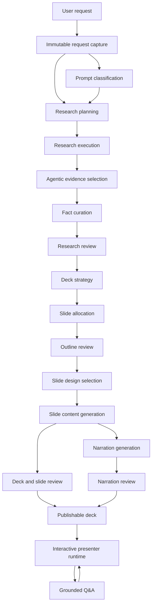

# Generation Pipeline V2 Architecture

Status: canonical target architecture
Created: 2026-05-07
Scope: presentation generation, narration, grounded Q&A, product experience, and quality gates

This document defines the target architecture for the next generation pipeline.
Implementation work should be grounded in this document. If an implementation
step cannot be mapped to one of the pipeline stages below, it should not be
merged as a generation improvement.

This document intentionally supersedes ad-hoc patching in the current generation
pipeline.

This is the source of truth for new generation work. `tasks.md` tracks execution
status, and `docs/deck-and-slide-types.md` remains the current inventory of
deck arcs and slide roles. Neither file should introduce a competing pipeline
shape. If this architecture is wrong, revise this document first or in the same
change that proves the mismatch.

## Problem Statement

The current generator is too complex for the job it performs. It combines a
small static slide layout set, deterministic contracts, slide recovery, deck
normalization, semantic review, and several local text guards. This creates two
bad outcomes:

- weak first drafts are repaired repeatedly instead of being generated from a
  clear plan
- slides look and feel similar because design is mostly deterministic and only
  the text varies

V2 moves quality upstream. The system should decide what it is building, what
source material is trustworthy, which facts belong on which slide, and which
layout best fits each slide before prose is generated.

## Non-Negotiable Principles

1. Generation quality starts with context and planning, not post-hoc repair.
2. Research facts must be traceable to sources or explicitly marked as model
   knowledge.
3. Every slide gets an explicit job, fact allocation, and layout intent before
   slide prose is generated.
4. The first slide is always an introduction.
5. The final slide is always a proper conclusion and question invitation.
6. Narration is a presenter script, not a spoken copy of slide bullets.
7. Q&A answers must use deck material, source material, and controlled model
   knowledge, then bridge back to the current presentation.
8. Guards must protect stage contracts, not patch arbitrary output strings.
9. Fail closed when material or generation quality is insufficient.
10. The architecture document may be revised when proven wrong; code should not
    drift silently away from it.
11. The exact user request and structured controls are immutable pipeline input;
    an agent may interpret them but may not replace or discard them.
12. Core owns artifact and entity identifiers. Agents never generate or rewrite
    protocol ids; selection decisions reference exact core-supplied ids using
    sparse lists or exhaustive keyed audits, as defined by the stage, or bounded
    positions where the contract is explicitly positional.

## Product Experience And Visual Design

The product should feel deliberately designed as one coherent experience, not
assembled from independently styled AI-generated components. Simplicity means
removing competing controls and unnecessary decisions, not hiding progress,
errors, sources, or essential question controls.

### Primary journey

1. Describe the presentation and optionally add sources. Useful defaults let the
   user proceed without selecting a theme, voice, or technical setting.
2. See understandable generation progress and the next expected outcome. Report
   actual work; do not invent percentages or label a partial deck as ready.
3. Review a ready presentation with faithful slide previews and one clear start
   action. Audio begins through an explicit user action.
4. Present with the slide as the visual focus. Keep playback, navigation, and
   asking a question easy to find without duplicate control groups.
5. Ask by text or voice in the same understandable interaction. Show listening,
   available transcription, answer generation, the answer, and the return to the
   presentation. Keep cancellation available while work is pending and retain
   the answer for inspection rather than showing a fleeting transparent overlay.
6. Close clearly, invite questions, and make replay and export easy to find.

These are user-facing steps over the existing pipeline and runtime states, not
a second state machine. UI wording must not imply capabilities or readiness the
underlying state does not provide.

Current connected behavior (2026-09-17): Studio's **Generate presentation** action
runs through research, slides, narration, final review and durable publication
without a second generation click. The historical `slides-ready` transport label
alone does not authorize playback: only its validated `result.publication`
enables the presenter link. Older unpublished previews stay labelled as previews.
The completed presenter supports questions and native PPTX download; voice audio
is synthesized on playback rather than eagerly generating all audio before the
job completes. The incremental descriptions below record earlier milestones,
not the current limits of the main action. See Phase 7b for publication ownership.

Incremental integration decision (2026-09-14): prioritize a connected application
over additional isolated research refinements. A research-only preview may expose
the existing V2 runner before downstream generation is implemented. Its API is
an execution adapter, not another semantic pipeline: immutable request in,
actual stage events and reviewed research out. Cancellation must propagate to
the active stage and its transports. In-process preview jobs are bounded and
must report unavailable runs after a server restart rather than silently rerun.
The preview must explicitly distinguish research readiness from publication;
no presenter, export, or generated-slide placeholder is enabled by research alone.
Outstanding research quality gates remain mandatory before full publication.

Connected outline increment (I2, 2026-09-14): the Studio now submits to
`/api/generation-v2/jobs`. `GenerationV2Pipeline` composes the existing research
stage group, then `deck-strategy`, `slide-allocation`, and `outline-review`, all
under one run id, recorder, cancellation signal and progress stream. Research
eval remains a deliberate stop at the research boundary, not an alternative
semantic implementation. The current transport is `slides-ready` (I3b below),
which authorizes inspection only, never playback or export. A rejected outline ends with its diagnostics;
no automatic outline-repair loop or whole-research replay is introduced.

Connected slide increment (I3b, 2026-09-14): after outline approval the same
`execute` call runs `design-selection`, `slide-generation`, and `slide-review`.
`plan`/`planOutline` are explicit diagnostic stop points, not product fallbacks.
`draftOutline` is the same downstream implementation used by `execute` and by
controlled recorded-outline evaluations; it requires the matching approved
research/outline artifacts and does not constitute publication.
Design selection chooses from the implemented layout registry. Slide writing
retains the full brief, strategy, allocated fact bank, all slide plans, and
previous drafts. Core owns identity, source URLs and reference checks; the
agent owns copy, source labels and semantic decisions. The single layout frame
defines content paths, geometry and typography for both composition and the
author's writing contract. Actual font metrics provide line capacity before
writing; there is no duplicated geometry prose in the author prompt. The
contract uses maximum item occupancy conservatively; the final measurement uses
the actual draft and item count. Each slide is measured using bundled open-license
fonts. A measured-fit rejection allows at most one
author revision with the previous draft and explicit physical feedback; no
shrinking, truncation, text extraction or stock prose is allowed. Technical
failures stop immediately. Slide review must explicitly approve these exact
design/draft artifacts; semantic rejection currently stops rather than looping.
Studio shows real 16:9 scenes, including selected vision-inspected source images,
only after this review. Narration, publication and user-facing export remain
unavailable in this increment. This capability
limit is explicit, not a generic image/content fallback. Server and browser use
identical full upstream Source Serif 4/Source Sans 3 files, including supported
scientific symbols and accented characters. These are not universal-script fonts;
unsupported glyphs fail as an asset limitation, not an author-rewrite request.

Outline inputs preserve the immutable request, classification and complete
approved fact bank, including allowed-use/provenance and knowledge policy.
Strategy chooses audience questions, roles, tone, timing and variety. Core assigns IDs and
order, and retains the classified audience/language/deck mode. Allocation
selects bounded fact IDs; core checks set membership, subset/disjointness,
count, intro/conclusion and knowledge permission. Outline review judges
semantic coverage, coherence and repetition. It must explicitly approve;
malformed or contradictory review output fails closed. Model knowledge may
support explanation only within the supplied research policy. No keyword
rules, score threshold or static content repairs are added.

Connected narration increment (Phase 7a, 2026-09-15): after successful slide
execution the API calls `GenerationV2Pipeline.narrateSlides` in the same run.
`narration-generation` writes the complete script with full deck/factual context;
`narration-review` owns the humanizer and factual assessment. An explicit,
actionable rejection may send the candidate and feedback to its writer once.
The revised artifact receives a new ID and its own review. Transport errors,
malformed output and exhausted revisions stop without substituting speaker notes.
The reviewed script can be inspected in Studio; `slides-ready` still authorizes
preview only. Old saved slide-only previews remain readable, but new API jobs
require the reviewed script. Final publication, TTS and runtime handoff remain
pending. Offline contract tests are not live narration or listening acceptance.

### Advanced menu

Provide one optional, initially collapsed Advanced panel beside the presentation
request. It is the single place for detailed control, not a separate mode or a
different generation pipeline. The default journey must work without opening it.

- Structure: presentation purpose/type, audience, depth, desired sections and
  their order, exact slide count, and target speaking duration. Explicit counts
  include the required introduction and conclusion; duration is a target, not
  a promise of exact playback time.
- Style: theme and supported narration/voice preferences. Do not expose controls
  that the active renderer or speech provider cannot honor.
- Sources: research preferences supplement the sources supplied in the main
  request; advanced settings must not silently discard those sources.

Group controls by user intent, show a compact summary of active overrides when
collapsed, and offer a reset to defaults that preserves the main request and
sources. Closing the panel must not discard its values.

Explicit choices become structured, immutable fields in the same request
artifact. Unset controls leave decisions to the agent. Missing request fields
must be implemented and tested end-to-end before exposing their UI controls.
Resolve contradictory instructions with the user rather than silently ignoring
a choice. Semantic interpretation remains agentic; these controls must not grow
topic-specific templates, regex inference, or a parallel planning path.

Current increment: the existing `targetSlideCount` field is explicitly labelled
"Target slides", following the strategy's thin-material policy below. It is not
the future exact-count control. An exact-count mode and section-order fields
remain unimplemented and must have their own explicit request contract before
being exposed. Do not silently reinterpret a request for an exact count as a target.

### Design constraints

- Establish one visual direction with purposeful typography, consistent spacing,
  restrained color, and a clear hierarchy. Decoration must support content rather
  than imitate a generic AI dashboard with nested cards, badges, and gradients.
- Studio is an authoring tool, not a marketing landing page: use a compact
  functional title and direct progress language rather than oversized slogans,
  italic display phrases or decorative status metaphors.
- Give each view one visually dominant next action. Keep secondary actions
  accessible; disclose advanced settings only when requested. Debug/provider
  information belongs in diagnostics, not the default presentation experience.
- Treat the layout library as an internal capability, not a menu of 20 decisions
  for the user. Variety should serve the material and remain visually coherent.
- Keep the slide frame and controls stable during narration and Q&A transitions.
  Motion should explain a transition, not distract or move the reading target.
- Apply the shared design language to the app, slide previews, presenter view,
  and exported PowerPoint, while respecting their different purposes. A polished
  browser view does not compensate for a poor or unreadable exported deck.

Before broad implementation, review a connected prototype of the primary journey,
not isolated attractive screens. Validate that a first-time user can generate,
start, pause, ask, cancel, resume, and export without verbal instructions, on
desktop and mobile with keyboard access and readable contrast. Do not add a new
visible feature unless its place in this journey and its necessity are clear.

## Change Control

Generation changes must follow this control rule:

1. Identify the failing stage.
2. Identify the artifact that was wrong or missing.
3. Decide whether the fix belongs in classification, research, fact curation,
   planning, allocation, layout selection, slide generation, narration,
   review, or Q&A.
4. Implement the smallest change that improves that stage contract.
5. Delete or bypass legacy code that the new stage replaces.
6. Add or update tests that exercise the stage contract, not one prompt string.
7. Run at least one live validation scenario that is not the scenario that
   caused the bug.

If a proposed fix cannot be described this way, it is a patch rather than an
architecture improvement and should not be accepted.

## Implementation Guardrails

These rules are for the implementation agent as much as for the codebase.

- Do not add one-off string/regex patches to fix a specific failed prompt.
- Scenario strings belong in tests and fixtures only, never in production
  generation logic.
- Do not add new recovery layers unless the layer is named in this document and
  has a defined input/output contract.
- Before changing generation code, state which V2 stage the change belongs to.
- Prefer replacing a legacy path over wrapping it with another fallback.
- If a validation failure reveals a missing pipeline responsibility, update this
  document first or in the same change.
- Keep deterministic code responsible for structure, routing, and safety.
- Keep LLM calls responsible for semantic classification, planning, synthesis,
  prose, and review.
- Natural-language intent, relevance, deck-mode, fact-role, and quality decisions
  are agentic stage responsibilities. Production code must not emulate those
  decisions with keyword inventories, language-specific regexes, or weighted
  phrase heuristics.
- Deterministic parsing is limited to protocol and structure concerns such as
  URL extraction, schema validation, source transport, boilerplate removal,
  deduplication, renderer bounds, and state-machine safety.
- Every stage receives its named upstream artifact rather than a parallel grab
  bag of summaries, excerpts, plans, hints, and recovery instructions.
- Every stage must be independently loggable and testable.
- No visible slide copy should be derived from internal labels such as
  `contract`, `brief`, `source role`, `claim`, `scaffold`, or `repair`.
- If V2 output is not good enough, fail the generation instead of showing a
  generic recovery deck.
- A fallback may complete structure, schema, or rendering only. It must not
  invent semantic slide content for a publishable presentation.

## Stage Ownership Summary

Each stage has one primary responsibility. Implementation should preserve these
boundaries.

| Stage | Primary function | Output artifact | Must not do |
| --- | --- | --- | --- |
| Request capture | Preserve exact input and structural controls | `PresentationRequestArtifact` | Interpret semantic intent |
| Prompt classification | Understand the request and route it | `PromptClassification` | Write slide copy |
| Research planning | Decide what to fetch and why | `ResearchPlan` | Scrape pages |
| Research execution | Fetch and store raw material | `ResearchBundle` | Curate final facts |
| Evidence selection | Select relevant passages from acquired material | `EvidenceSet` | Invent or summarize facts |
| Fact curation | Extract high-signal grounded claims | `FactBank` | Allocate facts to slides |
| Research review | Judge every requirement, traceability, and sufficiency | `ResearchReviewResult` | Repair missing research silently |
| Deck strategy | Choose the story arc and feasibility | `DeckStrategy` | Write slide prose |
| Slide allocation | Assign distinct material per slide | `SlidePlan[]` | Pick CSS or visuals |
| Design selection | Pick layout and visual intent | `SlideDesignSpec[]` | Rewrite facts |
| Slide generation | Write visible slide content | `SlideDraft[]` | Generate narration |
| Slide/deck review | Approve, reject, or request retry | `ReviewResult` | Repair content invisibly |
| Narration generation | Write presenter script | `NarrationScript[]` | Change slide facts |
| Publication review | Decide if user may see it | `ReviewResult` | Fail open |
| Q&A runtime | Answer interruptions and resume | `GroundedAnswer` + resume plan | Act as ungrounded chatbot |

## Pipeline Overview



## Typed Artifacts

V2 is built around explicit typed artifacts. These artifacts should be persisted
or at least logged in development mode so failures can be inspected without
guessing.

Source-address recognition is protocol parsing, never semantic classification.
The standard `linkify-it` parser preserves full HTTP(S) URLs in `explicitUrls`.
Scheme-less domain mentions are stored separately as `sourceCandidates`, with
their exact matched text and HTTPS URL. Email and other protocols are excluded;
bare IP recognition is disabled. Do not trim arbitrary trailing punctuation from
paths: balanced parentheses can be part of a valid source URL.

The existing classification agent chooses candidate positions from the original
request's meaning, across languages. A company/site identified by a domain can be
a source; a domain-shaped product name need not be. Core resolves only those
positions, preserves every full explicit URL and never invents a hostname or
path. Selected candidates enter the ordinary requested-source/explicit-target
flow, so acquisition fetches them directly before searching. No additional stage
or keyword rule is introduced. Publication still requires every full explicit
URL and rejects requested URLs absent from the immutable captured candidates.
Old artifacts without candidates remain readable. This revises the original
explicit-scheme-only capture rule after a reproduced failure to visit a reachable
user-named site. Search relevance and fetching remain separate responsibilities;
fetching still applies the public-address/redirect security policy.
The provider's classification parser validates source selection, grounding mode
and the explicit web control together. A contradictory complete response receives
the structured client's existing single contract-correction turn; core retains
the same independent acceptance checks. No mode is silently rewritten, and no
additional retry loop is introduced.

Persisted artifacts carry `schemaVersion`, `artifactId`, and `createdAt`.
Collection stages use explicit set artifacts such as `SlidePlanSet`,
`SlideDesignSpecSet`, `SlideDraftSet`, and `NarrationScriptSet` so provenance is
not lost around a bare array.

Every stage returns a `GenerationStageResult` with:
- `status`: `succeeded`, `rejected`, or `failed`
- stage name, run id, attempt, timestamps, and duration
- input artifact ids and source ids
- structured warnings and errors
- a schema-validated artifact only when one exists

Malformed output becomes a failed stage. Agent rejection remains a rejected
stage. Neither state may be normalized into apparent success.

Inference settings are an explicit provider responsibility, not semantic
prompt rules. The current local deployment explicitly requests reasoning effort
`low` (or diagnostic `none`) on every call, including parser retries. This is not
a hard reasoning-token cap: a low-effort response can still exhaust its entire
completion budget in reasoning. Do not inherit a model's higher reasoning default
or raise effort automatically. Token limits and stage deadlines remain in effect
independently of reasoning effort. Faster or structurally valid diagnostic output
does not establish semantic quality or authorize a production effort change.

Sequential execution budgets (2026-09-16): evidence selection owns one work
unit per acquired page, and the writer owns one work unit per planned slide.
Each unit has a 180-second deadline. A writer unit includes its initial author call and the existing
single geometry revision within one 180-second deadline. A format correction
does not reset that unit's time. Each enclosing sequential stage receives the sum
of its unit budgets, capped at 15 minutes regardless of page/slide count. This is a
resource policy derived from actual planned work, not subject or output text.
The shared deadline boundary propagates parent cancellation, rejects late
results even from an unresponsive provider, and distinguishes work-unit from
stage exhaustion. No timed-out unit is retried and no partial evidence set or deck is published.
Other stage deadlines, model request limits and review responsibilities are
unchanged except for the request-proportional completion allowances below. In particular, design/image preparation and whole-deck narration
still have their own finite stage budgets; this change does not claim arbitrary
deck sizes can finish within them or that a 15-minute writing ceiling is normal latency.

Whole-artifact completion capacity (2026-09-16) is owned by the provider's
`completion-capacity.ts`, not scattered fixed limits or retry-time increases.
The complete original input, exact schema and low effort remain unchanged.
All allowances include reasoning and JSON together and are capped at 14,000
tokens. The cap is a resource bound, not a promise to support arbitrary sizes.

For research planning, strategy, allocation, outline review, image selection,
design, slide review, narration, narration review and publication review, the
existing small-deck allowance is retained through three slides. Each further
slide reserves 1,000 additional tokens. Narration writing/review also count each
two requested minutes as one workload unit, taking the larger of that count and
the slide count; this is capacity planning, not a language-dependent word quota.
Research review retains 8,000 tokens through eight evidence requirements, then
reserves 500 per additional requirement. Fact curation retains the formula in
its stage contract. Per-page selection, per-image vision, single-slide writing,
classification and Q&A remain separately bounded single-unit calls.

Q&A uses the same provider capacity helper with fixed single-question allowances:
1,500 classification, 2,500 answer and 5,000 review tokens. The review allowance
was raised from 1,800 on 2026-09-18 after repeated real truncation, including
1,686 reasoning tokens leaving only 114 for the decision. This is reasoning-plus-
JSON headroom, not longer user answers or a higher reasoning effort. Full context,
approval requirements, the 60-second stage and 120-second question deadlines
remain unchanged. It does not grow with deck length or after a failed attempt.

Single-slide writing (2026-09-18) now reserves 7,000 completion tokens through
the same capacity helper, increased from 4,500 after an actual low-effort call
used 4,329 tokens for reasoning and truncated its JSON answer. This fixed
single-slide allowance does not grow with deck length or change after rejection.
It includes reasoning and final output, not a target output length. The original
input, low effort, 180-second work-unit deadline and retry counts are unchanged.
It provides headroom, not a guarantee against model loops or a quality approval.

The provider remains authoritative for its loaded context limit. Do not infer
token counts from characters, truncate evidence, omit the model-visible schema,
or describe an output allowance as complete context admission control. Real
call telemetry must be checked against the loaded model; a context error is a
failure, not permission to drop input or increase model memory. On the current
50,176-context local server, run long-deck diagnostics and app tests sequentially
until concurrent large-request execution is separately validated. These rules
change resources only, never semantic approval, required coverage or retry count.

An explicit provider `finish_reason=length` is incomplete execution, even if
the returned text happens to parse. The structured client must reject it before
parsing or parser-feedback retry, report the exhausted limit and available
token usage, and leave the stage failed. It must not replay the same exhausted
request as a format correction or silently enlarge its budget.

The shared structured client must put the exact request JSON Schema in the
model-visible system prompt as well as `response_format`. Do not assume grammar
sampling teaches the model the contract: llama.cpp documents that schemas are
not injected into the prompt and numeric range constraints are not enforced
for floating-point `number` fields. Local A/B probes on 2026-09-14 confirmed
schema-only descriptions were unavailable until explicitly included in the
prompt. Keep runtime validation, and do not rescale or repair invalid values.
This is generic protocol delivery, not a new content stage or semantic rule.
Reference: [llama.cpp grammar documentation](https://github.com/ggml-org/llama.cpp/blob/master/grammars/README.md#json-schemas--gbnf).

Agent decision payloads are not persisted artifacts. They contain semantic
fields plus selections of core-supplied ids (sparse lists or exhaustive keyed
audits, as defined by the stage) or explicitly bounded input positions. Core
validates those references, assigns every new persistent id,
and creates the artifact. This prevents model ordering, spelling, truncation, or
normalization from corrupting lineage.

### `PresentationRequestArtifact`

Purpose:
- preserve the exact validated `GeneratePresentationRequest`
- preserve structurally extracted explicit URLs and advanced controls even when
  classification is malformed or incomplete

Fields:
- `request`: the validated request including topic, duration, slide count,
  theme, web-research preference, and pedagogical profile
- `explicitUrls`: URLs extracted by deterministic protocol parsing

Rules:
- This artifact is created before the first LLM call.
- It is immutable and referenced by every stage that interprets user intent.
- Semantic stages may add interpretations but cannot remove or overwrite its
  values.

### `PromptClassification`

Purpose:
- understand what the user is asking for
- separate topic, audience, format, language, source instructions, and quality
  constraints

Fields:
- `requestArtifactId`
- `subject`
- `language`
- `audience`
- `presentationGoal`
- `deckMode`: `teaching`, `onboarding`, `sales`, `strategy`, `report`,
  `workshop`, `how-to`, `comparison`, `story`
- `groundingMode`: `explicit-sources`, `web-research`, `model-knowledge`,
  `mixed`
- `requestedSources`: exact request URLs with core-assigned ids
- `requestedCoverage`
- `presentationDirections`: structure and delivery instructions, not research topics
- `requestedSlideCount`
- `requestedDurationMinutes`
- `visualPreference`
- `voicePreference`
- `openQuestions`

Function:

```ts
classifyPrompt(request: PresentationRequestArtifact): Promise<PromptClassification>
```

Rules:
- This stage may use LLM classification.
- It must not write slide content.
- It must not decide final layout.
- The agent separates subject-matter coverage from presentation directions.
  Research planning turns only subject coverage into evidence requirements.
  Both interpretations and the full immutable request remain available to strategy.
- It must interpret source intent, broader research requests, and current-fact
  requirements without replacing exact URLs or controls in the request artifact.

### `ResearchPlan`

Purpose:
- decide what information must be gathered before generation
- avoid scraping random low-signal pages just because they exist

Fields:
- `requestArtifactId`
- `classificationArtifactId`
- `researchQuestions`
- `evidenceRequirements`
- `sourceTargets`
- `stopCriteria`
- `knownRiskAreas`

Function:

```ts
planResearch(
  request: PresentationRequestArtifact,
  classification: PromptClassification,
): Promise<ResearchPlan>
```

Rules:
- Explicit user URLs are always first priority.
- Same-domain support pages may be fetched when they answer a research question.
- General web search is used only when explicit sources are missing or the user
  requested broader research.
- If the subject is current, factual, legal, medical, financial, or otherwise
  time-sensitive, research is required.
- The output is a plan, not source material.

### `ResearchBundle`

Purpose:
- hold fetched material before curation

Fields:
- `sources`
- `pages`
- `fetchErrors`
- `targetOutcomes`: attempted URLs and mechanical stop reasons for every
  planned target, including targets that were never attempted; optional detail
  preserves agent rejection rationale without mislabelling it as a fetch error

Function:

```ts
executeResearch(plan: ResearchPlan, feedback?: ReviewResult): Promise<ResearchBundle>
```

Rules:
- Acquired source content stays here. New HTML responses are rendered in an
  isolated Chromium context from the exact fetched response. One `rendered-layout`
  content representation retains text blocks with measured CSS coordinates. This
  replaces DOM-order evidence for HTML; it is not an additional semantic summary,
  classifier or repair loop. Other text formats and historical HTML artifacts
  remain readable. Source URL, timestamp, page identity and exact offsets retain
  their existing ownership.
- Scripts, frames, media, downloads and service workers are disabled. Styles and
  fonts load only through the public-address/DNS-pinned research transport, without
  browser cookies or credentials. Each capture closes its browser and is bounded
  to 25 seconds, 60 resources, 2 MiB per resource, 8 MiB aggregate and 2,000 text
  blocks. Missing styles reject capture rather than invent layout. Missing fonts
  do not discard readable text: the browser measures layout using available
  substitute fonts, and the source header records the typography limitation.
  Exact wrapping and icon glyphs are not evidence of intended appearance. This
  corrects the former all-resource rejection rule; network, cancellation and
  aggregate resource limits remain unchanged. No semantic content is substituted.
- This is static CSS geometry, not screenshot vision or an interactive page.
  Transparent laid-out text is retained with `visible=false`, since animations may
  await scripts; hidden/display-none content is excluded. No semantic pairing is
  calculated. Curation/review interpret the layout and preserve uncertainty where
  attribution remains ambiguous. Image contents and dynamic-only applications
  require separate capabilities, not invented evidence.
- Evidence selection segments rendered content at complete block lines, keeping
  text and coordinates together. Existing character budgets, truncation reporting
  and exact offsets apply to the one serialized source representation.
- Downstream generation should not receive raw scraped pages directly.
- Fetch failures should be preserved and visible to validation.
- Review consumes a deterministic `ResearchBundleManifest` of this same
  artifact identity: source metadata/status, page identity and character count,
  fetch errors, and target outcomes, but no raw text. This is a structural view,
  not a new semantic summary or an additional pipeline stage. Publication
  retains that exact manifest and validates its links to the plan and evidence.
- Fetch explicit user URLs before exploratory work. Schedule exploratory
  targets in priority-ordered rounds, selecting at most one page per target
  per round before deepening a target. The existing global, per-domain, and
  per-target attempt limits remain hard resource bounds, including failed
  fetch attempts. These are scheduling rules, not semantic coverage decisions.
- Search each planned query once per execution and reuse its candidates in
  later rounds, together with newly discovered eligible links. The LLM still
  selects relevance; a page fetched for a target does not prove its requirement
  is fulfilled. Do not resubmit agent-rejected candidates, but let the target
  consider newly discovered candidates in later rounds. Stop when a complete
  round makes no fetch attempt or the existing attempt limits are reached.
- Every eligible discovered/search candidate is considered. Large candidate
  sets are selected in bounded agentic batches whose winners are recursively
  reranked; the implementation must not silently truncate to the first batch.
- Candidate limits bound resource use, not semantic relevance. No keyword or
  scenario-specific ranking may replace the source-selection agent.
- Each source-selection call exposes its actual candidate-index range and
  maximum selection count in both the model-visible schema and runtime parser,
  as in the other bounded V2 decisions. Never translate an invalid position
  into another source. Candidate batching must reduce each round's winners;
  a batch size below two is invalid configuration.

### Source images (connected raster-image slice)

Research must look for useful subject-specific image candidates while acquiring
source material, prioritizing the user's explicit sources. Additional image
search follows the same research permissions and bounded acquisition budget;
it must not become a second independent research pipeline.

Candidate discovery is the first bounded implementation slice: acquired pages
retain `imageDiscovery` with candidates, total unique candidate count and explicit
truncation. Candidate IDs belong to core; their parent page retains exact source
identity. URLs, alt text, captions and declared dimensions are untrusted page
metadata, not vision judgments. Absence of imageDiscovery means discovery was
not performed (including older research records); an empty performed discovery
is distinct. HTML image sources and Open Graph/Twitter image properties are
transport conventions, never subject-specific relevance rules.
Metadata discovery does not fetch image URLs. At most 100 unique HTTP(S)
candidate URLs are retained per acquired page, in document order, with the
total candidate count; alt/caption fields are capped at 4,000 characters.
Responses are bounded to 4 MiB of decoded bytes before HTML/XML parsing.
These are resource limits, not claims about relevance or source quality.
Text-only research review excludes this unassessed image metadata from its
manifest; the full acquired-page artifact retains it for the later image owner.
Text and image fetches share one public-network transport. Its socket resolver
validates the exact resolved addresses on every connection; literal addresses
and each redirect are checked too. There is no separate DNS preflight followed
by an unchecked resolution. Credentials, private/mapped/reserved addresses and
non-HTTP(S) URLs are rejected. Redirects, duration and decoded bytes are bounded.

Design selection owns the connected image preparation: one model selection of
at most four candidates per deck, one bounded download per selection, and actual
vision assessment for each downloaded image. This is not another research or
repair pipeline. An optional unavailable/rejected candidate has a recorded
outcome, not another automatic candidate search. A required missing visual fails.
Vision execution failure stops the stage, never approves a candidate.

Only JPEG, PNG and WebP signatures enter sharp 0.35.4 in this provider. Input is
limited to 8 MiB and 24 megapixels; animation is rejected. Orientation is applied,
metadata is removed and the whole image is normalized to at most 1600x1600 JPEG.
SVG/HTML and unsupported formats never enter this decoder. Original and normalized
SHA-256 identities, actual dimensions, source page, resolved image URL, available
caption and model judgment are retained. The exact normalized bytes are sent to
vision and both renderers. The PPTX adapter only receives this normalized JPEG,
not untrusted original formats handled by its older image-size dependency.
That dependency and the older Next image decoder remain audit work (R18); this
change does not claim a clean project-wide dependency audit.

Vision approval belongs to one exact slide/use. The design contract binds the
selected asset to that slide; required visuals cannot be dropped by layout
selection. Assets and decisions live with the design artifact, while textual
author/review requests receive descriptions and source metadata, never base64
pixels disguised as text. Browser and native PPTX use the same contained image
geometry, with no crop in this first slice. Image source links, supplied captions
and unverified reuse-rights status remain in notes; source host is visible.
Rights are not inferred or cleared by downloading or vision. Production reuse
permission checks, additional image layouts and
broader visual-quality acceptance remain follow-ups, not hidden fallbacks.
HTML srcset variants are retained through the standard srcset parser. The downloader
chooses the highest declared resolution within that one candidate, without URL
rewriting or a second download attempt. Resolution-variant arrays stay in the
acquired artifact, not in selection or vision prompts: they are download options,
not separate semantic candidates. Every candidate's identity, original URL,
caption, alt text and source context remain available, along with the unchanged
deck context. Actual decoded dimensions and the display
frame accompany the pixels in vision. Responsive picture/art-direction sources
and script-only images are not implemented. All image model calls are counted in
design-stage telemetry; pixel buffers never enter textual model context.
Images remain candidates until evaluated; a source-page association or filename
does not establish visual relevance.

The agents must use a vision-capable provider to inspect the actual image pixels
alongside the subject, source context and, when available, the intended slide
purpose. Assess what the image depicts, relevance, legibility and suitability
for the intended presentation use. Preserve the decision and its explanation
against the exact asset inspected. Vision describes visible content; it does not
by itself prove authenticity, source claims, or permission to reuse an image.

Research owns candidate acquisition; design selection owns which validated
asset supports which slide and its crop. Reuse an earlier assessment when the
asset and use are unchanged, rather than adding mandatory duplicate vision calls.
Do not replace either semantic judgment with keyword matching, filename rules,
or topic-specific exceptions. No unavailable/failed vision call may silently
approve an image, including one hosted on a trusted website.

Prefer a real, relevant source image over generic decoration. A source site's
logo, navigation, or advertisement is not a substitute for a picture of the
slide's subject. A logo can be appropriate when the intended
slide actually concerns that brand; the agent decides from pixels and purpose,
not a publisher blacklist. When no suitable validated image is available,
optional imagery can be omitted with an explicit
decision; a required visual remains a gap for the owning stage. Any selected
curated/generated illustration must be deliberate, high quality and appropriate,
never an unrelated automatic substitute or presented as photographic evidence.
Vision rejection follows existing bounded stage ownership, not an extra retry
loop. Browser and PPTX must use the same selected asset and crop.

### `EvidenceSet`

Purpose:
- select passages relevant to the research questions from complete acquired pages
- retain enough source metadata and exact evidence for citations and runtime Q&A

Fields:
- `researchBundleArtifactId`
- `sources`: selected source identity, URL, title, and retrieval metadata
- `snippets`: exact selected text with source and page references
- Historical records may retain optional `selectionCoverage`; it is read and
  reference-validated for existing publications, never generated by new selection.
  `FactBank` owns requirement contributions; research review owns fulfillment.

Function:

```ts
selectEvidence(
  plan: ResearchPlan,
  bundle: ResearchBundle,
): Promise<EvidenceSet>
```

Rules:
- Acquisition may deterministically segment and bound complete page content.
  Evidence candidates use the runtime's multilingual sentence segmentation
  (`Intl.Segmenter`), never arbitrary character cuts inside sentences. Character
  targets pack complete sentences and overlap whole sentences; an oversized
  indivisible sentence stays intact. Exact offsets and the aggregate evidence
  budget remain authoritative. This protects transport context, not semantic
  completeness: pronoun resolution, relevance and factual attribution still
  belong to the existing model stages. No topic/date rule or automatic fact
  correction is permitted.
- The LLM decides semantic relevance across those segments; the first characters
  of a page are never treated as its evidence by default.
- Core gives each supplied segment an immutable key. The agent must return one
  relevance assessment and rationale under every exact segment key. It receives
  all research questions and requirements as context, but does not produce a
  segment-by-requirement matrix or audit fulfillment. That duplicated the next
  stage's responsibility and exhausted bounded model execution on long sources.
  Core assigns snippet ids and preserves selected text exactly; fact curation
  independently links supported claims to requirements. Research review alone
  assesses complete coverage and readiness.
  This removes duplicate semantic work, not the grounding/publication gate.
- No summary created here may become a fact without fact curation.

### `FactBank`

Purpose:
- convert research into high-signal, traceable facts
- separate source-grounded facts from model-knowledge context

Fields:
- `facts`
- `uncertainties`: concise missing/conflicting-evidence observations, with sparse
  snippet and requirement references; not an exhaustive coverage audit
- `modelKnowledgeAllowed`

Fact fields:
- `id`
- `claim`
- `sourceIds`
- `evidenceSnippetIds`
- `evidenceRequirementIds`
- `role`: `identity`, `timeline`, `background`, `mechanism`, `capability`,
  `operation`, `example`, `value`, `risk`, `comparison`, `quote`, `other`
- `language`
- `allowedUse`: optional read-only compatibility with older saved facts; absent
  from the current fact-authoring contract

Placement ownership (revised 2026-09-17 after repeated generation failures):
research owns supported claims, qualifications and provenance, not a premature
visible-versus-spoken permission for every fact. Allocation and slide writing
choose which grounded claims to show and which details to explain. Review judges
factual meaning, useful coverage and readability, not an arbitrary display label.
This removes a competing editorial decision, not the evidence or publication
gate. Older publications remain immutable and readable.

Function:

```ts
curateFacts(
  evidence: EvidenceSet,
  classification: PromptClassification,
): Promise<FactBank>
```

Rules:
- LLM classification is preferred for relevance and role assignment.
- Deterministic filters may remove boilerplate, navigation, cookie banners, and
  repeated site chrome.
- Facts must be deduplicated semantically.
- Source-backed facts must reference snippets and sources present in the same
  `EvidenceSet`.
- Fact-to-requirement references record evidence contributions, not proof of
  complete fulfillment. Supported partial facts must retain their references
  alongside any uncertainty observed during extraction. Curation does not emit
  a sufficiency verdict, source-quality audit or per-requirement assessment.
  Research review alone judges complete coverage, source quality, material
  uncertainty and readiness. Core never equates a linked fact with full coverage.
- Fact-curation decisions return sparse `evidenceSnippetIds` and
  `evidenceRequirementIds` lists selecting only exact core-supplied ids. The
  request schema bounds each list to the available ids; core rejects unknown
  or duplicate references. Source facts require at least one snippet; grounded
  enrichment may have no planned requirement. Core assigns all new identities.
  Position shifts cannot silently change provenance.
- Do not repeat unselected references as boolean matrices. Controlled live
  replay on 2026-09-14 exhausted the output budget even without reasoning;
  the sparse decision contract replaced that encoding. The 2026-09-16 ownership
  revision additionally removes duplicate judgments from new fact banks, without
  changing grounding policy, model effort or token budgets. Evidence-segment
  assessments and the requirement-level review remain exhaustive keyed audits.
- Contradictory facts must be surfaced rather than silently resolved.
- Fact curation has a request-proportional completion budget, not a single
  fixed allowance for every deck. The resource rule is
  `clamp(7,000 + 500 * max(evidenceRequirementCount, 2 * requestedSlideCount), 10,000, 14,000)`;
  an unspecified slide count contributes zero. This reserves output capacity
  for additional claim/provenance records; it neither dictates how many facts
  the model must emit nor removes any source context. On 2026-09-18 the floor
  increased from 7,000 to 10,000 after a real 9,500-token truncation; an isolated
  replay needed 9,579 tokens to complete. The finite ceiling and existing 180-second
  stage deadline remain. Low reasoning, schema/reference checks, semantic
  review, and rejection of truncated output are unchanged. Controlled replays
  distinguish capacity from factual acceptance; a complete JSON response alone
  is never readiness approval.
- Uncertainties reference immutable evidence snippets, never generated fact
  positions. Full classification, research plan and selected text remain inputs.
- Historical fact banks remain readable through a separate legacy contract;
  new curation cannot write that contract. Historical explicit insufficiency
  remains a blocker. Current banks contain facts and uncertainties, not approval.
- If facts are too weak for the requested deck, generation should fail with a
  useful message or ask for better sources.

### `ResearchReviewResult`

Purpose:
- independently judge whether the research chain supports every planned
  evidence requirement
- preserve explicit requirement-level approval or retry ownership before deck
  planning begins

Fields:
- standard review fields: `approved`, `score`, `summary`, `issues`, and
  `retryRecommended`
- `requirementAssessments`: one persisted assessment per exact evidence
  requirement id
- unsupported assessments retain the earliest deficient artifact, affected
  facts, rationale, and retry instruction

Function:

```ts
reviewResearch(
  request: PresentationRequestArtifact,
  classification: PromptClassification,
  plan: ResearchPlan,
  acquisition: ResearchBundleManifest,
  evidence: EvidenceSet,
  facts: FactBank,
): Promise<ResearchReviewResult>
```

Rules:
- The LLM must semantically assess the complete meaning of every requirement;
  links and selection flags are not themselves proof.
- The immutable request defines scope. The review judges material evidence and
  coverage defects, not exhaustive perfection or alternative metadata labels.
  Unnecessary mandatory requirements introduced by planning require a planning
  correction; they do not silently become new user demands.
- Use one concise evidence-based rationale per requirement, with separate issues
  only for other material defects. Do not restate successful checks or duplicate
  unsupported requirements as generic issues. Actionable retry instructions may
  live in either an unsupported assessment or an issue; neither channel requires
  a duplicate in the other. Source evidence, fact claims and approvals remain
  fully available to the reviewer; no semantic filtering or context summarizer
  is inserted before this stage.
- The decision schema requires every exact evidence-requirement id as a key.
- This is the sole exhaustive research coverage/readiness judgment. Approval
  requires nonempty facts and an exact-artifact, complete review with all required
  requirements supported, no error issues and no retry. Missing, malformed or
  rejected review blocks outline generation and publication. Historical banks
  explicitly marked insufficient cannot be promoted by this contract revision.
- Core validates key identity, reference bounds, approval consistency, and
  declared retry-target references, but never decides whether natural-language
  evidence supports a claim or whether the chosen owner is semantically correct.
- A required unsupported assessment blocks approval and identifies the earliest
  owning stage: research planning, acquisition, evidence selection, or fact curation.
- The review contract orders artifacts as plan, acquisition manifest, selected
  evidence, and facts. Acquisition metadata explains what was attempted, not
  whether page content is semantically sufficient. Truncation or an exhausted
  resource budget alone is not grounds for rejection if the evidence suffices.
- An acquisition-owned retry keeps the plan unchanged, passes the review's
  explicit feedback to source selection, and rebuilds acquisition plus its
  downstream artifacts. It uses the same per-attempt resource limits and the
  existing single research retry, not a new retry layer. It currently reacquires
  sources rather than merging unreviewed old and new bundles. Changed queries,
  targets, or budgets belong to planning, not acquisition.
- The owning stage may run one bounded retry with the preserved review
  diagnostics. A second rejection fails closed.
- Completed but malformed structured output may receive one parser-feedback
  retry within the provider call. The runner retries only explicit retryable stage rejections,
  not failed execution. Transport errors, expired deadlines, cancellation, and
  exhausted output budgets or parser retries end the stage; they do not replay the whole stage or
  fall back to static semantic output.

### `DeckStrategy`

Purpose:
- decide the deck shape before individual slide writing begins

Fields:
- `deckMode`
- `storyArc`: ordered beats with an agent-selected role and `audienceQuestion`
- `requiredIntro`
- `requiredConclusion`
- `slideCount`
- `duration`
- `language`
- `audience`
- `tone`
- `layoutVarietyPolicy`
- `narrationStyle`

Function:

```ts
planDeckStrategy(
  request: PresentationRequestArtifact,
  classification: PromptClassification,
  factBank: FactBank,
): Promise<DeckStrategy>
```

Rules:
- The first slide is an intro role.
- The last slide is a conclusion role.
- Strategy assigns roles before material allocation. Allocation preserves those
  roles; core checks identity/order, while the agent reviews semantic suitability.
- Strategy is the single owner of the question each slide answers. It plans
  questions, not a parallel factual account or miniature script. The full fact
  bank and complete story remain available downstream; this is not context
  compression. Global tone and narration style remain in the strategy.
- Strategy is allowed to reduce requested slide count if source material is too
  thin.
- Strategy is allowed to fail if the requested deck would be misleading.

### `SlidePlan[]`

Purpose:
- allocate unique material to each slide before prose generation

Fields:
- `slideId`
- `order`
- `role`: `intro`, `context`, `evidence`, `mechanism`, `example`,
  `comparison`, `implication`, `activity`, `decision`, `summary`,
  `conclusion`
- `allowedFactIds`
- `requiredFactIds`
- `modelKnowledgeScope`
- `overlapPolicy`

Function:

```ts
allocateSlides(strategy: DeckStrategy, factBank: FactBank): Promise<SlidePlan[]>
```

Rules:
- Every slide must have a distinct reason to exist.
- `allowedFactIds` is the single positive material permission list for both
  visible copy and narration, including preview/recap. Required and overlap IDs
  must be subsets. Unallocated facts cannot be used by a draft. There is no
  separate forbidden list duplicating the complement of this permission.
- Required facts cannot be assigned to multiple body slides unless the slide
  role explicitly requires recap.
- The intro may preview later facts but should not exhaust the deck.
- The conclusion may synthesize facts but should not introduce new named facts.
- The agent selects the earlier facts needed for the conclusion's recap;
  review checks whether the strategy's audience question is answerable from
  its allocated material.
  Core does not copy all body facts into a closing or infer recap from words.
- A slide with no unique material is removed or the deck fails.
- Allocation selects fact IDs, overlap and model-knowledge permissions, not a
  second question, teaching-purpose paragraph or narration draft. Actual copy
  and supporting notes first belong to slide writing. The fact bank remains
  authoritative for meaning, conditions and scope.
- R20 grounding clarification (2026-09-18): model-knowledge scopes authorize
  general explanation and explicitly hypothetical examples, not invented
  subject-specific implementation, availability, commitments or outcomes. Missing
  evidence is not proof of nonexistence; planned/promised and demonstrated
  capabilities must remain distinguishable. Writers and independent reviewers use
  the same meaning of this permission, including speaker notes, not just visible
  slide text. Qualifications must accompany the claim rather than excuse a stronger
  assertion elsewhere. This is semantic LLM guidance, with no phrase matching,
  additional stage, static replacement or new retry path.
- R19 structural revision (2026-09-15): the earliest observed distortion was in
  strategy purpose, then repeated in allocation and design prose. Replace that
  chain with strategy questions, fact allocation and layout selection. No stage,
  reviewer, retry, topic-specific rule or fallback is added. This reduces
  competing accounts; it does not guarantee that LLM questions or prose are true.
- Old experimental V2 strategy/allocation/design artifacts are deliberately
  incompatible with these strict contracts. Regenerate from unchanged approved
  research; do not silently migrate or reinterpret their prose. Legacy saved
  presentation runtime is unaffected. Recorded pre-change previews are historical
  evidence, not inputs to current planning validation.

### `OutlineReview`

Input: immutable request, classification, approved `FactBank`, `DeckStrategy`
and `SlidePlanSet`. Output: `ReviewResult` targeting `outline-review`, with the
exact strategy and plan-set IDs. Purpose: check that the planned story answers
the request with distinct, supportable slide jobs before drafting visible copy.
The reviewer does not demand a finished speech or renderer at this stage.
An explicit rejection blocks readiness even if its score is high or no issues
were listed. An approval cannot simultaneously recommend retry or contain an
error. Issue references are bounded to supplied artifact, slide and fact
positions and resolved to core-owned IDs, never guessed from prose.

### Shared rendering foundation (implemented)

`composeSlideScene(SlideDraft, SlideDesignSpec)` owns geometry only. Its
1280x720 scene passes through font-aware text layout before `SlideSceneCanvas`
and `renderSlideScenesToPptx` consume the same `LaidOutSlideScene`.
Neither renderer classifies, rewrites, truncates, substitutes, or generates copy.
Unknown/mismatched layouts, unsupported image strategies, and excess item counts
fail explicitly. The old exporter remains isolated to saved legacy decks.

The registry now contains 20 compositions, including four whole-image layouts.
See `docs/deck-and-slide-types.md` for the exact inventory. The existing
design-selection call chooses one theme and content-appropriate compositions.
An explicit request.theme constrains that decision; otherwise the agent selects
Paper, Editorial or Signal from audience, tone and visual preference. No topic
mapping, seed-based theme choice, minimum-variety rejection or extra review stage.
Each theme is a complete design system, not a palette applied to shared geometry.
Paper uses top-down report layouts; Editorial uses magazine spreads, serif
hierarchy and margin titles; Signal uses typographic posters, offset hierarchy
and compact step grids. Dedicated composition modules own their geometry over
shared drawing primitives. Every layout ID has a distinct structural treatment
in each system, validated without relying on color or font differences.
Geometry and typography resolve before author field measurement; the same
measured scene is used by browser and PPTX. Older designs without themeId retain
their previous geometry and Editorial tokens; newly generated decisions require it.
All designs within a deck share a theme. Saved publications are never restyled
in place. The catalog supplies image requirements and capacities to validation,
not independent lists of image-layout names. Geometry remains renderer-owned;
copy, semantic selection and composition decisions remain agent-owned.
Studio's schematic theme previews use actual layout frames rather than independent
palette swatches. They are labelled style choices, never generated slide content.
Image layouts, Studio theme controls and publication are connected. Text measuring
and shared line positions are implemented, not full cross-platform font acceptance.
The developer-only design study uses explicit test fixtures, not pipeline output;
it cannot enable presenter/export from outline readiness.

The six-slide proof now passes package integrity and visual inspection in actual
PowerPoint. PptxGenJS 3.12.0 is pinned with a checked-in dependency correction:
its serializer declares the one emitted shared master once rather than declaring
nonexistent masters for subsequent slides. Root postinstall applies the correction
and fails if it cannot apply; production installs must keep scripts enabled.
See `patches/README.md`. No completed ZIP is rewritten or validation suppressed.
The renderer now measures glyph advances, ink bounds and line height from explicit
font assets using [Fontkit](https://github.com/foliojs/fontkit), and chooses line
boundaries using [Unicode UAX #14](https://github.com/foliojs/linebreak).
This is typography, not a language-specific content rule. There is no character
count fit estimate, arbitrary word splitting, semantic rewrite, truncation or
automatic font-size reduction. Unsupported fonts/glyphs and width/height overflow
return `SlideTextFitError` with owning slide and element references. The drafting
stage uses stable content paths, these diagnostics and the affected text in its
bounded author-owned revision, never a renderer-generated replacement sentence.
Unsupported fonts/glyphs stop execution instead of requesting a content rewrite.

Each measured text box retains its original text, exact source slices, font-asset
hash and style key. Both adapters reject missing/stale layout. Browser SVG text
and individually editable native PowerPoint lines use the measured positions;
SVG font family names are quoted so names containing numeric tokens remain valid
CSS rather than silently inheriting the surrounding application's font;
neither engine independently wraps or autofits the paragraph. The process-number
slot uses the available space up to its divider, without changing copy or size.

Fonts are injected as explicit assets, not discovered through hardcoded OS paths
in production. The developer proof receives its font directory explicitly and
uses the existing Georgia/Trebuchet MS design. Portable tests use an OFL font.
Studio generation uses the identical full upstream OFL Source Serif 4 and Source
Sans 3 assets on the server and in the browser. Pinned source revisions, hashes
and licenses are recorded in `packages/providers/assets/fonts/README.md`.
Before user-facing export, establish their
PowerPoint availability.
PPTX font embedding is not implemented, so substitution on another machine and
complex-script rendering remain acceptance work. Do not count current-host visual
tests or missing-glyph rejection as complete multilingual support.

### `SlideDesignSpec[]`

Purpose:
- make visual design a first-class generation artifact
- avoid today's "four templates forever" behavior

Fields:
- `slideId`
- `layoutId`
- `layoutFamily`
- `contentDensity`
- `visualRole`: `hero`, `evidence`, `process`, `comparison`, `quote`,
  `timeline`, `map`, `gallery`, `checklist`, `dashboard`, `question`
- `imageStrategy`: `source-image`, `curated-fallback`, `generated`,
  `none`
- `imageQuery`
- `variationSeed`

Function:

```ts
selectSlideDesigns(
  strategy: DeckStrategy,
  slidePlans: SlidePlan[],
  factBank: FactBank,
): Promise<SlideDesignSpec[]>
```

Rules:
- V2 should use a layout library with at least 20 safe layouts.
- The renderer owns layout implementation.
- The LLM chooses intent and compatible layout ids, not CSS.
- Design does not prewrite claims or speaker prose. Those belong to the author,
  using the unchanged fact bank and the strategy's audience questions.
- Deterministic variation may randomize safe parameters such as card count,
  image position, emphasis area, background treatment, and accent.
- Layout selection must be content-driven, not `slide 2 = flow`.
- Repeated layout ids are allowed only when the deck intentionally uses a
  repeated pattern.
- Browser slides and exported PowerPoint must implement the same design intent,
  aspect ratio, hierarchy, and content allocation. A good-looking browser view
  is not evidence of a good PPTX: render actual exported files for visual review.
- Shared theme tokens govern typography, color, spacing, and image treatment;
  renderer capacity and overflow checks must not invent, repeat, or silently
  discard semantic content. Keep application-shell styling separate from slide
  content generation.

Initial layout families:
- intro hero
- title plus source image
- quote with source
- timeline
- three-step process
- two-column comparison
- before/after
- evidence cards
- image gallery
- map/footprint
- metric/dashboard
- problem/solution
- mechanism diagram
- case study
- checklist
- decision tree
- workshop activity
- recap board
- Q&A closing
- minimal statement
- split narrative/image
- source excerpt
- myth/fact
- risks and mitigations

### `SlideDraft[]`

Purpose:
- generate visible slide content from a slide's allocated material and design
  spec

Common fields:
- `slideId`
- `title`
- `subtitle`
- `usedFactIds`
- `speakerNotes`
- `imagePrompt`
- `sourceAttributions`
- `likelyQuestions`

Visible content is one discriminated `content` shape, not a universal set of
parallel fields. Initial content kinds are `statement`, `list`, `cards`,
`process`, `comparison`, `quote`, `timeline`, `metrics`, `activity`,
`source-excerpt`, and `question`. A slide cannot simultaneously populate legacy
key points, explanations, cards, and hero copy with the same claim.

Function:

```ts
generateSlideDraft(
  strategy: DeckStrategy,
  slidePlan: SlidePlan,
  designSpec: SlideDesignSpec,
  factBank: FactBank,
): Promise<SlideDraft>
```

Rules:
- The slide generator receives only the facts allocated to that slide plus
  approved deck-level context.
- It does not receive the full raw research bundle.
- It does not receive internal labels as visible copy.
- It may use model knowledge only within `modelKnowledgeScope`.
- It must output content compatible with the selected layout.
- It must not create narration.
- Compose claims from allocated facts, not from paraphrases in planning prose or
  previous slides. Concision must preserve meaning, conditions, uncertainty and
  scope. Essential qualifications belong with visible claims; notes cannot repair
  a misleading visible statement, and notes must not strengthen a supported claim.
- The existing slide review compares visible copy and notes with the fact bank,
  not just with the approved plan or matching fact IDs. It accepts stylistic
  imperfections and faithful paraphrases, but rejects material semantic changes.
  No extra factual reviewer, semantic string filter or automatic rewrite is added.
  R19 acceptance remains open: both baseline and experimental review missed the
  original subtle scope error. Do not infer semantic correctness from matching
  references, positive test fixtures, or an automatic approval alone.

### `NarrationScript[]`

Purpose:
- create a human-presenter script that connects the deck into a coherent spoken
  story

Fields:
- `slideId`
- `openingBridge`
- `segments`
- `transitionOut`
- `sourceMentions`
- `questionInvitation`

Function:

```ts
generateNarrations(
  strategy: DeckStrategy,
  slidePlans: SlidePlan[],
  slideDrafts: SlideDraft[],
  factBank: FactBank,
): Promise<NarrationScript[]>
```

Rules:
- Narration should explain, connect, and contextualize.
- Narration is generated with the complete deck arc available so adjacent
  transitions and the ending are planned as one spoken presentation.
- It must not simply read the slide.
- It should sound like a presenter speaking to an audience.
- It should include transitions between slides.
- It may explain meaningful source limitations when useful.
- The final narration must clearly close the presentation and invite questions.
- Narration can include more detail than visible slide text, but only from
  allocated facts, deck-level context, or allowed model knowledge.

#### Humanizer responsibility (implemented; broad quality acceptance remains open)

The spoken presentation must pass an explicit humanizer assessment before
publication and speech synthesis. This belongs to the existing
`narration-review` stage, not an additional pipeline, post-publication text
filter, or separate unbounded rewrite loop. Narration generation should already
aim for natural presenter speech; this assessment verifies that it achieved it.

Inputs are the complete candidate script, deck strategy, slide plans, stable
slide drafts, and permitted factual context. The reviewer evaluates the whole
spoken story, not disconnected sentences:
- language- and audience-appropriate wording, sentence rhythm and explanations
- continuity between ideas and slides, without repetitive announcements or
  a mechanical reading of visible bullets
- a welcoming opening, meaningful transitions, and a proper closing with an
  invitation for questions
- opportunities to pause and let an idea land, without forced filler words,
  fabricated personal experience, or an artificially casual tone
- preservation of facts, attribution, uncertainty, and allocated knowledge scope

The LLM returns structured review feedback, not replacement narration. When
material problems require revision, the narration generator owns one targeted
revision using that feedback and the same factual constraints. Review then
targets the revised script; no previous approval carries over. Minor subjective
style preferences are advisory, not a new perfection gate. Existing rejection
and retry limits apply; there is no extra humanizer retry budget.

No phrase blacklist, English-specific substitution, regex-based style score,
or stock introduction/transition is permitted. Semantic changes belong to the
LLM. The approved script is immutable during playback; TTS must not silently
rewrite it. Natural writing and voice prosody are separate quality dimensions.
Acceptance includes listening to complete presentations using the actual TTS
voice, not just reading scripts or trusting a reviewer score.

Playback order is explicitly `openingBridge`, `segments`, `transitionOut`, then
`questionInvitation` when present. These are consecutive spoken passages, not
alternatives; the final transition closes rather than promising another slide.
The writer generates speech and source references only, not unused delivery
instructions. Rhythm belongs in natural sentences and paragraph boundaries.
`sourceMentions` are provenance IDs outside the spoken sequence. The optional
legacy `pausePrompts` field is read compatibility for already published artifacts,
not part of new generation; playback never voices that field.

Both narration and publication reviewers receive `narrationPlaybackView`, whose
passages use exactly the same `narrationPassages` assembly as playback/TTS. This is
a lossless structural projection, not a text filter: even defective passages
remain visible for semantic review. Every passage is treated as audience-heard
speech. Accidental spoken authoring/delivery instructions require rejection and
writer-owned revision, not an advisory warning; legitimate discussion of those
concepts is allowed. The existing revision budget and immutable publication
boundary are unchanged. No keyword removal, additional reviewer or runtime
rewriting is permitted.

### `ReviewResult`

Purpose:
- decide whether a deck can be shown

Review functions:

```ts
reviewResearch(
  request: PresentationRequestArtifact,
  plan: ResearchPlan,
  evidence: EvidenceSet,
  factBank: FactBank,
): Promise<ReviewResult>
reviewOutline(strategy: DeckStrategy, slidePlans: SlidePlan[], factBank: FactBank): Promise<ReviewResult>
reviewSlides(slides: SlideDraft[], slidePlans: SlidePlan[], factBank: FactBank): Promise<ReviewResult>
reviewNarration(
  narration: NarrationScript[],
  slides: SlideDraft[],
  strategy: DeckStrategy,
  slidePlans: SlidePlan[],
  factBank: FactBank,
): Promise<ReviewResult>
reviewDeckForPublication(deck: FinalDeck): Promise<ReviewResult>
```

Rules:
- Review may be LLM-assisted.
- R21 (2026-09-18): the slide-review provider uses `slideFactualReviewView`,
  retaining the exact brief, factual claims/origins, uncertainties, visible copy
  and speaker notes in original index order. Author strategy, design choices and
  approval context are not supplied as persuasive evidence. This same existing
  stage primarily checks factual fidelity; outline review owns the planned arc,
  measured rendering owns physical fit, and publication review owns the complete
  experience. No extra reviewer or semantic summary is introduced. Mapping returned
  slide/fact indexes to the original artifact identities remains core-owned.
- A focused-review diagnostic rejected the recorded unsupported draft and accepted
  an unrelated accurate control; task framing and input projection changed
  together. This is evidence for the combined boundary, not proof of universal
  factual reliability or an accepted end-to-end company presentation.
- Deterministic checks may validate schemas, missing fields, duplicate ids,
  repeated exact facts, source coverage, and required intro/conclusion presence.
- Review should fail closed on malformed LLM review payloads.
- Review should not rewrite visible content.
- If review finds a stage error, retry that stage with explicit feedback.
- If the same stage fails twice, fail the generation.
- R22 (2026-09-18): slide writing owns one bounded semantic revision after an
  explicit repairable slide-review rejection. Rewrite only slides with error
  issues identifying a slide and an actionable instruction, owned by the draft
  artifact. Preserve approved research, plans, designs, images and untouched
  drafts/scenes. The writer receives the previous draft and factual feedback;
  its existing one physical-fit correction retains that feedback. Create a new
  draft-set identity and review the entire resulting set, not only edited slides.
  Trace both attempts and the prior draft/review identities. A second rejection,
  unavailable review, unscoped feedback or an upstream-owned issue stops the run;
  no automatic full-pipeline rerun or fallback is added.
- The slide, narration and publication reviewers judge material defects:
  accept faithful paraphrase, reasonable simplification preserving the facts,
  clearly hypothetical examples and useful imperfect language. Plausibility is
  not evidence for additional subject-specific capabilities or availability;
  a hypothetical explanation must be framed as such, not asserted. A blocker must
  explain a materially misleading claim or unusable experience. Cosmetic advice
  remains advisory, with approval and no retry; score alone is not a gate. The
  code does not downgrade a model's rejection or error to make a run pass.

### `PublishablePresentation`

Purpose:
- represent the only artifact that may cross into the interactive runtime
- keep request, classification, acquisition manifest, selected evidence, facts, plans, designs,
  slides, narration, and reviews traceable as one immutable publication bundle

Rules:
- the request, classification, research plan, acquisition manifest, evidence set, fact bank, strategy, plans,
  designs, drafts, and narrations must form one complete reference chain
- every design, draft, and narration must match the ordered slide-plan ids
- every allocated or attributed fact id must resolve in the included fact bank
- every source attribution and fact evidence id must resolve in the included
  evidence set
- selected source URLs and snippet page identities must resolve in the included
  acquisition manifest, which records every exact planned target
- approved research, outline, slide, narration, and publication reviews are
  mandatory and must target the exact included artifacts
- any rejected, missing, malformed, or mismatched review blocks publication
- the complete `ResearchReviewResult`, including one assessment per planned
  evidence requirement, survives publication unchanged; an approval cannot
  contradict required unsupported assessments, blocking errors, or a retry request
- conversion to the runtime `Deck` shape happens after this contract, never
  before it

### Connected publication and speech increment (Phase 7b, 2026-09-15)

The production adapter now continues the same run through `publication-review`
and `publication`. Final review sees the complete factual context, slides,
script and prior reviews, but no inline image bytes as text. It returns explicit
feedback only. A rejected or unavailable final review stops the run; no whole-deck
repair or fallback is added. The existing `PublishablePresentation` contract
validates the exact complete artifact chain after approval.

`PublishedPresentationStore` persists the approved bundle and its measured scenes
write-once under `published-v2`. A ready job points to that durable publication;
old preview-only jobs cannot authorize audio. The new `/presentation/[id]` runtime
reads these V2 scenes and scripts directly, without calling legacy SessionService
or generating narration during playback. This is a runtime consumer, not another
generation pipeline. A later adapter to the legacy `Deck` contract is unnecessary
for this player and must not be introduced merely to reuse obsolete narration.

Fullscreen is a runtime display mode over the same mounted player, audio and
question components, not a separate route or playback session. It fits immutable
slide scenes to the available viewport, retaining navigation and question access.
Native browser fullscreen is preferred; unsupported/blocked contexts explicitly
use window-fill. Entering/leaving the mode does not reset playback or rewrite any
artifact. Escape/browser exit, focus and document scrolling belong to this UI
boundary, not generation or semantic validation.

### Library consumer (2026-09-16)

The library lists only validated records in `PublishedPresentationStore`, using
the first measured scene as its faithful 16:9 cover and the authored slide title.
Search and chronological sorting operate on saved metadata, not semantic model
classification. Paginated responses contain cover scenes, counts and dates,
never new summaries, inferred quality scores or exact-duration estimates.
Opening a card enters the same `/presentation/[id]` player with no regeneration
and no autoplay. Studio, Library and Presenter share the same navigation.

Invalid saved records are excluded and counted visibly, never repaired or
replaced by old sessions. Filesystem access failures remain errors. Explicit
archive confirmation moves a publication out of the active library and playback
lookup while retaining its original bytes under `published-v2/archived`.
Archiving must not overwrite an existing archived file. The old V1 library list
and delete endpoints return 410; their client/service/schema paths are removed.
The local historical decks, sessions, transcripts, evaluations and exports were
moved together into `legacy-archive`, with an inventory, not permanently deleted.
This consumer does not change generation, review policy or narration acceptance;
an existing model-approved publication can still have a separately recorded
manual quality defect. The known spoken-metadata defect remains open.

### Speech consumer

Piper receives only the exact approved spoken passages, assembled in order, at
the existing default speaking rate. Source IDs and pause cues are not voiced.
The audio endpoint accepts a publication ID and slide index, never arbitrary
replacement text. Missing/invalid audio fails rather than becoming silent success.
Bounded caching avoids repeating synthesis. Browser playback uses one native
audio control, preserves the current position while paused and advances on ended.
Slide geometry is unchanged by audio progress. Q&A connection is tracked in
Phases 7c/7d below. User-facing PPTX download and broader acceptance remain open.

Live evidence is separated: Apollo and W3C are narration continuations from saved
slides; only the bread example is a fresh brief-to-publication run. The W3C
narrator and reviewer repeated/missed a known conditional-meaning defect. That
is still R19, not proof of factual acceptance. No subject-specific correction
was added. The older Apollo image artifact lacks a now-required decision field
and was correctly refused publication, without inventing its missing value.

## Research Strategy

Research is a first-class stage, not a helper.

### Source priority

1. User-provided URLs
2. Same-domain pages that answer explicit research questions
3. User-requested web search
4. General web search for current or uncertain facts
5. Model knowledge only when the deck mode allows it

### Page selection

The research planner should classify pages before scraping deeply:
- homepage / overview
- about / company
- product / service
- documentation
- news / press
- case study
- pricing / commercial
- contact / location
- legal / low-signal
- navigation / index

Only pages relevant to research questions should be expanded.

### Curation

The fact curator should:
- extract claims
- attach evidence excerpts
- classify roles
- identify missing requested coverage
- identify source contradictions
- reject site chrome and generic marketing filler

### Research failure modes

Fail generation when:
- requested source pages cannot be fetched and no alternative source is allowed
- explicit requested coverage is missing
- facts are too thin for requested slide count
- source material contradicts itself and the contradiction matters

Continue with caveats when:
- the deck is allowed to use model knowledge
- missing facts are not central to the prompt
- sources are weak but still sufficient for a smaller or more cautious deck

## Intro And Conclusion Rules

### Intro slide

The intro must:
- name the subject clearly
- orient the audience
- state why the presentation exists
- preview the arc without exhausting the source facts
- establish language and tone

The intro must not:
- start with a narrow middle-slide detail unless the whole deck is about that
  detail
- use internal role labels
- be only a title slide

### Conclusion slide

The conclusion must:
- synthesize the deck
- state the main takeaway in audience-facing language
- make clear that questions are welcome
- avoid new named facts unless explicitly assigned

The conclusion must not:
- be a generic `Key takeaway and questions` template
- repeat the intro
- turn into another middle content slide
- contain hidden prompt or source-role language

## Interactive Q&A Runtime

### Private beta capacity (2026-09-18)

The current deployment is one API process for a small trusted group, not an
authenticated multi-tenant service. The library remains shared. Capacity belongs
to API admission, not semantic stages or content validation:

Optional remote access uses one ngrok HTTPS endpoint with required shared Basic
Auth for every path. Next proxies same-origin API calls to a loopback-only API;
cross-site browser writes are rejected. This transport/login boundary does not
add users, change artifacts, or bypass any generation/review stage. See
[`private-sharing.md`](./private-sharing.md) for operation and acceptance checks.

- Generation admits one active job plus four FIFO waiting jobs, with a `queued`
  transport state, one-based waiting position, polling and cancellation. The next
  job starts only after the previous executor settles, including cancellation.
  Pipeline deadlines start at dispatch, not submission. Twenty process-local job
  records are retained without evicting waiting or still-unwinding work.
- Questions admit one complete question pipeline at a time, with four waiting
  requests and a three-minute maximum queue wait. The existing 60-second stage
  and 120-second question deadlines begin after admission. Disconnect/Cancel
  removes waiting work and propagates cancellation to active work. A late result
  cannot be delivered as a different caller's answer.
- Generation and Q&A currently make model calls sequentially within each lane.
  One lane of each bounds V2 model concurrency to two and prevents a new long
  generation from filling both model slots. Any future within-lane parallelism
  must revisit this capacity contract. This is not a cross-process/distributed
  scheduler or a quota over external LM Studio clients or diagnostic scripts.
- STT has one active transcription and four waiting recordings, with a one-minute
  maximum wait before dispatch. This prevents one caller's worker cancellation
  from affecting another already-submitted worker request. The existing Piper
  worker remains serial and existing same-clip audio requests share a promise.
- Full/expired request queues return an explicit busy response; they do not crash,
  silently retry, change models or generate substitute content. The question UI
  explains that waiting may occur and keeps cancellation available.

An API restart still loses pending jobs and request queues; the browser reports
the unavailable job instead of resubmitting it. Publications remain on disk.
This bounded private-beta policy does not establish public-service security,
durable job recovery or performance acceptance for concurrent maximum-size decks.

Generation feedback is a read-only view of existing job progress, not another
pipeline state machine. The native dialog opens on submission, retains failures
and completion, and separates hiding from cancelling. Optional remaining-time
ranges use recent successful traces from the configured model, preferring equal
slide counts and disclosing numerical length adjustment otherwise. Queue wait is
excluded. Missing measurements and overruns are explicit; no fixed duration or
invented percentage can imply completion. Timing does not affect semantic stages,
retry budgets or publication gates. Audio is still prepared during playback.

Q&A is part of the presentation, not a separate chatbot.

### Inputs

Supported question paths:
- typed question
- recorded voice question
- live voice interruption

All paths should use the same backend answer pipeline after transcript quality
is established.

### Question pipeline

```ts
classifyQuestion(question, sessionState): Promise<QuestionClassification>
buildAnswerContext(classification, deck, factBank, currentSlide): Promise<AnswerContext>
answerQuestion(context): Promise<GroundedAnswer>
validateAnswer(answer, context): Promise<ReviewResult>
bridgeBack(answer, currentSlide, nextNarration): Promise<PresentationResumePlan>
```

### Runtime behavior

- Presentation should pause when a real question begins, not only after recording
  ends.
- The UI should show listening, live transcript, generating answer, speaking
  answer, and resume states.
- The user should be able to cancel before the question is submitted.
- Off-topic questions should be acknowledged and redirected.
- Relevant but unsupported questions should trigger controlled follow-up research
  when allowed.
- If an answer remains unsupported, the system should say what is missing.
- After answering, the presenter should bridge back to the interrupted slide or
  the next slide naturally.

### Answer grounding

Answer priority:
1. current slide and narration
2. full deck visible content
3. fact bank and source excerpts
4. allowed follow-up research
5. allowed model knowledge

The answer should distinguish:
- source-grounded fact
- explanation inferred from the deck
- model-knowledge context
- unavailable or unsupported information

### Connected text increment (Phase 7c, 2026-09-15)

The V2 published player now uses `PresentationQuestionPipeline`, not legacy
SessionService interaction. Its HTTP input is question text plus the interrupted
slide index, approved passage index and passage-local audio time. Text and a confirmed STT transcript enter the
same contract. Only the API's validated immutable publication supplies material.

Responsibilities in this increment:
- `qa-classification`: one structured LLM decision for relevance, ambiguity and
  evidence sufficiency. No keyword routing or fixed answer modes.
- Context assembly: retain the complete request, classification, fact bank,
  source excerpts, visible slide drafts and spoken scripts. Classification does
  not discard context by word overlap. Follow-up research is explicitly unavailable
  in this first connection, so a relevant evidence gap is not presented as researched.
- `qa-answer`: one model-written answer or specific clarification/limitation,
  reference indexes, and a natural bridge. No static semantic fallback.
- `qa-review`: independently inspect the actual question, evidence, answer and
  bridge. Missing, malformed, rejected or error-bearing review produces an error,
  never an approved answer. The model supplies its score; no local score threshold
  decides semantic quality.
- Resume assembly: preserve the interrupted slide and approved passage index;
  return passage-local time zero with the reviewed bridge. The answer writer
  receives the exact interrupted passage and following passage, alongside the
  full material. It connects the answer to that idea; it does not select a new
  narration point, rewrite the script, infer timestamps or navigate the deck.

The three model stages have trace records, a 60-second stage deadline and a
120-second total question budget. Only the existing structured-output correction
can retry a malformed completed response. No nested semantic retry or deck review
is added to runtime. Context/resume assembly are local transport operations, not
additional model calls. Client cancellation propagates to the provider; stale
results cannot replace a newer question or change playback.

The native modal announces pending work and supports Cancel/Escape. Completed
answers remain inline even when the user navigates to another slide. No auto-dismiss
timer or transparent answer flash. Errors leave the presentation paused.

Question progress (2026-09-18) is transport-only: the existing POST can negotiate
`application/x-ndjson` and stream a received/waiting notification, actual
classification/answer/review started/succeeded events, then either the reviewed
result or an error. The ordinary JSON response remains available to existing
clients. No new job registry, model call, semantic stage or retry is introduced.
The web consumer retains exact question/presentation/cursor identity checks,
rejects premature EOF and malformed or unapproved results, and aborts the same
request on Cancel. Disconnect still propagates to the existing queue/pipeline.
The modal uses observed stages, an indeterminate activity indicator and elapsed
time (not a percentage or completion estimate). Stage completion is never inferred
from elapsed time. Audio preparation and microphone permission/transcription use
their existing real client phases, with reduced-motion support for the indicator.

At the end of 7c, spoken answers and recording were pending; Phase 7d below
supersedes that status. Speech-onset detection, permitted follow-up research,
multi-turn conversation history and mobile acceptance remain open. The runtime
resume contract identifies a real approved spoken passage, not model-owned point
skipping. The initial full-slide time-only cursor was superseded by the natural
return increment below because it could resume in the middle of a word.

Legacy retirement: remove `QuestionAnswerService`, its grounding/heuristics modules,
legacy voice-turn service and SessionService's interaction/branch/resume methods.
Old `/interact` and `/voice-turn` endpoints return HTTP 410, without calling models,
STT or static answer builders. Existing saved-deck viewing, speech and export remain.
Other legacy provider/conversation modules still require a later reachability audit;
their continued presence is not permission to connect them to V2.

### Connected speech and recording increment (Phase 7d, 2026-09-16)

This adds runtime transport and playback, not another semantic answer pipeline.
The server retains only validated, explicitly approved answer artifacts in a
bounded 30-minute registry. An answer audio request identifies the publication
and answer; it cannot supply replacement text or client-claimed approval. Piper
speaks exactly the reviewed answer and bridge, not narration or metadata.

The player owns one active question operation. Answer playback locks narration
playback. The initial previously-playing check and exact-time resume have been
replaced by the explicit continuation preference below. Replay,
errors and Cancel leave it paused. The answer remains readable. Autoplay denial
offers explicit Play answer; it never silently resumes instead. Cancellation
aborts question/STT requests and drops stale responses. Piper synthesis already
started may finish in the server cache; cancellation stops playback, not that compute.

### Natural return increment (2026-09-16)

Playback and speech consume the existing ordered `narrationPassages`, including
the opening, connected segments and conclusion. Each clip is synthesized from
exact approved text. The player preloads only the next clip and advances in
order, keeping slide geometry stable. Full-slide audio remains available for
existing non-interactive consumers. No sentence regex, word-duration estimate,
new semantic segmentation, model stage or generated-content fallback is added.

An interruption remembers the slide and passage, not an arbitrary resume time.
After the reviewed answer, its model-written bridge prepares the audience to
revisit that passage. Resume starts the passage from zero: some context may be
repeated, but no content is skipped and no word is cut in half. The review checks
the answer and bridge against the unchanged full script and evidence.

`Continue presentation after the answer` is visible and on by default. It also
covers users who manually paused to formulate a question. Users can disable it;
then speech contains only the answer, not an announcement of a return that will
not happen. Clarification, replay, errors and cancellation never auto-resume.
Manual continuation after a question also uses the passage boundary; ordinary
pause/play without a question keeps its normal audio position. Browser autoplay
denial requires explicit Play, never a silently abandoned transition.

Record question pauses immediately before asking microphone permission. Its
modal shows permission, recording, final transcription, editable confirmation,
answer generation and answer playback as explicit states. Every four seconds,
at most one cumulative recording preview is transcribed; the final transcript
waits for the pending preview and requires user confirmation before entering
the exact text-question pipeline. This is rolling transcription, not streaming
token output. The input meter measures signal level, not speech or question intent.

The real Faster Whisper adapter uses its installed Silero VAD rather than the
legacy mock VAD. Language-detection probability is not transcription confidence;
unknown confidence is null. There are no word substitutions or confidence-based
semantic filters. Recordings have bounded byte/duration limits (browser 85s,
server 90s), restricted decoding formats, one active transcription, a 60s request
deadline, and worker termination on cancellation/timeout. Late microphone grants
after cancellation are closed. Model failure is explicit, never canned text.

Validation distinguishes synthetic speech from physical microphone input:
real Piper -> Whisper -> Qwen -> approved Piper passed, silence returned empty
text, but Whisper base misheard "gas" as "guess" in another sample. Transcript
confirmation is not a claim that recognition accuracy is solved. Hands-free
speech-onset/echo handling, physical microphone acceptance and broader STT
quality evaluation remain separate tasks. No new local TTS model was installed.

Open browser acceptance defect: the in-app browser remained at microphone
permission and Cancel/Enter/Escape did not dismiss that modal during live tests,
despite isolated cleanup tests passing. No console error was observed. A control
text question cancelled successfully in the same production player. Reload
restored the microphone-blocked player. Permission-event delivery versus application cleanup needs
investigation before recording is considered accepted; no guessed workaround
or permission bypass is authorized by this observation.

## Validation Strategy

Validation exists to protect publication, not to turn bad drafts into good decks.

### Stage-level validation

Each stage validates its own contract:
- prompt classification: complete enough to route
- research plan: covers user requirements
- fact bank: source-backed and deduplicated
- deck strategy: coherent arc and feasible slide count
- slide allocation: no accidental overlap
- design specs: compatible with content and renderer
- slide drafts: use allocated material and layout contract
- narration: presenter-like and grounded
- Q&A: relevant, grounded, and bridgeable

### Retry policy

- Retry the failed stage, not the whole deck.
- Retry with structured feedback.
- Two failed attempts at the same stage should fail the generation unless a
  user-facing reduced scope is possible.
- Do not silently switch to static generic recovery.

### Fail-closed examples

Fail instead of publishing when:
- semantic review rejects the deck
- final review is unavailable or malformed
- source-backed material is missing
- slides repeat the same claim as their main content
- narration is missing for a publishable presenter session
- the conclusion is generic filler
- the deck relies on unsupported named facts

## Migration Plan

The migration order is intentional: legacy semantic generation was removed
before V2 implementation so new stages cannot silently adapt to the old
recovery architecture. The phase numbers here are canonical and match
`tasks.md`.

### Phase 1: Cleanup before V2 generation

Goal:
- remove V1 semantic generation, repair, and fallback paths
- leave production generation fail-closed

Status:
- completed

### Phase 2: Baseline validation

Goal:
- prove the cleaned application, runtime, and provider boundaries remain stable
- document deferred live checks that require a publishable V2 deck

Status:
- completed before the V2 baseline checkpoint

### Phase 3: V2 types, interfaces, and logging

Goal:
- define every V2 artifact and stage result before semantic implementation
- persist enough diagnostics to inspect every stage failure

Tasks:
- add schemas for `PresentationRequestArtifact`, `PromptClassification`,
  `ResearchPlan`, `ResearchBundle`, `EvidenceSet`, `FactBank`, `DeckStrategy`,
  `SlidePlan`, `SlideDesignSpec`, `SlideDraft`, `ReviewResult`,
  `NarrationScript`, and `PublishablePresentation`
- add stage result metadata and artifact diagnostics
- add tests for success, rejection, and failure contracts

### Phase 4: Classification, research, and fact bank

Goal:
- build trustworthy, traceable material through agentic stages before planning

Tasks:
- implement LLM prompt classification and research planning
- execute explicit sources and planned search targets
- select relevant evidence agentically from complete acquired material
- curate a source-traceable `FactBank`
- review research coverage and sufficiency independently
- preserve missing facts and contradictions
- replace and delete overlapping heuristic research paths

### Phase 5: Deck strategy, slide allocation, and design selection

Goal:
- decide the story, distinct slide jobs, fact allocation, and compatible design
  before visible prose exists

Tasks:
- implement `DeckStrategy`, `SlidePlan[]`, and `SlideDesignSpec[]`
- require intro and conclusion roles
- define at least 20 renderer-supported layout ids
- allocate unique facts and explicit overlap policy per slide

### Phase 6: Slide drafts and stage review

Goal:
- generate layout-specific visible content and reject weak drafts at the owning
  stage

Tasks:
- generate `SlideDraft[]` from allocated facts and design specs
- use discriminated layout content instead of one universal repeated field set
- review grounding, role fidelity, repetition, language, and renderer safety
- retry the failed stage with structured feedback, then fail closed

### Phase 7: Narration, publication, and runtime handoff

Goal:
- generate a coherent presenter script and publish only a complete presentation

Tasks:
- generate narration with access to the full deck arc and adjacent slides
- review narration continuity and natural spoken language through the required
  humanizer assessment; review produces feedback, not rewritten narration
- publish only after slide, narration, and final review pass
- hand the immutable `PublishablePresentation` to the interactive runtime
- use its `FactBank` for grounded Q&A and controlled follow-up research

### Phase 8: Cross-scenario validation and release candidate

Goal:
- prove first-draft quality and failure transparency across unrelated domains

Tasks:
- run the required live matrix and record every stage artifact
- measure grounding, repetition, narration continuity, layout variety, latency,
  and PPTX renderer safety
- compare failures by stage instead of adding scenario-specific production code

## Definition Of Done For V2

V2 is not done until all of these are true:

- a fresh source-backed subject deck can pass live validation without generic
  recovery
- a fresh organization onboarding deck stays organization-specific
- a fresh workshop deck includes a real activity slide
- a fresh non-source concept deck can use model knowledge without pretending it
  is sourced
- slide 2 is not determined by index alone
- the final slide is not a template label
- narration sounds like a presenter and connects the deck
- typed Q&A and voice Q&A use the same answer pipeline
- failed research or weak source material fails clearly
- no new generation code relies on scenario-specific hardcoded strings

## Required Live Test Matrix

Run these repeatedly while building V2:

- explicit source subject: Donald Duck first 1934 cartoon appearance
- explicit source product: `https://molted.email`
- explicit source organization: System Verification onboarding
- multi-URL organization prompt
- user asks to "google" information
- topic-only model-knowledge deck: Ferrari brand lesson
- business strategy deck: marketing strategy for new production real estate
- workshop deck: AI in daily work for product owners, project managers, and
  test leads
- Swedish prompt smoke test, even before Swedish quality is the primary bar

Each test should record:
- generated artifacts by stage
- final deck id
- slide titles
- slide fact allocation
- selected layouts
- review outcome
- generation duration
- visible failure if failed
