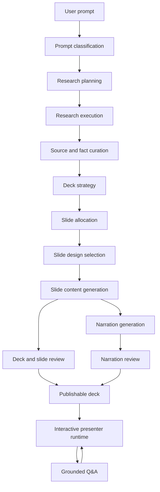

# Generation Pipeline V2 Architecture

Status: canonical target architecture
Created: 2026-05-07
Scope: presentation generation, narration, grounded Q&A integration, and quality gates

This document defines the target architecture for the next generation pipeline.
Implementation work should be grounded in this document. If an implementation
step cannot be mapped to one of the pipeline stages below, it should not be
merged as a generation improvement.

This document intentionally supersedes ad-hoc patching in the current generation
pipeline.

This is the source of truth for new generation work. `tasks.md` tracks execution
status, and `docs/deck-and-slide-types.md` remains the current inventory of
deck arcs and slide roles. Neither file should introduce a competing pipeline
shape. If this architecture is wrong, revise this document first or in the same
change that proves the mismatch.

## Problem Statement

The current generator is too complex for the job it performs. It combines a
small static slide layout set, deterministic contracts, slide recovery, deck
normalization, semantic review, and several local text guards. This creates two
bad outcomes:

- weak first drafts are repaired repeatedly instead of being generated from a
  clear plan
- slides look and feel similar because design is mostly deterministic and only
  the text varies

V2 moves quality upstream. The system should decide what it is building, what
source material is trustworthy, which facts belong on which slide, and which
layout best fits each slide before prose is generated.

## Non-Negotiable Principles

1. Generation quality starts with context and planning, not post-hoc repair.
2. Research facts must be traceable to sources or explicitly marked as model
   knowledge.
3. Every slide gets an explicit job, fact allocation, and layout intent before
   slide prose is generated.
4. The first slide is always an introduction.
5. The final slide is always a proper conclusion and question invitation.
6. Narration is a presenter script, not a spoken copy of slide bullets.
7. Q&A answers must use deck material, source material, and controlled model
   knowledge, then bridge back to the current presentation.
8. Guards must protect stage contracts, not patch arbitrary output strings.
9. Fail closed when material or generation quality is insufficient.
10. The architecture document may be revised when proven wrong; code should not
    drift silently away from it.

## Change Control

Generation changes must follow this control rule:

1. Identify the failing stage.
2. Identify the artifact that was wrong or missing.
3. Decide whether the fix belongs in classification, research, fact curation,
   planning, allocation, layout selection, slide generation, narration,
   review, or Q&A.
4. Implement the smallest change that improves that stage contract.
5. Delete or bypass legacy code that the new stage replaces.
6. Add or update tests that exercise the stage contract, not one prompt string.
7. Run at least one live validation scenario that is not the scenario that
   caused the bug.

If a proposed fix cannot be described this way, it is a patch rather than an
architecture improvement and should not be accepted.

## Implementation Guardrails

These rules are for the implementation agent as much as for the codebase.

- Do not add one-off string/regex patches to fix a specific failed prompt.
- Scenario strings belong in tests and fixtures only, never in production
  generation logic.
- Do not add new recovery layers unless the layer is named in this document and
  has a defined input/output contract.
- Before changing generation code, state which V2 stage the change belongs to.
- Prefer replacing a legacy path over wrapping it with another fallback.
- If a validation failure reveals a missing pipeline responsibility, update this
  document first or in the same change.
- Keep deterministic code responsible for structure, routing, and safety.
- Keep LLM calls responsible for semantic classification, planning, synthesis,
  prose, and review.
- Natural-language intent, relevance, deck-mode, fact-role, and quality decisions
  are agentic stage responsibilities. Production code must not emulate those
  decisions with keyword inventories, language-specific regexes, or weighted
  phrase heuristics.
- Deterministic parsing is limited to protocol and structure concerns such as
  URL extraction, schema validation, source transport, boilerplate removal,
  deduplication, renderer bounds, and state-machine safety.
- Every stage receives its named upstream artifact rather than a parallel grab
  bag of summaries, excerpts, plans, hints, and recovery instructions.
- Every stage must be independently loggable and testable.
- No visible slide copy should be derived from internal labels such as
  `contract`, `brief`, `source role`, `claim`, `scaffold`, or `repair`.
- If V2 output is not good enough, fail the generation instead of showing a
  generic recovery deck.
- A fallback may complete structure, schema, or rendering only. It must not
  invent semantic slide content for a publishable presentation.

## Stage Ownership Summary

Each stage has one primary responsibility. Implementation should preserve these
boundaries.

| Stage | Primary function | Output artifact | Must not do |
| --- | --- | --- | --- |
| Prompt classification | Understand the request and route it | `PromptClassification` | Write slide copy |
| Research planning | Decide what to fetch and why | `ResearchPlan` | Scrape pages |
| Research execution | Fetch and store raw material | `ResearchBundle` | Curate final facts |
| Fact curation | Extract high-signal grounded claims | `FactBank` | Allocate facts to slides |
| Deck strategy | Choose the story arc and feasibility | `DeckStrategy` | Write slide prose |
| Slide allocation | Assign distinct material per slide | `SlidePlan[]` | Pick CSS or visuals |
| Design selection | Pick layout and visual intent | `SlideDesignSpec[]` | Rewrite facts |
| Slide generation | Write visible slide content | `SlideDraft[]` | Generate narration |
| Slide/deck review | Approve, reject, or request retry | `ReviewResult` | Repair content invisibly |
| Narration generation | Write presenter script | `NarrationScript[]` | Change slide facts |
| Publication review | Decide if user may see it | `ReviewResult` | Fail open |
| Q&A runtime | Answer interruptions and resume | `GroundedAnswer` + resume plan | Act as ungrounded chatbot |

## Pipeline Overview



## Typed Artifacts

V2 is built around explicit typed artifacts. These artifacts should be persisted
or at least logged in development mode so failures can be inspected without
guessing.

Persisted artifacts carry `schemaVersion`, `artifactId`, and `createdAt`.
Collection stages use explicit set artifacts such as `SlidePlanSet`,
`SlideDesignSpecSet`, `SlideDraftSet`, and `NarrationScriptSet` so provenance is
not lost around a bare array.

Every stage returns a `GenerationStageResult` with:
- `status`: `succeeded`, `rejected`, or `failed`
- stage name, run id, attempt, timestamps, and duration
- input artifact ids and source ids
- structured warnings and errors
- a schema-validated artifact only when one exists

Malformed output becomes a failed stage. Agent rejection remains a rejected
stage. Neither state may be normalized into apparent success.

### `PromptClassification`

Purpose:
- understand what the user is asking for
- separate topic, audience, format, language, source instructions, and quality
  constraints

Fields:
- `subject`
- `language`
- `audience`
- `presentationGoal`
- `deckMode`: `teaching`, `onboarding`, `sales`, `strategy`, `report`,
  `workshop`, `how-to`, `comparison`, `story`
- `groundingMode`: `explicit-sources`, `web-research`, `model-knowledge`,
  `mixed`
- `requestedSources`
- `requestedCoverage`
- `requestedSlideCount`
- `requestedDurationMinutes`
- `visualPreference`
- `voicePreference`
- `confidence`
- `openQuestions`

Function:

```ts
classifyPrompt(request: GeneratePresentationRequest): Promise<PromptClassification>
```

Rules:
- This stage may use LLM classification.
- It must not write slide content.
- It must not decide final layout.
- It must identify when the user asks for sources, URLs, "google it", or
  current facts.

### `ResearchPlan`

Purpose:
- decide what information must be gathered before generation
- avoid scraping random low-signal pages just because they exist

Fields:
- `researchQuestions`
- `requiredFacts`
- `sourceTargets`
- `sameDomainDepth`
- `searchQueries`
- `sourcePriority`
- `stopCriteria`
- `knownRiskAreas`

Function:

```ts
planResearch(classification: PromptClassification): Promise<ResearchPlan>
```

Rules:
- Explicit user URLs are always first priority.
- Same-domain support pages may be fetched when they answer a research question.
- General web search is used only when explicit sources are missing or the user
  requested broader research.
- If the subject is current, factual, legal, medical, financial, or otherwise
  time-sensitive, research is required.
- The output is a plan, not source material.

### `ResearchBundle`

Purpose:
- hold fetched material before curation

Fields:
- `sources`
- `pages`
- `snippets`
- `fetchErrors`
- `sourceMetadata`
- `rawTextSamples`

Function:

```ts
executeResearch(plan: ResearchPlan): Promise<ResearchBundle>
```

Rules:
- Raw scraped text stays here.
- Downstream generation should not receive raw scraped pages directly.
- Fetch failures should be preserved and visible to validation.

### `FactBank`

Purpose:
- convert research into high-signal, traceable facts
- separate source-grounded facts from model-knowledge context

Fields:
- `facts`
- `sourceSummaries`
- `sourceQuality`
- `missingFacts`
- `contradictions`
- `modelKnowledgeAllowed`

Fact fields:
- `id`
- `claim`
- `sourceIds`
- `evidenceExcerpt`
- `role`: `identity`, `timeline`, `background`, `mechanism`, `capability`,
  `operation`, `example`, `value`, `risk`, `comparison`, `quote`, `other`
- `confidence`
- `language`
- `allowedUse`: `visible-slide`, `narration-only`, `qa-only`, `context-only`

Function:

```ts
curateFacts(bundle: ResearchBundle, classification: PromptClassification): Promise<FactBank>
```

Rules:
- LLM classification is preferred for relevance and role assignment.
- Deterministic filters may remove boilerplate, navigation, cookie banners, and
  repeated site chrome.
- Facts must be deduplicated semantically.
- Contradictory facts must be surfaced rather than silently resolved.
- If facts are too weak for the requested deck, generation should fail with a
  useful message or ask for better sources.

### `DeckStrategy`

Purpose:
- decide the deck shape before individual slide writing begins

Fields:
- `deckMode`
- `storyArc`
- `requiredIntro`
- `requiredConclusion`
- `slideCount`
- `duration`
- `language`
- `audience`
- `tone`
- `layoutVarietyPolicy`
- `narrationStyle`

Function:

```ts
planDeckStrategy(
  classification: PromptClassification,
  factBank: FactBank,
): Promise<DeckStrategy>
```

Rules:
- The first slide is an intro role.
- The last slide is a conclusion role.
- Strategy is allowed to reduce requested slide count if source material is too
  thin.
- Strategy is allowed to fail if the requested deck would be misleading.

### `SlidePlan[]`

Purpose:
- allocate unique material to each slide before prose generation

Fields:
- `slideId`
- `order`
- `role`: `intro`, `context`, `evidence`, `mechanism`, `example`,
  `comparison`, `implication`, `activity`, `decision`, `summary`,
  `conclusion`
- `audienceQuestion`
- `learningPurpose`
- `allowedFactIds`
- `requiredFactIds`
- `forbiddenFactIds`
- `modelKnowledgeScope`
- `overlapPolicy`
- `narrationIntent`

Function:

```ts
allocateSlides(strategy: DeckStrategy, factBank: FactBank): Promise<SlidePlan[]>
```

Rules:
- Every slide must have a distinct reason to exist.
- Required facts cannot be assigned to multiple body slides unless the slide
  role explicitly requires recap.
- The intro may preview later facts but should not exhaust the deck.
- The conclusion may synthesize facts but should not introduce new named facts.
- A slide with no unique material is removed or the deck fails.

### `SlideDesignSpec[]`

Purpose:
- make visual design a first-class generation artifact
- avoid today's "four templates forever" behavior

Fields:
- `slideId`
- `layoutId`
- `layoutFamily`
- `contentDensity`
- `visualRole`: `hero`, `evidence`, `process`, `comparison`, `quote`,
  `timeline`, `map`, `gallery`, `checklist`, `dashboard`, `question`
- `imageStrategy`: `source-image`, `curated-fallback`, `generated`,
  `none`
- `imageQuery`
- `variationSeed`
- `emphasis`
- `speakerSupport`

Function:

```ts
selectSlideDesigns(
  strategy: DeckStrategy,
  slidePlans: SlidePlan[],
  factBank: FactBank,
): Promise<SlideDesignSpec[]>
```

Rules:
- V2 should use a layout library with at least 20 safe layouts.
- The renderer owns layout implementation.
- The LLM chooses intent and compatible layout ids, not CSS.
- Deterministic variation may randomize safe parameters such as card count,
  image position, emphasis area, background treatment, and accent.
- Layout selection must be content-driven, not `slide 2 = flow`.
- Repeated layout ids are allowed only when the deck intentionally uses a
  repeated pattern.

Initial layout families:
- intro hero
- title plus source image
- quote with source
- timeline
- three-step process
- two-column comparison
- before/after
- evidence cards
- image gallery
- map/footprint
- metric/dashboard
- problem/solution
- mechanism diagram
- case study
- checklist
- decision tree
- workshop activity
- recap board
- Q&A closing
- minimal statement
- split narrative/image
- source excerpt
- myth/fact
- risks and mitigations

### `SlideDraft[]`

Purpose:
- generate visible slide content from a slide's allocated material and design
  spec

Common fields:
- `slideId`
- `title`
- `subtitle`
- `usedFactIds`
- `speakerNotes`
- `imagePrompt`
- `sourceAttributions`
- `likelyQuestions`

Visible content is one discriminated `content` shape, not a universal set of
parallel fields. Initial content kinds are `statement`, `list`, `cards`,
`process`, `comparison`, `quote`, `timeline`, `metrics`, `activity`,
`source-excerpt`, and `question`. A slide cannot simultaneously populate legacy
key points, explanations, cards, and hero copy with the same claim.

Function:

```ts
generateSlideDraft(
  strategy: DeckStrategy,
  slidePlan: SlidePlan,
  designSpec: SlideDesignSpec,
  factBank: FactBank,
): Promise<SlideDraft>
```

Rules:
- The slide generator receives only the facts allocated to that slide plus
  approved deck-level context.
- It does not receive the full raw research bundle.
- It does not receive internal labels as visible copy.
- It may use model knowledge only within `modelKnowledgeScope`.
- It must output content compatible with the selected layout.
- It must not create narration.

### `NarrationScript[]`

Purpose:
- create a human-presenter script that connects the deck into a coherent spoken
  story

Fields:
- `slideId`
- `openingBridge`
- `segments`
- `transitionOut`
- `pausePrompts`
- `sourceMentions`
- `questionInvitation`

Function:

```ts
generateNarrations(
  strategy: DeckStrategy,
  slidePlans: SlidePlan[],
  slideDrafts: SlideDraft[],
  factBank: FactBank,
): Promise<NarrationScript[]>
```

Rules:
- Narration should explain, connect, and contextualize.
- Narration is generated with the complete deck arc available so adjacent
  transitions and the ending are planned as one spoken presentation.
- It must not simply read the slide.
- It should sound like a presenter speaking to an audience.
- It should include transitions between slides.
- It may mention source confidence when useful.
- The final narration must clearly close the presentation and invite questions.
- Narration can include more detail than visible slide text, but only from
  allocated facts, deck-level context, or allowed model knowledge.

### `ReviewResult`

Purpose:
- decide whether a deck can be shown

Review functions:

```ts
reviewResearch(factBank: FactBank, classification: PromptClassification): Promise<ReviewResult>
reviewOutline(strategy: DeckStrategy, slidePlans: SlidePlan[], factBank: FactBank): Promise<ReviewResult>
reviewSlides(slides: SlideDraft[], slidePlans: SlidePlan[], factBank: FactBank): Promise<ReviewResult>
reviewNarration(narration: NarrationScript[], slides: SlideDraft[]): Promise<ReviewResult>
reviewDeckForPublication(deck: FinalDeck): Promise<ReviewResult>
```

Rules:
- Review may be LLM-assisted.
- Deterministic checks may validate schemas, missing fields, duplicate ids,
  repeated exact facts, source coverage, and required intro/conclusion presence.
- Review should fail closed on malformed LLM review payloads.
- Review should not rewrite visible content.
- If review finds a stage error, retry that stage with explicit feedback.
- If the same stage fails twice, fail the generation.

### `PublishablePresentation`

Purpose:
- represent the only artifact that may cross into the interactive runtime
- keep classification, facts, plans, designs, slides, narration, and reviews
  traceable as one immutable publication bundle

Rules:
- every design, draft, and narration must match the ordered slide-plan ids
- strategy references must match the included classification and fact bank
- every included review must be approved
- an approved publication review is mandatory
- conversion to the runtime `Deck` shape happens after this contract, never
  before it

## Research Strategy

Research is a first-class stage, not a helper.

### Source priority

1. User-provided URLs
2. Same-domain pages that answer explicit research questions
3. User-requested web search
4. General web search for current or uncertain facts
5. Model knowledge only when the deck mode allows it

### Page selection

The research planner should classify pages before scraping deeply:
- homepage / overview
- about / company
- product / service
- documentation
- news / press
- case study
- pricing / commercial
- contact / location
- legal / low-signal
- navigation / index

Only pages relevant to research questions should be expanded.

### Curation

The fact curator should:
- extract claims
- attach evidence excerpts
- classify roles
- score confidence
- identify missing requested coverage
- identify source contradictions
- reject site chrome and generic marketing filler

### Research failure modes

Fail generation when:
- requested source pages cannot be fetched and no alternative source is allowed
- explicit requested coverage is missing
- facts are too thin for requested slide count
- source material contradicts itself and the contradiction matters

Continue with caveats when:
- the deck is allowed to use model knowledge
- missing facts are not central to the prompt
- sources are weak but still sufficient for a smaller or more cautious deck

## Intro And Conclusion Rules

### Intro slide

The intro must:
- name the subject clearly
- orient the audience
- state why the presentation exists
- preview the arc without exhausting the source facts
- establish language and tone

The intro must not:
- start with a narrow middle-slide detail unless the whole deck is about that
  detail
- use internal role labels
- be only a title slide

### Conclusion slide

The conclusion must:
- synthesize the deck
- state the main takeaway in audience-facing language
- make clear that questions are welcome
- avoid new named facts unless explicitly assigned

The conclusion must not:
- be a generic `Key takeaway and questions` template
- repeat the intro
- turn into another middle content slide
- contain hidden prompt or source-role language

## Interactive Q&A Runtime

Q&A is part of the presentation, not a separate chatbot.

### Inputs

Supported question paths:
- typed question
- recorded voice question
- live voice interruption

All paths should use the same backend answer pipeline after transcript quality
is established.

### Question pipeline

```ts
classifyQuestion(question, sessionState): Promise<QuestionClassification>
buildAnswerContext(classification, deck, factBank, currentSlide): Promise<AnswerContext>
answerQuestion(context): Promise<GroundedAnswer>
validateAnswer(answer, context): Promise<ReviewResult>
bridgeBack(answer, currentSlide, nextNarration): Promise<PresentationResumePlan>
```

### Runtime behavior

- Presentation should pause when a real question begins, not only after recording
  ends.
- The UI should show listening, live transcript, generating answer, speaking
  answer, and resume states.
- The user should be able to cancel before the question is submitted.
- Off-topic questions should be acknowledged and redirected.
- Relevant but unsupported questions should trigger controlled follow-up research
  when allowed.
- If an answer remains unsupported, the system should say what is missing.
- After answering, the presenter should bridge back to the interrupted slide or
  the next slide naturally.

### Answer grounding

Answer priority:
1. current slide and narration
2. full deck visible content
3. fact bank and source excerpts
4. allowed follow-up research
5. allowed model knowledge

The answer should distinguish:
- source-grounded fact
- explanation inferred from the deck
- model-knowledge context
- unavailable or unsupported information

## Validation Strategy

Validation exists to protect publication, not to turn bad drafts into good decks.

### Stage-level validation

Each stage validates its own contract:
- prompt classification: complete enough to route
- research plan: covers user requirements
- fact bank: source-backed and deduplicated
- deck strategy: coherent arc and feasible slide count
- slide allocation: no accidental overlap
- design specs: compatible with content and renderer
- slide drafts: use allocated material and layout contract
- narration: presenter-like and grounded
- Q&A: relevant, grounded, and bridgeable

### Retry policy

- Retry the failed stage, not the whole deck.
- Retry with structured feedback.
- Two failed attempts at the same stage should fail the generation unless a
  user-facing reduced scope is possible.
- Do not silently switch to static generic recovery.

### Fail-closed examples

Fail instead of publishing when:
- semantic review rejects the deck
- final review is unavailable or malformed
- source-backed material is missing
- slides repeat the same claim as their main content
- narration is missing for a publishable presenter session
- the conclusion is generic filler
- the deck relies on unsupported named facts

## Migration Plan

The migration order is intentional: legacy semantic generation was removed
before V2 implementation so new stages cannot silently adapt to the old
recovery architecture. The phase numbers here are canonical and match
`tasks.md`.

### Phase 1: Cleanup before V2 generation

Goal:
- remove V1 semantic generation, repair, and fallback paths
- leave production generation fail-closed

Status:
- completed

### Phase 2: Baseline validation

Goal:
- prove the cleaned application, runtime, and provider boundaries remain stable
- document deferred live checks that require a publishable V2 deck

Status:
- completed before the V2 baseline checkpoint

### Phase 3: V2 types, interfaces, and logging

Goal:
- define every V2 artifact and stage result before semantic implementation
- persist enough diagnostics to inspect every stage failure

Tasks:
- add schemas for `PromptClassification`, `ResearchPlan`, `ResearchBundle`,
  `FactBank`, `DeckStrategy`, `SlidePlan`, `SlideDesignSpec`, `SlideDraft`,
  `ReviewResult`, `NarrationScript`, and `PublishablePresentation`
- add stage result metadata and artifact diagnostics
- add tests for success, rejection, and failure contracts

### Phase 4: Classification, research, and fact bank

Goal:
- build trustworthy, traceable material through agentic stages before planning

Tasks:
- implement LLM prompt classification and research planning
- execute explicit sources and planned search targets
- curate a source-traceable `FactBank`
- preserve missing facts and contradictions
- replace and delete overlapping heuristic research paths

### Phase 5: Deck strategy, slide allocation, and design selection

Goal:
- decide the story, distinct slide jobs, fact allocation, and compatible design
  before visible prose exists

Tasks:
- implement `DeckStrategy`, `SlidePlan[]`, and `SlideDesignSpec[]`
- require intro and conclusion roles
- define at least 20 renderer-supported layout ids
- allocate unique facts and explicit overlap policy per slide

### Phase 6: Slide drafts and stage review

Goal:
- generate layout-specific visible content and reject weak drafts at the owning
  stage

Tasks:
- generate `SlideDraft[]` from allocated facts and design specs
- use discriminated layout content instead of one universal repeated field set
- review grounding, role fidelity, repetition, language, and renderer safety
- retry the failed stage with structured feedback, then fail closed

### Phase 7: Narration, publication, and runtime handoff

Goal:
- generate a coherent presenter script and publish only a complete presentation

Tasks:
- generate narration with access to the full deck arc and adjacent slides
- review narration continuity without rewriting it in the review stage
- publish only after slide, narration, and final review pass
- hand the immutable `PublishablePresentation` to the interactive runtime
- use its `FactBank` for grounded Q&A and controlled follow-up research

### Phase 8: Cross-scenario validation and release candidate

Goal:
- prove first-draft quality and failure transparency across unrelated domains

Tasks:
- run the required live matrix and record every stage artifact
- measure grounding, repetition, narration continuity, layout variety, latency,
  and PPTX renderer safety
- compare failures by stage instead of adding scenario-specific production code

## Definition Of Done For V2

V2 is not done until all of these are true:

- a fresh source-backed subject deck can pass live validation without generic
  recovery
- a fresh organization onboarding deck stays organization-specific
- a fresh workshop deck includes a real activity slide
- a fresh non-source concept deck can use model knowledge without pretending it
  is sourced
- slide 2 is not determined by index alone
- the final slide is not a template label
- narration sounds like a presenter and connects the deck
- typed Q&A and voice Q&A use the same answer pipeline
- failed research or weak source material fails clearly
- no new generation code relies on scenario-specific hardcoded strings

## Required Live Test Matrix

Run these repeatedly while building V2:

- explicit source subject: Donald Duck first 1934 cartoon appearance
- explicit source product: `https://molted.email`
- explicit source organization: System Verification onboarding
- multi-URL organization prompt
- user asks to "google" information
- topic-only model-knowledge deck: Ferrari brand lesson
- business strategy deck: marketing strategy for new production real estate
- workshop deck: AI in daily work for product owners, project managers, and
  test leads
- Swedish prompt smoke test, even before Swedish quality is the primary bar

Each test should record:
- generated artifacts by stage
- final deck id
- slide titles
- slide fact allocation
- selected layouts
- review outcome
- generation duration
- visible failure if failed
