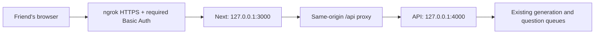

# Private Sharing

Scope: a few trusted friends using the same library, not individual accounts or
a public multi-tenant service. A shared username/password protects the entire
ngrok HTTPS endpoint using [ngrok Basic Auth](https://ngrok.com/docs/gateway/traffic-policy/actions/basic-auth).
The browser displays its standard login prompt, not a new application login page.
Authenticated friends can access and archive any presentation in the shared library.

## Boundary

- Every path requires authentication, including API, audio and PPTX exports.
  There are no public-path exceptions. Web middleware removes the Authorization
  header after ngrok checks it; local ngrok request inspection is disabled. This
  intentionally avoids ngrok's paid header-transformation action; the actual
  authentication still runs at the ngrok edge, not in the middleware.
- Browser requests use relative `/api` paths. They never address the visitor's
  localhost. The server-only `SLIDESPEECH_API_ORIGIN` setting can override the
  proxy target before building Next; its default is `http://127.0.0.1:4000`.
- Production and development web commands bind to loopback. The API defaults to
  `API_HOST=127.0.0.1`. Do not bind either service to a public/LAN interface for
  this setup; the local services intentionally do not implement password auth.
- Cross-site browser writes are rejected. Broad cross-origin API access is
  removed. The proxy has 330 seconds for queued questions (180s wait + 120s work);
  it forwards disconnects so cancellation still releases queued work.
- TLS and login are handled by ngrok: requests pass through that service. Do not
  use confidential material unless this is acceptable. This is not end-to-end
  encryption from the visitor directly to the application.

## Run

1. Install/configure ngrok for your account using its normal setup. Never place
   its account authtoken in this repository.
2. Start the API, build the web app and run its production start command.
3. Run `npm run share:private` from the repository root. It checks the same-origin
   API before opening a tunnel and fails rather than starting without its policy.
4. The first run generates a strong random password and username `friends` in
   `.local/ngrok/access.json`. The directory is excluded from Git and restricted
   to its owner, as are both secret files. Later runs preserve those credentials.
5. Share the ngrok **HTTPS** URL and send the credentials separately. The computer,
   API, web server, ngrok and model server must remain running. Browser microphone
   permission is still required; HTTPS provides its secure context.

Stop the tunnel process with Ctrl+C to close remote access without stopping the
local app. This command does not install an automatic background service. To
rotate access, stop the tunnel, replace the password in `access.json` with a new
random 16-128 character password and restart; the policy is regenerated each run.
The old password then stops working. Basic Auth has no application logout button;
use a private browser window on shared computers.

Do not stop or replace another application's ngrok tunnel without approval. If
the account's concurrent-session/endpoint limit prevents starting another tunnel,
the command fails; it never silently removes authentication or changes that limit.
Account limits can also affect long questions, audio traffic and the free-plan
browser warning page. Validate the actual HTTPS endpoint before sharing it.

## Acceptance

Verify missing and wrong passwords receive HTTP 401 for both page and API URLs;
correct credentials must load Studio, the library, a saved presentation and audio.
Export paths must also require authentication. The current V2 player does not yet
connect a user-facing PPTX download; do not test a V2 publication ID against the
legacy session-export endpoint or claim that the tunnel adds that capability.
A correct password with a cross-site write must still receive 403.
Check the local listeners are loopback-only. Keep tests for policy enforcement,
secret persistence/permissions, same-origin requests and proxy timing.
